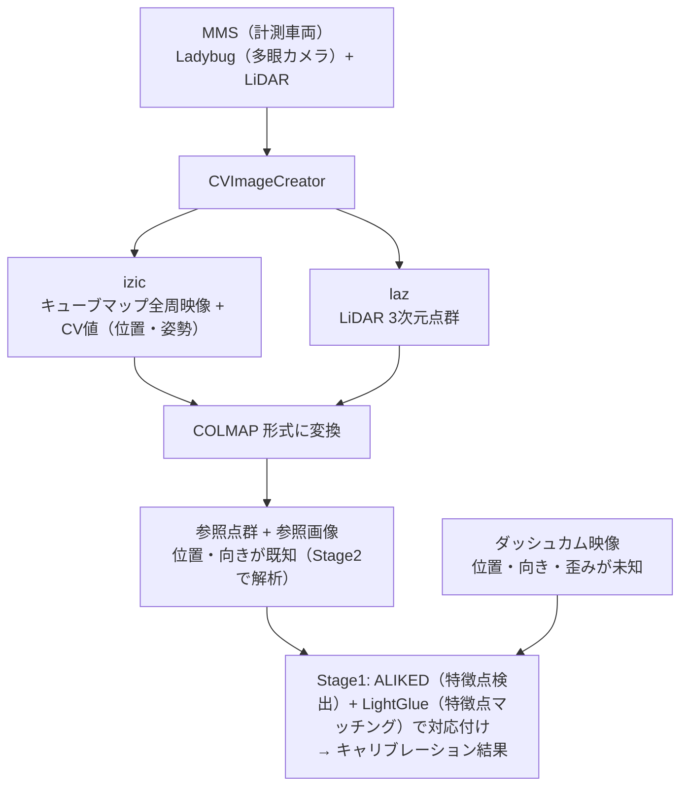
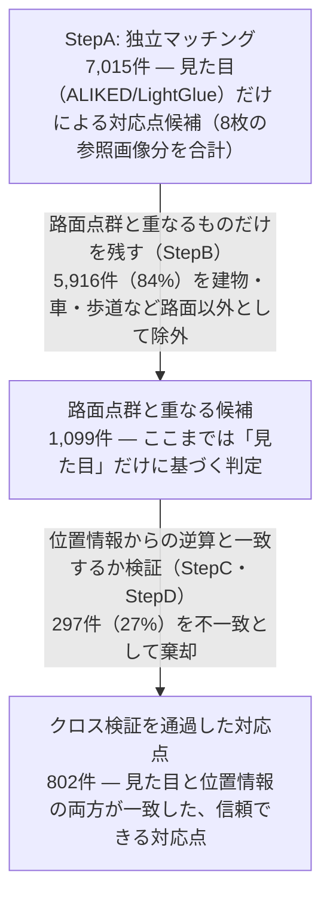
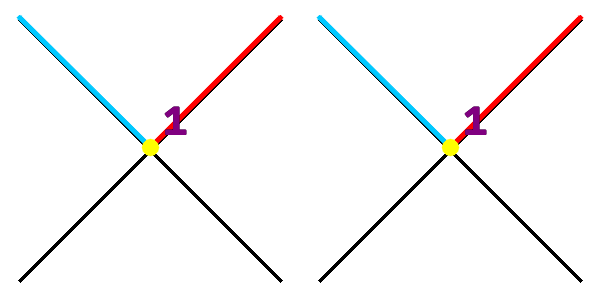
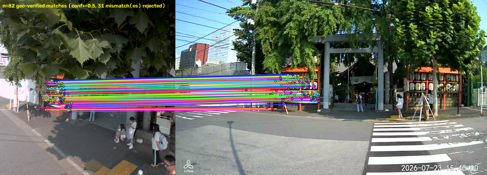
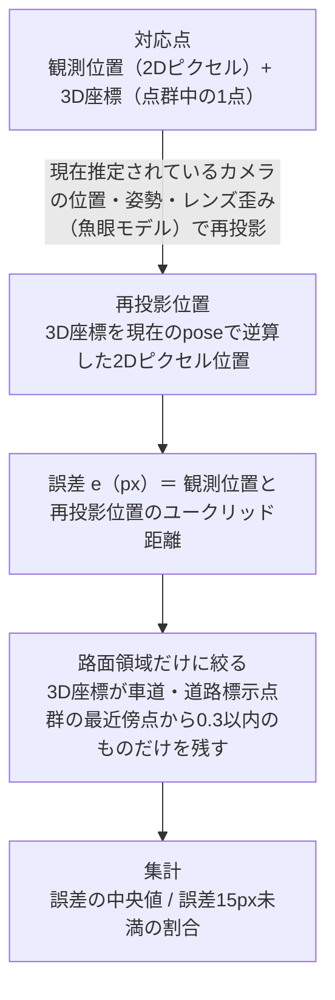
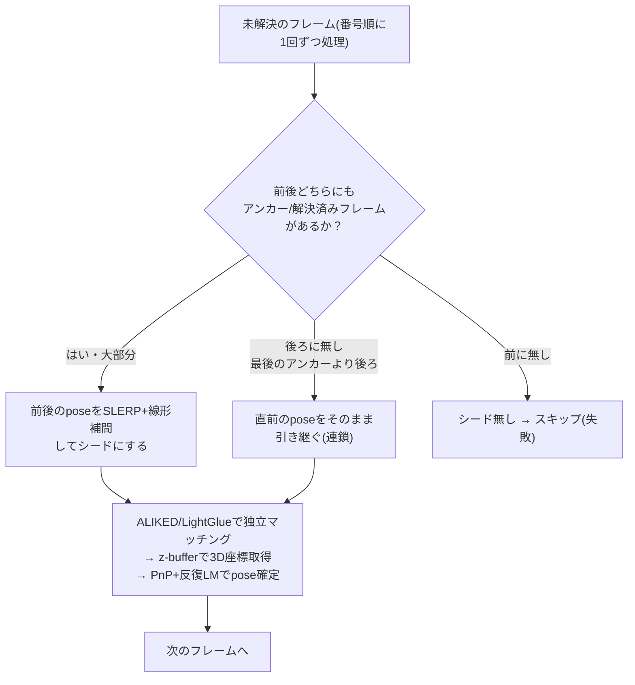
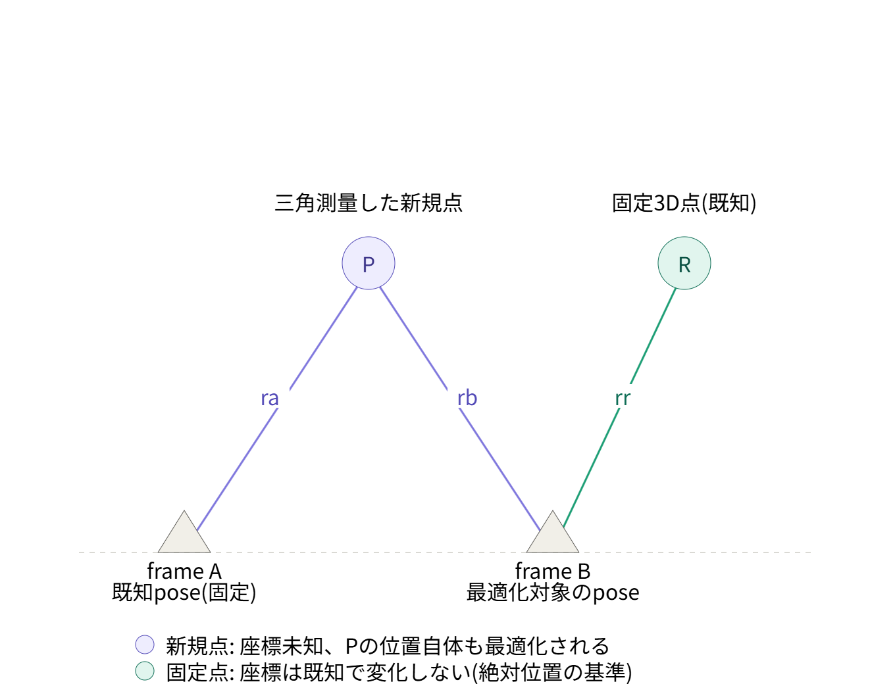
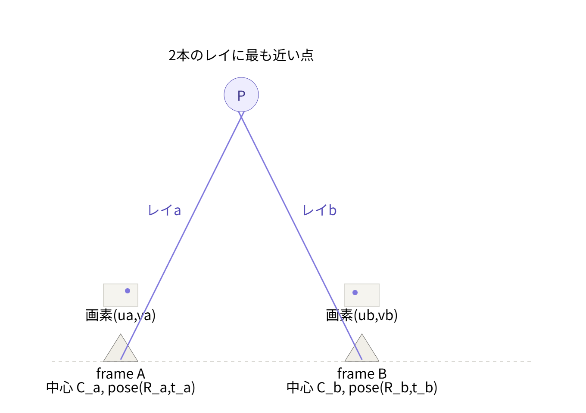

*Lens Calibration & Full-Trajectory Pose Estimation — Technical Brief*

# MMS全周映像・LiDAR点群を利用したダッシュカムのレンズキャリブレーションと全フレーム軌跡復元

*キャリブレーションボードを使用せずにMMS全周映像とLiDAR点群を使用してダッシュカム(コムテック ドライブレコーダー HDR204G)のレンズキャリブレーションを行い、さらにその結果を使って動画全フレームの位置・姿勢(軌跡)を復元する方法を整理した資料です。*

**全体の構成**

一連の処理は大きく3部に分かれます。

1. **[第1部: レンズキャリブレーション](#第1部-レンズキャリブレーション)** — 少数(10枚程度)の較正対象フレームだけを使い、レンズの内部パラメータ(焦点距離・歪み係数)と、その10枚自身の位置・姿勢を求める。参照画像は`run_calibration.py`が**自動選択**する。
2. **[第2部: 全フレーム軌跡復元](#第2部-全フレーム軌跡復元)** — 第1部で求まった固定の内部パラメータを引き継ぎ、動画の残り全フレーム(本データセットでは840枚)の位置・姿勢を求める。
3. **[第3部: 手動アンカー指定によるレンズキャリブレーション](#第3部-手動アンカー指定によるレンズキャリブレーション-run_manual_calibrationpy)** — 第1部の自動参照画像選択が特定の状況で自己確認的に失敗する問題への対策として、参照画像をユーザーが手動で指定する`run_manual_calibration.py`を追加した。第1部の代替であり、目的(内部パラメータ+較正対象フレームのposeを求める)は同じ。

第2部は第1部(または第3部)の出力(内部パラメータ + 較正済みフレームのpose)がなければ実行できません。まず第1部から読み進めてください。

---

# 第1部: レンズキャリブレーション


***図1** — 現時点の最良の結果（frame 00374、写真と点群レンダリングの交互表示）。横断歩道を含む路面全体がほぼ一致して見える*

この結果で求まったレンズモデルとパラメータは以下の通りです。

| 項目 | 値 | 説明 |
|---|---|---|
| レンズモデル | 等距離射影(equidistant)ベースの魚眼モデル | θ_d = θ(1 + k1θ² + k2θ⁴)（θ: 入射角、θ_d: 歪みを含めた投影角。動径方向2次の歪み係数k1・k2のみで、接線方向の歪みは扱わない。k3・k4を加えた拡張モデルも検証したが不採用 — 理由は[Stage7の節](#k1k2のみを採用する理由レンズモデルの次数について)を参照） |
| fx | 909.46 | 焦点距離(x方向、px) |
| fy | 909.34 | 焦点距離(y方向、px) |
| cx | 976.38 | 主点(x座標、px) |
| cy | 522.55 | 主点(y座標、px) |
| k1 | -0.05998 | 歪み係数1 |
| k2 | -0.01921 | 歪み係数2 |

## 概要

**目的とパイプライン全体の構成**

目的は、**MMS**(Mobile Mapping System、計測車両)で取得した全周映像と**LiDAR**点群を使用して、ドライブレコーダー(ダッシュカム)のレンズキャリブレーション(レンズの歪み・焦点距離などの内部特性と、取り付け位置・向きを求めること)を行うことです。

この作業は、次の8つのStageからなる一連のパイプラインとして実装されています。以降の章では、このStage番号の順に内容を説明します。

| Stage | 内容 |
|---|---|
| 1 | マッチング (ALIKED / LightGlue) |
| 2 | 参照データセット解析 |
| 3 | 対応点ルックアップ (z-buffer) |
| 4 | 初期姿勢推定 (per-frame pose init) |
| 5 | 一括バンドル調整 (joint bundle adjustment) |
| 6 | 線分交点による補正 (LineMatch) |
| 7 | 路面点群クロス検証マッチング |
| 8 | レンダリング |

***図2** — パイプライン全体のStage構成*

補足: このStage番号は実装の整理に伴って今後も変わり得るため、コード側では番号ではなく`LineMatch`・`RoadCrossval`のような名前で各Stageを参照するようにしています。実際、以前は「誘導マッチングによる補正」というStageも存在しましたが、公平な重みで検証した結果、既定設定に対して実質的な差(路面領域の対応点数・誤差ともほぼ同一)が見られなかったため、コードごと削除しました。

---

## Stage 1 — マッチング (ALIKED / LightGlue)

**ALIKED と LightGlue による対応付け**

ダッシュカムの各フレームと参照画像それぞれから、**ALIKED**という手法で「特徴点」(角や模様の交点など、画像内で識別しやすい点)を検出します。次に**LightGlue**という手法で、2枚の画像間で同じ場所を写している特徴点同士を対応付けます。対象は参照画像**全件**(数百枚、参照データの詳細はStage2)で、多数の画像を効率よく処理するための標準的な設定(解像度・検出感度とも既定値)を使います。

対応付いた点は、参照点群側では3次元座標が分かっているため(Stage3で3次元座標を割り当てます)、「3次元座標 ↔ ダッシュカム画像上の2次元位置」の組が数千組集まります。この組を使って、Stage4・Stage5でダッシュカムの位置・向き・レンズの歪みを最適化計算によって求めます。

---

## Stage 2 — 参照データセット解析

**「正確な地図」としての参照データ**

MMSは**Ladybug**(全方位を一度に撮影する多眼カメラ)とLiDAR(レーザー光で周囲の形状を計測するセンサー)を搭載した計測車両で、これによって位置が既知の参照データを事前に取得しておきます。このデータを**CVImageCreator**に与え、キューブマップ化された全周映像と各フレームのカメラ位置・姿勢(CV値)を含む**izic**ファイル、およびLiDARによる3次元点群の**laz**ファイルが得られます。この izic と laz を**COLMAP**形式に変換したものが、Stage1で使われた参照データです。**COLMAP**は、複数の画像から3次元形状やカメラ位置を復元するStructure-from-Motion(SfM)ツールとして広く使われているオープンソースソフトウェアで、カメラパラメータ・各画像の位置姿勢・3次元点群をテキストファイル(cameras.txt / images.txt / points3D.txtなど)で表現する標準的なフォーマットとしても使われています。本パイプラインではこのCOLMAP形式を**データの受け渡し形式**として使っているだけで、COLMAP自体によるマッチング・SfM計算は行っていません(位置・姿勢・点群はすべてCVImageCreatorから得られた値です)。

つまり参照点群はLiDARによる直接計測から得られたものであり、参照画像の位置・姿勢も、画像同士のマッチングによる復元ではなく、計測時点で既に分かっている値(CV値)をそのまま使っています。この「正確な地図(参照点群+参照画像)」に対して、Stage1以降で「位置が分かっていないダッシュカムの映像」を重ね合わせ、位置・向き・レンズ特性を逆算していくことになります。

参照データ自身の精度を確認しておきます。下図は、参照画像(cam00_frm00233)に、同じ参照データの点群を、その画像自身の(MMSの直接計測による、推定を一切介さない)既知の位置・姿勢だけで再投影し、実際の写真と交互に表示して比較したものです。ダッシュカムの位置推定は一切関与していません。


***図3** — 参照画像(cam00_frm00233)に、参照データ自身の位置・姿勢(MMSの直接計測、推定なし)だけを使って点群を再投影し、写真と交互に表示して比較したもの。建物の輪郭・窓の格子・横断歩道の縞模様まで、目立ったズレなく重なっている*

点群・画像の位置姿勢がいずれも同一のMMS計測からそのまま得られた値であるため、この一致度は「推定の正しさ」ではなく「参照データそのものの内部整合性」を表しています。この精度が、Stage1以降でダッシュカムの位置・向き・レンズ特性を逆算する際の「正確な地図」としての土台になります。



***図4** — 参照データとダッシュカム映像を対応付ける全体の流れ*

---

## Stage 3 — 対応点ルックアップ (z-buffer)

**2次元の対応点に3次元座標を割り当てる**

Stage1で見つかった対応点(参照画像側の2Dピクセル)に、3次元座標を割り当てるステージです。参照画像を撮影したカメラの位置・姿勢(既知)を使って点群の全点をその参照画像に再投影し、同じピクセルに複数の点が重なる場合はカメラに最も近い(奥に隠れていない)点だけを残す**z-buffer**を構築します。対応点のピクセル位置の近傍でz-bufferが埋まっている最も近い点を探し、その1点をそのまま3次元座標として採用します。

補足: 割り当てられる3次元座標は、点群中に実在する1点そのものであり、複数点の平均や補間によって新しく作られた点ではありません。

---

## Stage 4 — 初期姿勢推定 (per-frame pose init)

**フレームごとのおおまかな位置・向きを求める**

Stage3で3次元座標が付いた対応点を使い、ダッシュカムの各フレームについて個別に、カメラの位置・向きのおおまかな初期値を求めます。これは次のStage5(全フレームをまとめて最適化する一括バンドル調整)の出発点として使われます。

---

## Stage 5 — 一括バンドル調整 (joint bundle adjustment)

**遠方の誤差は少ないが、路面付近の誤差が大きい**

Stage4の初期値を出発点に、全フレームの対応点をまとめて使い、ダッシュカムの位置・向き・レンズの歪みを一括で最適化します。しかし、建物など遠くの被写体は高精度に位置合わせできる一方、車両直近の路面や道路標示ではズレが大きく残りました。


***図5** — 実際の比較（写真と点群レンダリングを交互に表示、frame 00374）。奥の建物群はほぼ一致して見える一方、手前の横断歩道にはっきりとしたズレが見える*

根本の原因は、**特徴点マッチングが遠方の建物などにしかほとんど現れなかった**ことです。ALIKEDは検出感度や解像度の設定次第で路面にも特徴点を出せますが、Stage1の標準的な設定では、コントラストの強い建物の角などが優先的に検出され、テクスチャ（模様・凹凸）に乏しい路面の特徴点は結果的にほとんど埋もれてしまいます。加えて、破線や白線のような繰り返しパターンは線のどの位置を見ても同じように見えてしまう（**アパーチャ問題**）ため、たとえ特徴点が出ても本来対応するべき箇所ではなく隣の破線に誤ってマッチングしやすく、信頼できる対応点として使えません。


***図6** — 実際のStage1マッチング結果(標準設定のALIKED/LightGlue、frame 00374と最も近い参照画像)。緑・水色などの対応点はすべて奥の建物に集中しており、手前の横断歩道(両画像とも高コントラストで写っている)には1点も対応点が出ていない*

その結果、カメラの位置・向き・レンズの歪みを求める最適化は、事実上**遠方のデータだけ**に基づいて行われることになります。近傍（路面）の幾何を拘束するデータがほとんど無いまま、遠方に最適化されたカメラモデルがそのまま近傍にも適用される形になり、モデルにわずかな誤差が残っていても、それが近傍では画像上のズレとして大きく増幅されて現れます（同じ位置誤差でも、近い対象ほど画像上の見た目のズレが大きくなるため）。つまり近傍の精度を意図的に犠牲にしているわけではなく、**近傍を拘束する材料が最初から無かった**ために、遠方優先の最適化結果がそのまま近傍の誤差として表面化した、というのが実態です。

> **課題**
>
> 路面付近の精度向上が課題として残りました。この課題にStage6〜7で取り組みます。

---

## Stage 6 — 線分交点による補正 (LineMatch)

**線分の交点を使ったギャップ埋め**

Stage5までの結果でまだ対応点が無い領域を、古典的な線分検出(LSD)を使って補うステージです。線分同士の交点は、線分そのもの(アパーチャ問題の影響を受けやすい)と違って位置が一意に定まるため、参照画像側の交点をStage5までの姿勢で再投影し、ダッシュカム画像側で実際に検出された交点がその近くにあれば対応点として採用します。参照画像・ダッシュカム画像の両方に対してLSDを新たに実行するという意味で、Stage1(ALIKED/LightGlue)とは完全に独立した特徴抽出です(Stage1の結果は「まだ対応点が無い領域はどこか」を判定するためだけに使われます)。建物の角のような交点では高精度に機能しますが、横断歩道のような路面標示が作る交点は依然としてマッチングの手がかりとしては弱く、路面付近の精度改善という点ではStage7ほど信頼できません。

当初は、この交点情報が最適化計算で無視されるリスクを避けるため、LineMatchの対応点だけ通常より大きな重み(`--line_match_weight`)を与えて強制的に採用させていました。しかし実際に計測すると、LineMatch自身が見つけた対応点は、建物領域では1〜3px程度の誤差に収まる一方、路面領域では7〜15px程度の誤差を持つことが分かりました。強制的な重み付けは、この路面領域での低い精度をそのまま最適化計算に持ち込んでしまい、結果的に精度を悪化させていました。この計測結果を受けて、既定値は`--line_match_weight 1.0`(通常の対応点と同じ重みで公平に競わせる)に変更しています。

### LineMatchは路面に寄与しないのに、なぜ有用なのか

LineMatchが追加する対応点は建物の角などに集中しており、実際に調べると路面領域には1点も追加されません(路面点群から一定距離以内という採用条件に該当する新規点はゼロでした)。それでも、LineMatchを含めてカメラモデル全体(fx, fy, cx, cy, k1, k2 + 各フレームのpose)を再フィットすると、路面領域の精度が改善します。

| | 路面領域の対応点(n) | 誤差の中央値 |
|---|---|---|
| Stage5(LineMatch前) | 138 | 9.65px |
| Stage6(LineMatch後、同じ138点を再評価) | 138 | **6.22px** |

対応点の集合自体はStage5からStage6で変わっていません(同じ138点)。カメラモデルは画像全体で共有される1つのモデルなので、建物の角という路面とは無関係な領域の対応点で全体のフィットが改善されれば、その恩恵は(内容が変わっていない)路面領域の再投影精度にも及ぶ、ということです。

> **さらに確認: Stage7への波及効果**
>
> LineMatchを完全に無効化した場合(`--skip_line_match`)と既定設定を比較すると、最終的なStage7(路面点群クロス検証マッチング)の結果にも明確な差が出ます。
>
> | | LineMatchあり(既定) | LineMatchなし |
> |---|---|---|
> | 路面領域の対応点数 | 7,670 | 4,466 |
> | 誤差の中央値 | 2.64px | 3.12px |
>
> 興味深いのはこの差の原因です。Stage7は毎回ゼロから独立にマッチングをやり直すため、LineMatchの有無はStage7自身の候補生成に直接関係しません。実際、同じ参照画像を使ったペアでは、StepA(独立マッチング)・StepB(路面点群との重なり判定)の候補数は完全に一致します(例: frame 00001とcam00_frm00018のペアはどちらも1,210独立マッチ・126件が路面点群と重なる、で同一)。差が出るのはStepD(位置情報からの逆算との一致確認)の採用率だけで、LineMatchなしでは104件→81件のように2〜3割少なくなります。これは、LineMatchによって改善されたposeの精度が、StepCの予測位置の正確さを通じてStepDの合否判定に影響しているためです。

つまりLineMatchの価値は「路面に対応点を追加すること」ではなく、「画像全体のposeとレンズパラメータの精度を底上げし、それが最終的な路面領域の検証精度にも波及すること」にあります。

> **誘導マッチングによる補正について(削除済み)**
>
> 以前は、LineMatchと似た考え方で、参照画像側の特徴点を予測位置に再投影し、局所的な正規化相互相関(NCC)で対応箇所を探す「誘導マッチングによる補正」という補正ステージもありました。LineMatchと同じ公平な重み(1.0)で検証した結果、既定設定(誘導マッチングなし)に対して実質的な差が見られませんでした(路面領域の対応点数7,684 vs 7,670、誤差2.67px vs 2.64px)。この結果を受けて、コードごと削除しています。

---

## Stage 7 — 路面点群クロス検証マッチング

**点群を分類し、車道・道路標示だけを抽出する**

参照データにはLiDARによる高密度な点群があり、しかもこの点群自体は道路上も含めシーン全体を密に覆っています。**つまり、点群の密度不足が原因ではありません。**Stage1・Stage6(LineMatch)も同じこの**フルの点群**を使って2次元の対応点に3次元座標を与えていますが、これらはいずれも「見た目に基づいて対応点を探す」という汎用的な手法である点で共通しています。Stage5で述べた通り、この種の手法はコントラストの高い建物などに対応点が偏りやすい構造的な性質を持つため、路面付近の精度を高めるには、汎用的な対応点探索そのものを改善するのではなく、**路面だけを狙って対応点を検証する専用の仕組み**が別途必要になります。

> **なぜフルの点群では実現できないのか**
>
> フルの点群は建物・車道・車・木など**あらゆるものを区別なく**含んでいます。ある対応点の参照画像側ピクセルの近くに「何らかの3次元点がある」ことを確認しても、それが車道の点なのか、たまたま近くに写り込んだ建物や車の点なのかは分かりません。実写真ではほぼどのピクセルの近くにも何かしらの3次元点があるため、この確認は事実上ほとんど絞り込みになっておらず、結果的にALIKEDが最も出やすい建物にマッチングが偏る、という元々の傾向をそのまま追認してしまいます。

下図は、特徴点マッチングの結果ではなく、**点群そのもの**を可視化したものです。上段は点群を3次元的に表示したもの、下段は参照画像を撮影したカメラの位置・向き(既知)を使って、点群を参照画像に重ねて描画したものです。


***図7** — 点群(LiDARの3次元点、実データ)。上段: 点群を3次元表示したもの(A: フルの点群、B: セマンティックセグメンテーションで車道[マゼンタ]・道路標示[オレンジ]だけを抽出した点群)。下段: 同じ抽出済み点群を実際の参照画像に重ねた例(C: 元の参照画像、D: 車道・道路標示点群をオーバーレイ)。横断歩道・車線の位置と点群がよく一致している*

そこで、点群の各点に対して**セマンティックセグメンテーション**（各点が「車道」「道路標示」「建物」などどのカテゴリに属するかをAIで分類する技術）を適用し、**車道と道路標示だけを抽出した、意味づけされた点群**を用意しました。

> **なぜセマンティックセグメンテーションした点群が有効なのか**
>
> この点群を使えば、「参照画像側のこのピクセルは、他の何かではなく**車道・道路標示そのものに対応している**」と、クラスまで含めて確認できます。これにより、Stage7のStepBは初めて意味のある絞り込みとして機能し、数百件の独立マッチングの中から**本当に路面領域の情報を持つもの**だけを的確に取り出せるようになります。フルの点群では区別できなかった「車道の点かどうか」を、セグメンテーションによるクラス情報が補っている、というのが実態です。

補足: 実装上、車道と道路標示は**区別せず1つの点群としてまとめて**使っています。アルゴリズムが必要としているのは「このピクセルが建物や車ではなく路面(車道・標示のどちらでもよい)に対応しているか」という判定だけで、車道と道路標示のどちらであるか、その境界がどこにあるかは使っていません。両者を分けて境界情報まで活用するアイデア(境界付近の点は特に高コントラストで信頼できるのでは、という仮説)も検討しましたが、実際に採用した検証方式(独立マッチングと再投影の一致確認)はこの境界情報が無くても機能するため、まとめて扱っても問題ありません。

> **残る限界: 走行車両・路上駐車の影響**
>
> セグメンテーションで担保されるのは「その3次元点が本当に車道・道路標示である」ことだけで、現在マッチングしている2次元ピクセルが実際に路面そのものを写しているかどうかまでは保証しません。走行中や路上駐車中の車両は、次の2通りで誤差の原因になり得ます。**(1)**MMS計測時に車両が路面上に存在すると、LiDARは車両の表面を計測してしまい、セグメンテーションモデルがその点を誤って「車道」クラスに分類した場合、本来の路面より高い位置の点が路面点群に混入します。**(2)** MMSとダッシュカムは別の走行時に撮影されているため、どちらか一方の画像にだけ車両が写り込んでいる状況が起こり得ます。現在の実装には車両やオクルージョンを検出・除外する仕組みがなく、StepAの独立マッチングが車両表面上でたまたま成立してしまった場合、その再投影位置が偶然StepDの許容範囲内に収まれば、誤って採用されてしまいます。

### 路面点群クロス検証マッチングとは？

「見た目だけで対応付けた点」と「現在分かっている位置情報から逆算した点」の**両方が一致する対応点だけ**を信頼する、という検証方法です。**路面付近の精度向上が課題**だった問題を、この**路面点群クロス検証マッチングで解決**しました。

ここでALIKED / LightGlueによるマッチングが**2回**登場することに気付いた方もいるかもしれません。1回目はStage1で説明した、参照画像全件に対する標準設定でのマッチングで、ここではおおまかなカメラの位置・向き・歪み(ラフなpose)を、実質的に遠方の建物の対応点だけを使って求めています。2回目がこのStage7のStepAで、**1回目で求めたラフなposeを使い**、近傍(路面)の精度を検証・向上させるために、あえて異なる設定・異なる対象で改めてマッチングを行っています。

|   | 1回目（Stage1、既存の手法） | 2回目（Stage7のStepA） |
|---|---|---|
| 目的 | おおまかなカメラの位置・向き・歪み(ラフなpose)を求める | ラフなposeを使い、路面付近の精度を検証・向上させる |
| 相手にする参照画像 | 参照画像**全件**（数百枚） | ラフなposeから選んだray-alignment上位**K枚**をプール(既定`--road_match_ref_topk 8`。単一の最近傍1枚だけにする`--road_match_use_nearest_ref`は既定オフ) |
| ALIKEDの設定 | `--extract_resize 1440`(長辺1440pxにリサイズ)、`--max_kpts 2048`(上限あり) | リサイズなし(ネイティブ解像度)、`--road_match_max_kpts -1`(上限なし)。検出感度(`--aliked_detection_threshold`系)自体は既定で両者とも0.05と同じ |
| 結果の使われ方 | そのままカメラの最適化計算に使う | 路面点群への重なり・再投影との一致を**検証してから**使う |

***図8** — ALIKED / LightGlueマッチングが2回登場する理由と、それぞれの違い*

#### StepA〜D: 路面点群クロス検証マッチングの4ステップ

**StepA. 独立マッチング** — ダッシュカムの各フレームに近い撮影位置の参照画像を選び、ALIKED / LightGlueで見た目だけを頼りに対応点を探す。ここでは標準設定ではなく、**リサイズなし(ネイティブ解像度)で抽出し、検出数の上限も外したALIKED設定**を使い、路面の特徴点が建物に埋もれず拾えるようにしている(検出感度の閾値自体はStage1と既定で同じ0.05 -- 効いているのは解像度と検出数上限の2点)。参照画像はもともと3840×3840と大きいため、Stage1の`--extract_resize 1440`によるリサイズだけでも情報量が大きく失われており、路面標示のような低コントラストで細かいテクスチャはこの段階で潰れやすい。

**StepB. 路面点群との照合** — 車道・道路標示だけの点群を参照画像に投影し、StepAの対応点のうちこの点群と重なるものだけを残す（3次元座標が付く）。

**StepC. 再投影** — その3次元座標を、現在分かっているダッシュカムの位置・向きでダッシュカム画像に逆算して映してみる。

**StepD. 一致確認** — 逆算した位置の近くに、StepAで見た目だけから見つけた対応点があれば、その対応点は信頼できると判断する。

> 2つの独立した手がかり（見た目 / 位置からの逆算）が一致 → 信頼できる対応点として採用

***図9** — 路面点群クロス検証マッチングの4ステップ*

ポイントは、外観だけに頼らず、位置情報からの逆算という**独立した根拠**も同時に要求することです。アパーチャ問題によって隣の破線に誤ってマッチングした場合、その誤った対応点は本来の3次元位置から逆算した位置とは大きくズレるため、StepDで自然に棄却されます。

### 実例: どれくらいの誤マッチングを排除しているか

frame 00374(参照画像8枚をプールした場合)を例に、実際の対応点数の推移を数値で確認します。



***図10** — frame 00374(参照画像8枚をプール)における実際の対応点数の推移(パイプラインのログ値)。路面点群による絞り込み(StepB)だけでなく、位置情報との一致確認(StepD)によっても、見た目だけでは検出できない誤マッチングの一部(1,099件中297件、27%)が除外されている*

StepAの独立マッチングでは7,015件の対応点候補が得られますが、これはStage1と同様に「見た目だけ」を頼りにマッチングした結果で、この時点では誤マッチングを検出する仕組みがありません。このうち路面点群と重なるもの(StepB)は1,099件で、残り5,916件は建物・車・歩道など路面以外を写しており、そもそも路面付近の精度検証には使えないものとして除外されます。

ここからが本題です。路面点群と重なった1,099件のうち、位置情報からの逆算(StepC)と実際に一致したもの(StepD)は802件でした。つまり、路面点群と重なってはいるものの、見た目だけのマッチングでは実は誤った箇所に対応付けていた候補が297件(1,099件中27%)含まれていたことになります。典型的には、アパーチャ問題によって横断歩道の縞模様の隣の縞に誤ってマッチングしてしまうようなケースです。**路面点群クロス検証マッチングの優位性は、単に「路面に関係する候補を選び出す」ことだけでなく、路面領域に限定した上でさらにこの27%のような誤マッチングを検出・除外できる**ことにあります。

実際の判定結果を見てみます。下図は、路面点群と重なった全候補(StepBを通過した1,099件)を、StepDでの採用/棄却で色分けして実写真に重ねたものです。



***図17** — frame 00374、StepBを通過した全候補の最終判定。緑=採用(StepD通過)、赤=棄却(見た目マッチと位置情報からの逆算が不一致)*



***図18** — 図17の横断歩道部分を拡大したもの。赤(棄却)の多くが白線と路面の境界(縞の縁)上に乗っており、アパーチャ問題によって隣の縞に誤ってマッチングした典型例であることが分かる*

### 改良: 参照画像を複数試す

StepAの独立マッチングは、ray-alignmentスコア上位**K枚**(既定値 `--road_match_ref_topk 8`)の参照画像それぞれに対して独立に行い、得られた候補をすべてプールしてからStepB〜Dに進みます。横断歩道のような路面標示は、1枚の参照画像だけでは候補がほとんど得られない場合があるため、複数の参照画像を試すことで、そのうちのどれかが拾ってくれることを期待した設計です。


***図11** — frame 00374における路面点群クロス検証マッチングのStepA採用点(road_crossval_vis)。A: 参照画像1枚のみ(ref_topk=1) — 横断歩道の縞模様の上にはほとんど点が乗っていない。B: ray-alignment上位8枚をプール(ref_topk=8) — 縞模様のほぼ全体に点が広がっている*

補足: 図11のような`road_crossval_vis`画像は、StepDを通過した(採用された)対応点だけを次のように描画しています。

- **丸**: StepAの独立マッチングが実際に検出した、ダッシュカム画像上の観測位置
- **十字**(常に赤): 路面点群の3次元座標を、現在推定されているカメラの位置・姿勢で逆算(再投影)した予測位置
- **線**: 丸と十字を結び、両者のズレ(誤差 e)を表す
- **色**(丸・線): 緑=誤差 < 15px、黄=15px ≤ 誤差 < 40px、赤=誤差 ≥ 40px

黄・赤の点も棄却されているわけではなく、その点の奥行き(depth)に応じた許容範囲(`--road_match_metric_tol`による深度スケール、図9・図13参照)は満たしています。遠い点ほど同じ実距離の誤差でもピクセル上のズレが大きくなるため、遠方の点は多少黄・赤でも正常です。

この変更による路面領域の対応点数と精度の変化は次の通りです(全10フレーム集計)。

| 指標 | 参照画像1枚(ref_topk=1) | 上位8枚をプール(ref_topk=8) |
|---|---|---|
| 路面領域の対応点数 | 872 | 7,670 |
| 誤差の中央値 | 3.16px | 2.64px |
| 誤差15px未満の割合 | 92% | 96% |

***図12** — 参照画像を複数(ref_topk)使うことによる路面領域対応点の改善(全10フレーム集計)*

補足: 対応点数が872件から7,670件へと約9倍に増えているのは、これまで対応点がほとんど無かった横断歩道の縞模様のような箇所にも新たに候補が得られるようになったためです。厳しい(誤差の出やすい)箇所を新たに多数含めた上で中央値・割合とも改善しているため、単に易しい対応点を増やしただけではないことが確認できます。

> **結果**
>
> これが現時点で最良の結果であり、`--road_match_ref_topk 8`を含む本節の変更はすべて既定値になっています。冒頭の図1の比較画像は、この設定で得られた結果です。

### 路面付近の対応精度

路面点群クロス検証マッチングの導入と、その後の実装上の調整（マッチング候補の絞り込み方法や、対応点が実際の最適化計算に反映されるようにする重み付けの見直しなど）を経て、路面付近の対応点における位置ズレは次のように改善しました。まず、この「誤差」がどう計算されているかを示します。



***図13** — 誤差の求め方。実際の最適化計算(joint bundle adjustment)が使うデータ選択を再現した上で、路面領域だけに絞って集計している*

**注意: 以下の図14は「補正の前後比較」ではありません。** 図14の2つの例は、いずれも路面点群クロス検証マッチングで**採用された対応点**について、その時点(Stage6までのフィット)での誤差eを測っただけのものです。「eという数字が、実際の画像上ではどれくらいのズレに見えるか」を感覚的につかんでもらうための実例であり、Stage7の再フィットでこの誤差がその後どう変化したかは示していません(採用された点それぞれのfit後の誤差は記録していないため)。「導入前後でどれだけ改善したか」という本題の比較は、この次の図15(路面領域全体の集計値)で示します。


***図14** — 図13の誤差eが実際どう見えるかの実例(2点とも路面点群クロス検証マッチングの採用点、Stage6までのフィット時点での誤差)。**1.** frame 00374、e = 1.91px — 採用点の大半はこの程度小さく、拡大しないと赤(観測位置)と青(再投影位置)の違いすら見えない。**2.** frame 00333、e = 41.0px — 見た目にもはっきりズレて見えるが、このフレームの奥行きではdepth-scaled許容範囲(`--road_match_metric_tol`)内なので棄却されず採用された例*

以下は、路面点群クロス検証マッチングという**ステージ自体を導入する前と後**で、路面領域の対応点(個々の点ではなく全体の集計値)がどう変わったかの比較です。

| 指標 | 導入前 | 導入後 |
|---|---|---|
| 誤差の中央値 | 6.3px | 3.0px |
| 誤差15px未満の割合 | 74.6% | 97.9% |

***図15** — 路面付近の対応点における位置ズレ(路面点群クロス検証マッチング導入前後の集計比較。図14個々の点のfit後の値ではない)*

> **結果**
>
> これまで路面情報がほとんど得られていなかったフレームも含め、路面付近の精度が遠方と同程度の水準まで改善しました。

### 各ステージの寄与度

Stage5(最初の一括バンドル調整)からStage7(最終結果)までの間に、カメラのレンズパラメータ・各フレームのposeがどれだけ変化し、そのうちどの段階がどれだけ寄与しているかを確認します。Stage7の最終結果を「ゴール」とし、そこに至るまでの差をStage6がどれだけ縮めているかを見る、という比較です。

**レンズパラメータ(fx, fy, cx, cyの差の大きさ、ゴールとのユークリッド距離)**

| ステージ | ゴールとの差 | Stage5からの改善 |
|---|---|---|
| Stage5 | 26.85px | - |
| Stage6 | 13.22px | **51%短縮** |
| Stage7(ゴール) | 0px | 100% |

**各フレームのpose(全10フレーム平均、ゴールとの差)**

| ステージ | 回転差 | 並進差 | Stage5からの改善 |
|---|---|---|---|
| Stage5 | 1.56° | 2.46 | - |
| Stage6 | 0.50° | 0.70 | **回転68%・並進71%短縮** |
| Stage7(ゴール) | 0° | 0 | 100% |

**路面領域の誤差(感覚的な改善の目安)**

| ステージ | 路面領域の対応点数 | 誤差の中央値 |
|---|---|---|
| Stage5 | 138 | 9.65px |
| Stage6 | 138 | 6.22px |
| Stage7 | 7,670 | 2.64px |

Stage5からゴールまでのposeのズレのうち、半分から7割程度は**Stage6(LineMatch)だけで解消**されており、Stage7(路面点群クロス検証マッチング)が残りを仕上げる、という寄与度になります。

補足: これは「Stage7自身の結果をゴールとしたときの相対的な寄与度」であり、Stage7そのものの必要性(検証の仕組みがなければ信頼できる路面精度が得られないこと)とは別の観点です。路面領域の対応点数がStage7で138件から7,670件へと大きく増えているのも、Stage7になって初めて路面を狙って対応点を検証するようになるためで、pose収束への寄与度だけでは測れない役割(見た目と位置情報の両方が一致した、信頼できる対応点をそもそも大量に用意すること)をStage7は担っています。

### k1,k2のみを採用する理由(レンズモデルの次数について)

COLMAPのOPENCV_FISHEYEモデルはk1〜k4の4係数まで扱えるが、本パイプラインはk3,k4を常に0に固定し、k1,k2のみで魚眼レンズをフィットしている。理由は「精度が足りるから」ではなく、**k3,k4を自由にすると画像の四隅で歪みモデルが破綻する**ことが実験で確認されたため。

**症状**: θ_d(θ)(入射角θに対する歪み後の投影角)は本来θの増加に対して単調増加であるべきだが、k3,k4を自由にフィットすると、実対応点が届く範囲(harumi01では概ね主点からr<1050px程度)を超えたあたりでθ_dが減少に転じる(**折り返り**)。この「折り返り」より外側では点群がどこにも投影されず、画像四隅(r≈1078〜1124px)が完全に黒く抜ける。

**原因**: 実対応点は主点から半径1050px程度までしか届かず、四隅との間に対応点が一切無い「無データ帯」が生じる。k1,k2の2係数だけならこの帯域でも滑らかに外挿されるが、k3,k4という自由度を追加すると、無データ帯の形状を拘束するものが何も無いまま歪みモデルが暴れられるようになる — 古典的な過学習(Runge現象)と同じ構図。

**検証した対策と結果**:

| 対策 | 結果 |
|---|---|
| k3,k4を自由なまま単調性への緩やかな罰則を追加 | 効果不十分、折り返り解消せず |
| k3,k4のみ固定(k1,k2は自由) | 四隅は解消するが、k1,k2だけでも同じ現象が起こり得ることが判明 |
| k1〜k4全て固定 | 四隅は解消するが、Stage7(路面データ)がk1〜k4全体に関与できなくなる |
| 単調性への漸増罰則(k1〜k4自由) | 単調性は確保できるが、θ_dの到達範囲自体が不足(四隅に届かない) |
| **k3,k4への大きさベースのリッジ正則化**(k1〜k4自由) | 正則化を強めるほどk1,k2のみモデルの結果に漸近するだけで、途中の値で上回ることは一度もなかった |

最終的に、Stage7の路面データを加えてもk1〜k4モデルの四隅性能はむしろ悪化する(fold-back角度がStage5:76°→Stage7:70°と後段ほど悪化)ことを実測で確認し、これは特定の設定ミスではなくk1〜k4モデル自体の構造的な不安定性であると結論づけた。k1,k2のみのモデルはStage5〜7を通じて89〜90°を安定して維持しており、これを正式に採用している。

この調査を通じて、`--road_match_aliked_threshold`(0.01)と`--line_match_weight`(2.0)という2つの設定値も再確認された。過去に高速化のため0.05/1.0へ変更されたことがあったが、その際は対応点が既に届いている範囲の精度指標だけで判断しており、四隅の外挿挙動への影響は未検証だった。実際には0.05/1.0の組み合わせがこの折り返り問題を悪化させることが分かり、0.01/2.0に戻している(付録の引数表を参照)。

---

## Stage 8 — レンダリング

**結果の可視化**

最終的に求まったカメラの位置・向き・レンズの歪みを使い、点群をダッシュカム視点に再投影して検証用の画像・GIFを生成するステージです。本資料で使っている実写真と点群レンダリングを交互に表示する比較(図1・図5など)も、このStage8の出力です。

---

# 第2部: 全フレーム軌跡復元

## 概要

第1部で求まるのは、内部パラメータ(fx, fy, cx, cy, k1, k2)と、較正対象に選んだ少数のフレーム(本データセットでは10枚)自身の位置・姿勢だけです。しかし実際に使いたいのは、ダッシュカム動画の**全フレーム**(本データセットでは840枚)の位置・姿勢です。第2部はこれを2段階で行います。

| 段階 | スクリプト | 内容 |
|---|---|---|
| 1 | `run_localization.py` | 第1部の10枚を起点に、残り約830枚それぞれのposeを、参照データセットとの独立マッチングで個別に解く |
| 2 | `refine_localization.py` | 段階1で解いた全フレームのposeを、隣接フレーム同士の対応点も使って1つの連立最適化問題として同時に磨き上げる |

内部パラメータ(レンズの歪み・焦点距離)は第1部で求めた値のまま、第2部を通じて一切変更しません。第2部が求めるのはあくまで各フレームの位置・姿勢(pose)です。

---

## 全フレームへの適用 (run_localization.py)

**較正対象フレームだけでなく、動画の全フレームの位置を求める**

Stage1〜8の較正パイプライン(`run_calibration.py`)が最適化するのは、`--calib_target_frames`で指定した少数のフレーム(本データセットでは10枚)だけです。しかし実際に使いたいのは、ダッシュカム動画の全フレーム(本データセットでは840枚)の位置・向きです。`run_localization.py`は、較正パイプラインが求めた固定の内部パラメータと、この10枚の確定済みposeを引き継ぎ、残り約830枚のposeを新たに求める後続のステップです。

**なぜ全参照画像との総当たりができないのか**

最も単純な方法は、残り830枚それぞれについて、Stage1と同じように参照画像**全件**(数百枚)とマッチングすることです。しかしこれは現実的ではありません。参照画像は解像度が大きく(3840×3840)、ALIKEDによる特徴抽出だけで1枚あたり数十秒かかります。830枚 × 参照画像数百枚という組み合わせを総当たりで処理すると、それだけで数十時間〜日単位の計算時間になってしまいます。

**解決策: 視線方向による参照画像の絞り込み + アンカー間補間シード**

そこで、各フレームについて参照画像**全件**ではなく、そのフレームの「おおよその位置・向き」に対して視線方向が近い上位`--ref_topk`枚(既定3枚)だけとマッチングします。ただし、この絞り込み自体に各フレームの「おおよそのpose」が必要になります。まだposeが分かっていない未知のフレームに対してこれを得るため、次の方式を使います。

1. フレームを番号順(=動画の時系列順)に1回だけ処理する。ダッシュカム動画は連続撮影のため、隣接フレームの位置は空間的にも近いという前提が成り立つ。
2. 較正済みの10枚は、そのままそのposeを採用する(joint bundle adjustment・LineMatch・路面点群クロス検証マッチングで磨き上げた、データセット中最も精度の高いposeのため、再マッチングは行わない)。
3. それ以外のフレームについて、参照画像を選ぶための**シード**(あくまで候補選びのためのおおよその位置)の決め方は3通りある。
   - **前後どちらにも**較正済み(または既に解けた)フレームがある場合: その2つのposeを**補間**したものをシードにする(回転はSLERP、並進はカメラ中心の線形補間)。大部分のフレームはこちらに該当する。
   - **前にしか**無い場合(=最後の較正済みアンカーより後ろのフレーム): 直前に成功したフレームのposeをそのまま**連鎖的に**引き継ぐ。
   - **前にも**無い場合(=先頭付近でまだ較正済みアンカーに到達していない): シードが得られないためそのフレームはスキップする(失敗としてカウントされるが、処理は次のフレームへ進む)。
4. 実際のposeは、このフレーム自身のマッチング結果から独立に**PnP**(Perspective-n-Point、複数の2D画素-3D点の対応から、その画素を観測したカメラのpose(位置・向き)を幾何学的に解く手法)+反復最小二乗法で解く。



***図16** — run_localization.pyのシード決定ロジック。全840フレームを番号順に1回ずつ処理する単純なfor文であり、「ループを抜ける条件」に相当するものは無い(最後のフレームまで処理したら終わる)。前後に較正済み/解決済みフレームが両方あるかどうかで、シードの決め方が3通りに分岐する*

**路面クロス検証の再利用**

一般点群だけから解いた初期poseは、Stage5で述べたのと同じ「遠方優先」の系統誤差を引き継ぎます。これを補正するため、`--road_points_txt`を指定すると、Stage7と同じ考え方の路面点群クロス検証パスを各フレームに追加できます。StepAの独立マッチングはすでに得ているため、追加のALIKED抽出コストなしに、路面領域の対応点だけを路面点群に照らして検証し、信頼できるものを一般点群対応点に加えてposeを解き直します。

> **課題: 参照データセットの空間的カバレッジ**
>
> 較正に使った参照データセット(300枚、走行区間のうちx:[0,152] y:[0,119]の範囲だけをカバー)では、この範囲を外れるフレーム(frame 500番台以降)で対応点数が~2000から~20-30まで崩壊し、姿勢が物理的にあり得ない値(奥行きが数十〜数百m飛ぶなど)になることが分かりました。地図としての参照データセットのカバー範囲が足りていないだけで、アルゴリズム自体の欠陥ではありません。走行区間全体をカバーする拡張データセット(573枚)を使うことで解消します。

**中断・再開**

830枚全部の処理には数時間かかることがあるため、各フレームのposeが確定次第`--output_dir/poses_partial.json`に逐次書き込みます。同じ`--output_dir`で再実行すると、既に解けたフレームをスキップして続きから再開します。

---

## 全フレームの同時再最適化 (refine_localization.py)

`run_localization.py`が解いた各フレームのposeは、そのフレーム自身の参照データセット対応点だけを使ったPnP+反復最小二乗法の結果であり、フレーム同士は連鎖的なシード(おおよその初期値)でしかつながっていません。`refine_localization.py`はこれをさらに一段階磨き上げる後処理で、**window内で隣接するダッシュカムフレーム同士を直接マッチングして三角測量した新規点**と、**参照データセット由来の固定点**の両方の再投影誤差を、全自由フレームのpose + 全新規点のxyzを1本のパラメータベクトルとして扱う**1回の連立最小二乗問題**にまとめて最適化します。

### 内部の3段階([1/3][2/3][3/3]) -- 第1部のStage 1〜8とは別の番号

`refine_localization.py`実行時のログに出る`=== [1/3] ... ===`〜`=== [3/3] ... ===`は、**第1部(レンズキャリブレーション、`run_calibration.py`)のStage 1〜8とは全く別の、このスクリプト自身の3段階**を指す(たまたま両方に「Stage」的な番号が出るため紛らわしいが無関係)。

| | 内容 | 主な処理 |
|---|---|---|
| **[1/3]** | 内部パラメータ・初期pose読み込み | `run_localization.py`の出力(`--poses_colmap_dir`)から固定intrinsicsと全フレームの初期poseを読む。参照データセット対応点(`run_localization.py`が保存済み)もここで読み込む。 |
| **[2/3]** | ダッシュカム画像同士のマッチング + 三角測量 | window内で隣接するフレーム同士をALIKED/LightGlueでマッチングし、後述の3種類の対応点(自由な新規点/路面点群クロス検証点/フル点群クロス検証点、`--line3d_match`使用時は3D線分マッチング点も)を収集する。**GPU(ALIKED/LightGlue)を使う唯一の段階**で、フレーム数が多いと最も時間がかかる。 |
| **[3/3]** | 自由フレームpose + 新規3次元点の同時最適化 | [2/3]が集めた対応点を1本の連立最小二乗問題として解く(下記「3種類の残差」)。CPUのみ、[2/3]に比べ短時間。 |

**[2/3]の結果はキャッシュできる**: `--dump_stage2 <path>`を指定すると、[2/3]が集めた対応点データ一式(下記参照)をpickleに保存し、[3/3]を実行せずに終了する。`--load_stage2 <path>`で読み込むと[1/3][2/3]をスキップして[3/3]から実行できる。GPUが要る[2/3]は1回だけ実行し、その後`--line3d_weight`や`--interframe_weight`など[3/3]側の重みだけを変えたスイープをCPUだけで何度も高速に繰り返せる(`--line3d_weight`のスイープ実験で実際に使用、8〜9分かかる[2/3]を1回で済ませ、[3/3]だけを重み違いで数十秒〜数分ずつ再実行した)。保存される内容:

- 固定intrinsics・全フレームの初期pose・自由/アンカーフレームの判定
- 座標が既知の固定3次元点(`ref_obj`/`ref_img`) -- 参照データセット対応点/路面点群クロス検証点/フル点群クロス検証点をまとめて保持し、`ref_group`で種類を区別する(後述の`ref_weight`や精度集計はこの区別を使う)
- 3D線分マッチングの点対直線対応点(`--line3d_match`使用時、未使用なら空)
- 座標が未知の自由な新規点とその観測画素(2視点分)

### [2/3]の対応点収集: 3種類の候補と、その振り分け方

window内で隣接する2フレーム(frame_a, frame_b)をALIKED/LightGlueでマッチングした候補は、以下の順で振り分けられる:

1. **マスクによる除外**: `--mask_png`で車両自身(ダッシュボード・ワイパー)の映り込み領域を指定していれば、frame_a・frame_bどちらかの画素がその領域に入る候補は除外する。車両は全フレームで画面上の同じ位置に静止しているため、そのままではALIKED/LightGlueが高信頼度の「マッチ」を作ってしまうが、実シーンの視差を全く反映しない偽の対応点になる。
2. **路面ROI候補 → `--road_points_txt`でクロス検証**: 画像下部(road_roi_frac)に入る候補は、一方のフレームの現在poseで路面点群をz-buffer化して最近傍点を引き当て、もう一方のフレームへ再投影して許容誤差内かを検証する(路面標示はアパーチャ問題で通常のエピポーラRANSACに弾かれやすいため、代わりにこの検証を使う)。合格した点は`road_xyz`の座標をそのまま使う固定3次元点(`ref_group="road"`)として追加する。
3. **残り(路面ROI以外)の候補 → `--full_points_txt`でクロス検証(未指定ならスキップ)**: セマンティック分類前のフル点群(`points3D.txt`、道路・建物等すべて含む)を指定していれば、2と同じz-bufferクロス検証を建物・標識等にも適用する。合格した点は固定3次元点(`ref_group="full_pc"`)として追加する。LightGlueの信頼度スコアだけでなく、実際の3D点群との整合性で対応点の信頼性を判定できる。
4. **フル点群でも検証できなかった候補 → 三角測量**: 2視点三角測量(前述)で座標未知の自由な新規点として追加する。`--full_points_txt`を指定しない場合、路面ROI以外の候補は全てこの経路になる(従来の挙動)。

1ペアあたりの採用点数上限(`--max_points_per_pair`)は、LightGlueスコア上位N件ではなく**画像を10x10グリッドに分けて各セルから均等に抽出**する(スコア上位方式だと、道路標識のような一部の特に紛らわしくない領域に選抜が集中し、実際には密にマッチしている他の領域(建物ファサード等)にほぼ対応点が無くなることが、フレーム間トラッキングの可視化で確認された)。

### 3種類の残差: ra, rb, rr



***図19** — `ra`/`rb`/`rr`という3種類の残差の違い。紫の点Pは2つのフレーム(frame A・frame B)が共有する三角測量済みの新規点で、frame A側の再投影誤差が`ra`、frame B側が`rb`。同じ点Pの座標が両方の残差に登場するため、Pを介してframe Aとframe Bのposeが結びつく。緑の点Rは座標が既知で変化しない固定点(参照データセット対応点・路面点群クロス検証点・後述の3D線分マッチング点)で、対応する1フレームだけに`rr`という残差を持つ*

- **ra・rb**: window内で隣接する2フレーム(frame_a, frame_b)をALIKED/LightGlueでマッチングし、フィッシュアイモデルの逆変換で得た2本のカメラレイの交点として三角測量した新規点(座標は未知、最適化対象)への再投影誤差。**隣接フレーム同士を鎖状につなぐ**役割。
- **rr**: 座標が既知・固定の3D点への再投影誤差。中身は4種類あるが、残差としては区別されず同じ配列(`ref_frame_idx`/`ref_obj`/`ref_img`、種類は`ref_group`で記録)に連結される。
  1. `run_localization.py`が保存した参照データセットとの2D-3D対応点(`ref_group="orig"`)
  2. 路面点群クロス検証で採用された点(`--road_points_txt`、`ref_group="road"`)
  3. フル点群クロス検証で採用された点(`--full_points_txt`、路面ROI以外の候補が対象、`ref_group="full_pc"`)
  4. 後述の3D線分マッチングで得られた点(`--line3d_match`) -- これは点対点ではなく専用の点対直線残差を使うため、実際には`rr`とは別の残差配列(`line_*`)で扱われる

  1〜3は各フレームを**絶対位置・実スケールに係留する錨**の役割で、隣接フレームとは直接つながらない。

window内の全フレームが共有点(ra/rb)を介して鎖状に連結され、かつ各フレームが固定点(rr)で個別に係留されているため、最適化([3/3])が収束するまではどのフレームのposeも「確定」とは言えない(隣のフレームの未収束な誤差が共有点を介して逆流し得る)。このため`refine_localization.py`はフレームごとに逐次poseを書き出すのではなく、[3/3]の連立最適化が完了した時点で全フレームのposeを一括して書き出す設計になっている。

### 新規点(P)の三角測量



***図20** — 2視点三角測量の手順。frame A・frame Bそれぞれのカメラ中心から、マッチした画素へ向かうレイを求め、その2本のレイに最も近い点としてPの初期座標を求める*

1. **マッチング**: frame_a・frame_b(window内で隣接)をALIKED/LightGlueでマッチングし、画素ペア(ua,va)/(ub,vb)を得る。
2. **画素→レイ変換**: それぞれの画素を、そのフレームの現在のposeを使ってフィッシュアイモデルの逆変換でワールド座標系のレイ方向に変換する。
3. **三角測量**: 2本のレイは通常わずかにねじれの位置にあるため、両方のレイへの垂直距離の二乗和を最小化する点を最小二乗法で解き、Pの初期座標とする。

三角測量で得られるのはあくまで**初期値**で、両フレームの現在poseでの再投影誤差が閾値(既定30px)を超えていれば誤対応として棄却される。生き残った点は、Stage3の連立最適化でPの座標自体もframe_a・frame_bのposeと一緒にさらに調整される。

### 解析的ヤコビアンによる収束の改善

Stage3の連立最適化は当初、数値差分ヤコビアン(`jac_sparsity`によるスパース性のヒントのみを与え、実際の微分はscipyが有限差分で計算)を使っていた。しかしダッシュカム840フレーム規模(パラメータ数は自由フレーム数×6+新規点数×3で100万を超える)では、有限差分は1回のヤコビアン評価に多数の残差再計算を要するため、最適化ステップの予算(`max_nfev`)を使い切っても収束せず、`first-order optimality`が1e6台のまま(≒未収束)で打ち切られていた。

`calibration_lib.py`の`joint_bundle_adjust`(較正パイプライン本体のStage5)ですでに検証済みの解析的ヤコビアン(合成データでの数値差分との比較により、最大絶対誤差1.6e-8まで一致することを確認済み)と同じ導出を移植し、`jac=`に直接渡す + `x_scale='jac'`を指定する形に変更した。これにより1回のヤコビアン評価コストが残差評価そのものと同程度まで下がり、最終パスが`Both ftol and xtol termination conditions are satisfied`という形で実際に収束するようになった。

### 路面標示のアパーチャ問題と3D線分マッチング (--line3d_match)

window内の隣接フレーム同士のALIKED/LightGlueマッチング(ra/rbを生む三角測量)は、車線・横断歩道のような**等間隔の繰り返しパターン**に対してアパーチャ問題を起こしやすい(Stage1のマッチングで最初に直面したのと同じ問題)。実際に、ある区間(frame 00035〜00134)で路面標示の位置ズレが徐々に拡大する現象が確認された。

対策として、iwanelab/LensCalibrationのcctvブランチ(防犯カメラ向け静止カメラキャリブレーション)にある「Stage 5 — 線分マッチングによる高精度化」を、ダッシュカムの各自由フレーム1枚ずつ vs 参照データセット画像という構成に移植した。**ダッシュカムフレーム同士ではなく**、ダッシュカムフレーム(fisheye) ⇔ 参照データセット画像(pose・intrinsics既知、pinhole)の対応点であるため、得られる3D点は座標既知の固定点として`rr`側(緑の点R)に加わる。

**手法の要点**:
1. **検出+3D統合**: 古典的な線分検出(LSD)を両画像で行い、バラバラな短い線分を**3D距離**(2Dピクセル距離ではない)で1本の直線に統合する。2Dでは近く見えても3D的に無関係な線分(ひび割れ・汚れなど)を誤って繋がないための工夫。
2. **種別分類**: 統合した線分を、幾何(傾き等)ではなく**明るさ・コントラスト**で`paint`(白線境界)/`other`(舗装補修痕等)に分類する。同じ実世界の線は参照側・実写側のどちらで見ても同じ種別になる。
3. **マッチング**: 種別が一致し、3D化したときの方向ベクトルの角度差・3D長さの差・重心間距離がいずれも許容範囲内の組み合わせをHungarian法で1対1に割り当てる。次点候補との差が僅かな場合は採用しない(繰り返しパターンでの紛らわしい誤対応を防ぐ)。

> **知見: 撮影機材が違えば閾値も違う**
>
> paint/other分類の明るさ・コントラスト閾値は、防犯カメラ(securitycam)側の実測値(bright≥210, contrast≥55)をそのまま流用すると、このダッシュカムデータセットでは検出線分の明るさがp99でも198〜204にしか達せず、ほぼ全てが`other`に分類されてしまった。目視確認(線分を種別で色分けした画像を実際に見て判定)により、ダッシュカム(calib)側は`bright≥130, contrast≥15`、参照データセット(ref)側は`bright≥190, contrast≥40`という、**互いに異なる**閾値が実態に合うと判明した。露出・解像度(1920×1080 vs 3840×3840)・JPEG圧縮が異なる2つの画像ソースを同じ絶対閾値で扱う理由はない。

> **知見: ダッシュボードの映り込みを除外する**
> 車両自身が写り込む領域(ダッシュボード・ワイパー)の縁がLSDに強い直線として検出され、路面標示と誤ってマッチングされることが実測で判明した。較正パイプライン本体(`--mask_png`)と同じ可視領域マスクをダッシュカム側の検出対象領域から差し引くことで解消する。

> **知見: フィッシュアイの広い画角による性能劣化**
> 路面点群(この実験では652万点)を各画像へ再投影する処理自体は高速(1回0.9秒程度)だが、フィッシュアイの広い画角では「画角内」という条件だけで652万点中561万点が該当してしまう。この561万点全体に対して画像1枚ごとにcKDTreeを構築するコスト(1回3.6秒×1フレームあたりcalib+参照8枚=9回)が、実測した1フレームあたり総処理時間(約70秒)の大半を占めていた。路面標示のマッチングにカメラから数百m先の点は無関係なので、**距離40m以内**に絞ってからcKDTreeを構築するようにしたところ、対象点数が1/17程度(56万点)に減り、1フレームあたり約2.4倍(68.8秒→28.7秒)高速化した。

**実行方法**:

```
python refine_localization.py \
  --poses_colmap_dir O:\...\output_localize\colmap \
  --images_dir O:\...\dashcam_outside\jpgs \
  --road_points_txt O:\...\points3D(road).txt \
  --mask_png O:\...\mask.png \
  --line3d_match \
  --ref_dataset_npy_dir O:\...\02_dataset \
  --ref_images_dir O:\...\dataset_full\images \
  --output_dir O:\...\output_refine
```

---

# 第3部: 手動アンカー指定によるレンズキャリブレーション (run_manual_calibration.py)

## 背景: 自動参照画像選択の限界

第1部(`run_calibration.py`)は、較正対象フレームに対する参照画像を、視線方向(ray-alignment)などの指標から**自動選択**する。この方式は、視野が実際には重なっていないフレーム同士を誤って選んでしまい、マッチング自体は(見た目の上では)成立するものの、実際には無関係な画像同士を対応付けている「自己確認的な失敗」を起こすケースがあった(視野の重なりが薄いフレームほど対応点数が少なく、少ない対応点同士がたまたま整合してしまうと、誤りとして検出されにくい)。

この根本対策として、**参照画像をユーザーが目視で確認し、`anchor.json`に明示的に指定する**方式に切り替えたのが`run_manual_calibration.py`である。目的(内部パラメータ+較正対象フレームのposeを求めること)は第1部と同じで、参照画像選択の自動/手動が唯一の違いになる。

## anchor.json の形式

```json
{
  "<較正対象フレームのID>": {
    "ref_images": ["<参照画像名(拡張子無し)>", ...],
    "note": "<任意のメモ、ログの可読性のために表示される>"
  },
  ...
}
```

アンカーは3つ以上、各アンカーにつき参照画像は1枚以上指定する。参照画像は、そのアンカーフレームと実際に視野が重なっているものを選ぶ(重なりが薄いと点マッチング数が極端に少なくなり、そのアンカーの精度に悪影響する)。

## パイプライン(10ステップ)

| ステップ | 内容 |
|---|---|
| 1 | 点マッチング(ALIKED/LightGlue、各アンカー×各参照画像、路面ROIは除外) |
| 2 | 点対応から内部パラメータ・各アンカー姿勢を概算フィット |
| 3〜8 | 点群レンダリング→レンダー画像と実写のALIKED/LightGlueマッチング→フィット、を収束まで反復(非路面の点のみ)。破綻判定(後述)を含む |
| 9 | 路面線分マッチング(収束済み姿勢を前提に実行、詳細は次節) |
| 10 | 点対応+線分対応の両方を使った最終フィット、COLMAP形式で出力 |

非路面の点だけで先に高精度化してから、最後に路面線分マッチングで仕上げるという順序を採用している(路面線分マッチングは高精度なposeを前提にした検証的な性質が強く、粗いposeの段階でいきなり路面線分に頼ると、後段の判定基準(角度・距離の許容範囲)がposeの誤差と線分自体の対応誤差を区別できなくなるため)。

**破綻判定**: 各アンカーのフィット後カメラ位置が、そのアンカーに指定した参照画像(いずれか)の既知位置から`--broken_dist_threshold_m`(既定20m)以上離れたら「破綻」とみなし、反復を中断する。n_inliers・reprojection誤差といったデータ適合度だけの指標は、シーンの繰り返しパターンや退化した幾何構成によって「ゲームされ得る」(実際には誤ったフィットなのに指標上は良く見える)ことが分かっていたため、参照画像という独立な正解データとの比較を破綻判定に採用している。

## 路面線分マッチングの設計

ステップ9の実装は、第2部(`refine_localization.py`)の`--line3d_match`(cctvブランチ由来)を土台にしているが、開発過程で複数の非自明な問題が見つかり、そのたびに設計を変更している。パラメータを安易に元へ戻すと過去に判明した問題が再発するため、経緯を含めて記録する。

### 検出: LSD + HoughLinesP のミックス方式

素のgray画像に対するCanny+LSDは、暗いアスファルトのテクスチャノイズを大量に拾ってしまう一方、note-tech.com/white_line_detect/を参考にした「明度フィルタ+Canny+HoughLinesP」はノイズには強いが、投票制のため横断歩道ストライプのような短い標示を検出できないという逆の弱点を持つ。そのため両方式で生線分を検出し、明度フィルタ後の入力から統合することで、ノイズを抑えつつ双方の苦手分野を補い合う設計にした(既定で有効)。

### 種別分類(paint/other)の自動閾値化

第2部の`--line3d_calib_paint_bright_thresh`等は固定絶対値(calib 130/15、ref 190/40)だったが、ref画像はframeごとに露出が大きく異なることが判明した(実測: cover領域内の明度p88がcam00_frm00383で134、cam00_frm00350で96)。固定絶対値では、実在する白線でもframeによって安定して`paint`と判定できないケースがあったため、既定を「その都度の画像自身の検出結果分布に対するパーセンタイル」による自動決定に変更した(既定30%/40%、calib/refで独立に指定可能 — 撮影機材・解像度が異なる2つの画像ソースは分布の形自体が異なりうるため)。

判定の対象も、統合前の生セグメント単位(ノイズが大きく、同じ実在の線でも明度・コントラストが71〜166・1〜95とばらつくことが実測で判明)ではなく、統合後の最終グループの全サンプルをプールしてから一括で行うよう変更した。

### 断片統合と芋づる式誤統合の罠

1本の実在する白線が、生セグメントの検出・一次統合の粒度では複数の短い断片グループに分かれてしまうことがある。同じ向き・近接した3D区間を持つ断片同士をさらに統合する処理(`_consolidate_collinear_line_groups`)を追加したが、その実装には2段階の失敗があった。

> **失敗1: 無限直線への垂線距離で判定**
>
> 当初、統合条件を「無限直線への垂線距離」で判定していたところ、道路沿いに平行に伸びる別々の実在線同士まで、たまたま同じ向き・近い直線上に乗るという理由だけで芋づる式に大量誤統合し、1フレームの最終マッチ数が55件から6件に激減した。区間(有限の線分)同士の最短距離に判定基準を変更して解消した。

> **失敗2: 統合をまとめて検証し、まとめて棄却**
>
> 区間同士の距離に直しても、union-findで全ペアを先にまとめてから最後に1回だけ検証する方式では、A-B間・B-C間がそれぞれ許容内でもA-C間は無関係なほど離れているという連鎖的な誤統合が起こり得た(実測: 無関係な断片が連鎖し、3D長さ20〜37mという実在しない"線"が生成され、参照画像とのマッチングに誤って採用された)。さらに、検証で問題を検知した際に統合全体を棄却する方式だったため、本来正しく統合できるはずだった断片まで巻き添えでバラバラのまま残ってしまう副作用もあった。
>
> 最終的に、生セグメントの一次統合(第2部の`_incremental_merge_segments`)と同じ設計に改め、候補ペアをgapの小さい順に**1件ずつ**検証しながら統合するよう変更した(悪い統合1件だけをスキップし、他の良い統合は成立させる)。統合の妥当性検証は、外れ値除去後のinlier比率(既定60%以上)で行う — 垂線距離を外れ値除去**後**の点に対して測ると、除去後の点は定義上必ず閾値内に収まってしまい判定にならない点に注意。

### 3D長さの計算は外れ値除去後の点群を使う

外れ値除去(`_line_3d_fit`)はcentroid・directionを頑健化するが、"length"を外れ値除去**前**の点群から最大ペア距離で計算すると、road_xyzの最近傍探索がray-castで拾ってしまった無関係な1点のせいで、1本の生セグメントだけのグループでも3D長さが20m超という実在しない値になることが実測で見つかった。length・p_start・p_endは必ず外れ値除去後の点群から計算するよう修正した。

### ref/calib間の距離判定は区間同士の最短距離を使う

参照画像とダッシュカム画像の対応候補を絞り込むコスト行列は、当初centroid(線分の中心点)同士の距離で3D距離を判定していた。しかし、calib側とref側で検出・統合できた範囲(どこからどこまでを1本の線とみなせたか)が画像ごとに異なるため、centroid距離は「実際の位置ズレ」ではなく「検出範囲の違いによる見かけ上のズレ」を主に反映してしまう。実測では、本来正しい対応のcentroid距離が0.79〜0.90mと許容値0.20mを大幅に超えていたが、内訳を分解すると線の向きに沿った成分が0.71m、線に垂直な真のズレは0.35m程度だった。区間同士の最短距離(断片統合と同じ考え方)で計算し直すと0.176mとなり、許容値内に収まることを確認した。

### 長さの整合性は絶対値ではなく比率で判定する

第2部の`_LINE_LENGTH_DIFF_TOL_M`(絶対値0.30m)は、長い路面線分の正しい対応(11.37m vs 13.14m、差1.77m)まで弾いてしまうことが判明したため撤廃したが、長さの整合性チェックを完全に無くした結果、ref/calib間で3D長さが桁違い(実測: 22.6m vs 1.9m〔11.6倍〕、25.6m vs 0.41m〔61.7倍〕など)という明らかに無関係な対応まで採用されてしまう副作用が発生した。絶対値ではなく比率(長い方/短い方、既定1.5倍)で判定するよう変更し、正しい対応(比率1.16倍)は通しつつ、無関係な対応(実測で1.8倍〜61.7倍)は弾けるようにした。

### レビュー用HTML

`09_line_match/{アンカーID}_a_review.html`(cctvブランチの`_write_match_review_html`を移植)で、成立したマッチを1件ずつ参照画像・実写画像を並べて目視確認できる。線・端点マーカーの色はtype別(paint=赤、other=青、unknown=グレー)。

> **知見: マッチ数だけでは不十分**
>
> 上記の断片統合・長さ整合性の問題は、いずれも「マッチ数が増えた/減った」という集計値だけでは気づけず、このレビューHTMLで個々のマッチを目視確認して初めて発覚した。新しい閾値やフィルタを追加・変更した際は、必ず実際のマッチが正しいか(向き・3D長さ・両画像に実在する線状の物体があるか)を目視確認することが欠かせない。

### 線分対応の重み付け

`joint_fit`(第3部独自の連立最小二乗フィット)で、線分対応点の残差重みは`line_weight × その対応の3D長さ(m)`(1mの線がline_weight単体と同じ重みになるスケール)。長い線ほど多くの3D点でフィットしており測定誤差の影響を受けにくく信頼度が高い、という考えに基づく。

---

# 付録

**主なコマンドライン引数**

本資料で触れた設定に対応する、実際のコマンドライン引数を以下にまとめます。実際の実行コマンドは次のような形になります(値は既定値、パスは一部省略)。

```
python run_calibration_pipeline_roadmatch.py \
  --dataset_dir O:\...\dataset \
  --calib_target_dir O:\...\dashcam_outside\jpgs \
  --road_points_txt O:\...\points3D(road).txt \
  --calib_target_frames 00001,00042,...,00374 \
  --render_frames 00374 \
  --mask_png O:\...\mask.png \
  --line_match_weight 2.0 \
  --road_match_max_kpts -1 \
  --road_match_aliked_threshold 0.01 \
  --road_match_metric_tol 0.3 \
  --road_match_ref_topk 8 \
  --road_weight 2.0 \
  --output_dir O:\...\output_roadmatch_reftopk8
```

## 基本引数

| 引数 | 既定値 | 説明 |
|---|---|---|
| `--dataset_dir` | 必須 | 参照データセット(COLMAP形式)のディレクトリ(Stage2) |
| `--calib_target_dir` | 必須 | ダッシュカム画像のディレクトリ |
| `--road_points_txt` | 必須 | 路面点群(points3D(road).txt、セマンティックセグメンテーション済み)のパス |
| `--render_frames` | 必須 | Stage8でレンダリングするフレーム |
| `--calib_target_frames` | 全件 | 処理対象のダッシュカムフレーム(カンマ区切り) |
| `--output_dir` | - | 出力ディレクトリ |

## Stage 1 — マッチング

| 引数 | 既定値 | 説明 |
|---|---|---|
| `--max_kpts` | 2048 | Stage1のALIKED最大検出点数 |
| `--extract_resize` | 1440 | Stage1の特徴抽出前リサイズ幅 |
| `--aliked_detection_threshold` | 0.05 | Stage1のALIKED検出感度(低いほど多く検出) |
| `--conf` | 0.5 | Stage1のLightGlueマッチング採用閾値 |
| `--mask_png` | harumi01用マスク | ダッシュカムのボンネット等を除外するマスク画像。`--mask_png ""`で無効化 |

## Stage 6 — 線分交点による補正 (LineMatch)

| 引数 | 既定値 | 説明 |
|---|---|---|
| `--skip_line_match` | オフ | LineMatchをスキップする |
| `--line_match_weight` | 2.0 | LineMatch対応点の重み。1.0(他の対応点と公平に競わせる)の方が路面精度指標は良く見えるが、四隅の外挿(折り返り問題、[Stage7の節](#k1k2のみを採用する理由レンズモデルの次数について)参照)が悪化するため2.0に固定 |

## Stage 7 — 路面点群クロス検証マッチング

| 引数 | 既定値 | 説明 |
|---|---|---|
| `--skip_road_match` | オフ | 路面点群クロス検証マッチングをスキップする |
| `--road_match_max_kpts` | -1(無制限) | StepA用ALIKEDの最大検出点数 |
| `--road_match_aliked_threshold` | 0.01 | StepA用ALIKED検出感度。0.05の方が高速(かつ既に届いている範囲の精度指標も同等)だが、四隅の外挿(折り返り問題、[Stage7の節](#k1k2のみを採用する理由レンズモデルの次数について)参照)が悪化するため0.01に固定 |
| `--road_match_metric_tol` | 0.3 | StepDの許容誤差(実距離スケール、点の depth に応じてpxへ換算) |
| `--road_match_tol_px` | 80.0 | StepDの許容誤差を固定ピクセル数で指定する場合のフォールバック(`--road_match_metric_tol`を0以下にした場合のみ使われる) |
| `--road_match_ref_topk` | 8 | StepAで独立に試す参照画像の枚数(ray-alignment上位K枚) |
| `--road_match_roi_frac` | 0.5 | 画像下部(路面)領域をエピポーラRANSACから除外する範囲 |
| `--road_weight` | 2.0 | Stage7対応点の重み。最適化計算での優先度と、候補選抜からの除外免除を兼ねる |

## run_localization.py — 全フレームへの適用

| 引数 | 既定値 | 説明 |
|---|---|---|
| `--calib_colmap_dir` | 必須 | 較正パイプラインのCOLMAP出力ディレクトリ(固定内部パラメータ+較正済みフレームのpose) |
| `--dataset_dir` | 必須 | 参照データセット(COLMAP形式)のディレクトリ |
| `--images_dir` | 必須 | poseを求める全画像のフォルダ |
| `--ref_topk` | 3 | フレームごとにマッチングする参照画像の枚数(ray-alignment上位k件) |
| `--road_points_txt` | なし | 路面点群クロス検証パスを有効にする場合のpoints3D(road).txtパス |
| `--limit` | 全件 | 処理するフレーム数を先頭から制限する(動作確認用) |

## refine_localization.py — 全フレームの同時再最適化

| 引数 | 既定値 | 説明 |
|---|---|---|
| `--poses_colmap_dir` | 必須 | `run_localization.py`のCOLMAP出力ディレクトリ(固定intrinsics+全フレームの初期pose) |
| `--images_dir` | 必須 | ダッシュカム画像のフォルダ |
| `--window` | 2 | 隣接フレームマッチングの前後窓幅 |
| `--road_points_txt` | なし | 路面点群クロス検証を有効にする場合のpoints3D(road).txtパス |
| `--full_points_txt` | なし | セマンティック分類前のフル点群(points3D.txt)のパス。指定すると路面ROI以外の候補にもz-bufferクロス検証を適用する |
| `--full_pc_max_depth` | 60.0 | フル点群のうちこの距離(m相当)より遠い点を除外(性能対策、路面より緩め) |
| `--full_pc_metric_tol` | 0.5 | フル点群クロス検証の許容誤差(実距離スケール、路面より緩め) |
| `--full_pc_lookup_radius` | 8 | フル点群z-bufferの最近傍探索半径(px) |
| `--interframe_weight` | 1.0 | ダッシュカム同士のフレーム間トラッキング(ra/rb)の重み。line3d/refに対して相対的に上げると、実測トラッキングの整合性を優先させられる |
| `--mask_png` | なし | ダッシュボード等を除外するマスク画像。`--line3d_match`使用時は指定を推奨。[2/3]の通常のフレーム間マッチングにも適用される |
| `--dump_stage2` | なし | [2/3]完了後の対応点データをpickle保存し、[3/3]を実行せず終了する(重みスイープ実験用) |
| `--load_stage2` | なし | `--dump_stage2`で保存したpickleを読み込み、[1/3][2/3]をスキップして[3/3]から実行する |
| `--line3d_match` | オフ | 3D線分マッチング(cctvブランチのStage5移植、点対直線残差)を有効にする |
| `--ref_dataset_npy_dir` | `--line3d_match`使用時必須 | 較正パイプラインの`02_dataset`(cameras.npy/images.npy)のパス |
| `--ref_images_dir` | `--line3d_match`使用時必須 | 参照データセットの画像フォルダ |
| `--line3d_ref_topk` | 8 | フレームごとに候補とする参照画像の枚数 |
| `--line3d_angle_tol_deg` | 15.0 | 3D直線同士を同一とみなす方向ベクトルの角度差の上限 |
| `--line3d_dist_tol_m` | 0.20 | 3D直線同士を同一とみなす重心間距離の上限 |
| `--line3d_ambiguity_ratio` | 0.7 | Hungarian割当の最良候補が次点候補よりこの倍率以上小さくない場合は不採用 |
| `--line3d_weight` | 4.0 | 3D線分マッチング対応点の重み |
| `--line3d_calib_paint_bright_thresh` / `--line3d_calib_paint_contrast_thresh` | 130 / 15 | paint判定閾値(ダッシュカム側)。目視確認で撮影機材ごとに調整が必要 |
| `--line3d_ref_paint_bright_thresh` / `--line3d_ref_paint_contrast_thresh` | 190 / 40 | paint判定閾値(参照データセット側) |
| `--line3d_max_road_depth` | 40.0 | 路面点群のうちこの距離(m相当)より遠い点を除外(性能対策) |
| `--limit` | 全件 | 処理するフレーム数を先頭から制限する(動作確認用) |

## run_manual_calibration.py — 手動アンカー指定によるレンズキャリブレーション

```
python run_manual_calibration.py \
  --dataset_dir O:\...\dataset_full \
  --images_dir O:\...\dashcam_outside\jpgs \
  --output_dir O:\...\output_manualcalib \
  --anchors_json O:\...\anchor.json \
  --road_points_txt O:\...\points3D(road).txt \
  --mask_png O:\...\mask.png
```

| 引数 | 既定値 | 説明 |
|---|---|---|
| `--dataset_dir` | 必須 | 参照データセット(COLMAP形式)のディレクトリ |
| `--images_dir` | 必須 | ダッシュカム画像のディレクトリ |
| `--output_dir` | 必須 | 出力ディレクトリ(新規であること、上書き不可) |
| `--anchors_json` | 必須 | アンカー(較正対象フレーム)と参照画像の対応を記述したJSON |
| `--road_points_txt` | 必須 | 路面点群(points3D(road).txt)のパス |
| `--mask_png` | なし | 車両自身(ダッシュボード・ワイパー等)を除外する可視領域マスク |
| `--free_k34` | オフ | k3,k4も自由変数にする(既定は0固定、理由は[Stage7の節](#k1k2のみを採用する理由レンズモデルの次数について)と同じ) |
| `--broken_dist_threshold_m` | 20.0 | 反復高精度化ループでの破綻判定の距離閾値(m) |
| `--max_iterations` | 5 | 反復高精度化ループの最大反復回数 |
| `--line3d_weight` | 4.0 | 線分対応点の残差に掛ける基準重み。実際に各対応点へ掛かる重みは`line3d_weight × その対応の3D長さ(m)` |
| `--line3d_angle_tol_deg` | 15.0 | 3D直線同士を同一とみなす方向ベクトルの角度差の上限 |
| `--line3d_dist_tol_m` | 0.20 | 3D直線同士を同一とみなす、区間同士の最短距離の上限 |
| `--line3d_length_ratio_tol` | 1.5 | ref側/calib側の3D長さの比率(長い方/短い方)の許容上限。桁違いの対応(実測で最大61.7倍)を弾く |
| `--line3d_ambiguity_ratio` | 0.7 | Hungarian割当の最良候補が次点候補よりこの倍率以上小さくない場合は不採用 |
| `--line3d_calib_paint_bright_thresh` / `--line3d_calib_paint_contrast_thresh` | None(自動) | paint判定の絶対閾値(ダッシュカム側)。既定は画像自身の分布からパーセンタイルで自動決定 |
| `--line3d_ref_paint_bright_thresh` / `--line3d_ref_paint_contrast_thresh` | None(自動) | paint判定の絶対閾値(参照データセット側) |
| `--line3d_calib_paint_bright_percentile` / `--line3d_calib_paint_contrast_percentile` | 30 / 40 | paint判定閾値を自動決定する際のパーセンタイル(ダッシュカム側) |
| `--line3d_ref_paint_bright_percentile` / `--line3d_ref_paint_contrast_percentile` | 30 / 40 | paint判定閾値を自動決定する際のパーセンタイル(参照データセット側)。calib/refで独立に指定できるのは、撮影機材・解像度が異なり分布の形自体が異なりうるため |
| `--line3d_max_road_depth` | 40.0 | 路面点群のうちこの距離(m相当)より遠い点を除外(性能対策) |
| `--line3d_no_hough` | オフ | LSD+HoughLinesPミックス方式を無効にし、従来のLSD単独検出に戻す |
| `--line3d_hough_white_percentile` | 88 | Hough側の明度フィルタ閾値を自動決定する際のパーセンタイル |
| `--line3d_hough_canny_low` / `--line3d_hough_canny_high` | 50 / 150 | Hough側のCanny閾値 |
| `--line3d_hough_blur_ksize` | 5 | Hough側のCanny前GaussianBlurカーネルサイズ |
| `--line3d_hough_threshold` / `--line3d_hough_min_line_length` / `--line3d_hough_max_line_gap` | 40 / 50 / 25 | HoughLinesPのパラメータ |

*Camera calibration project — road-surface cross-validation matching brief*