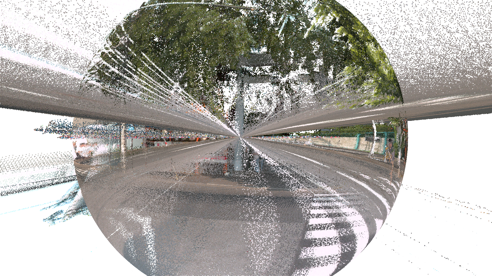
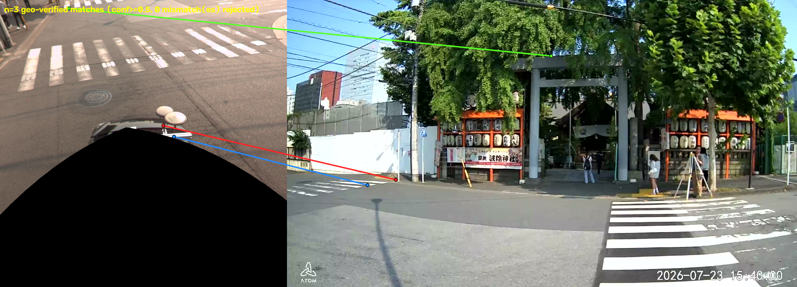
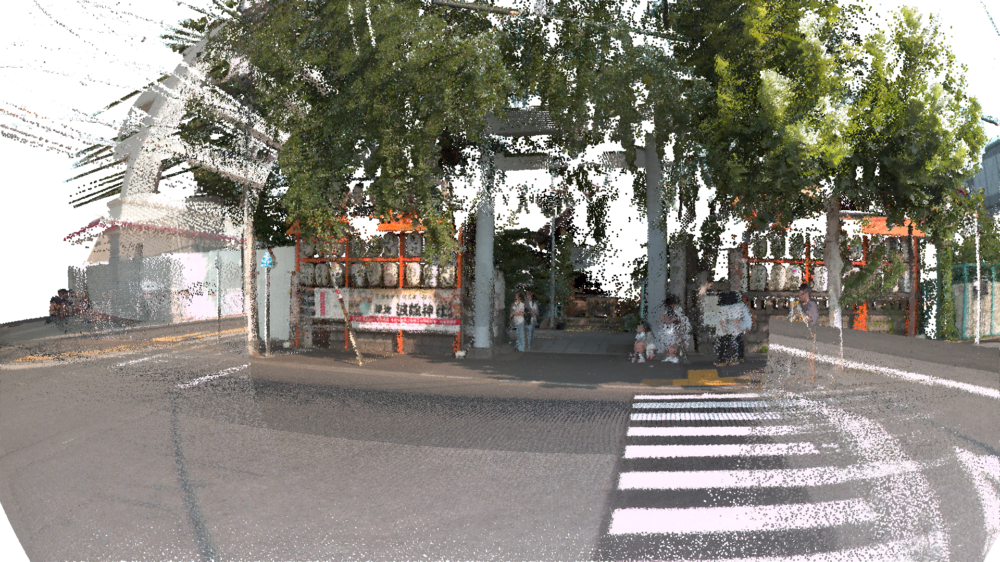
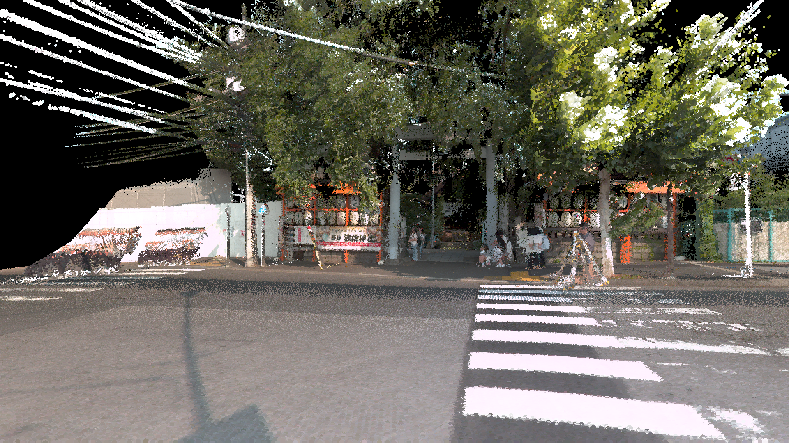
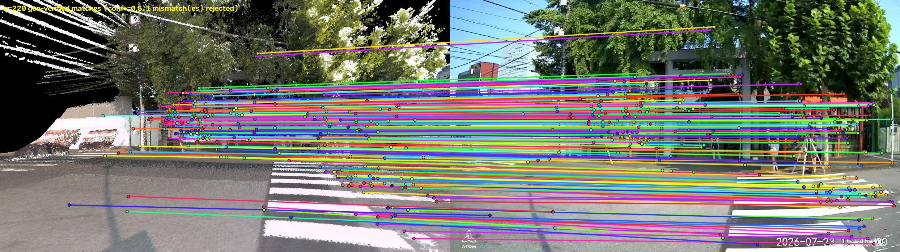
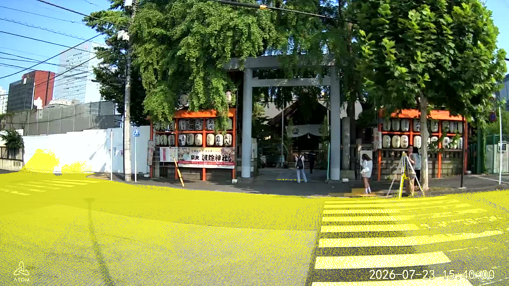
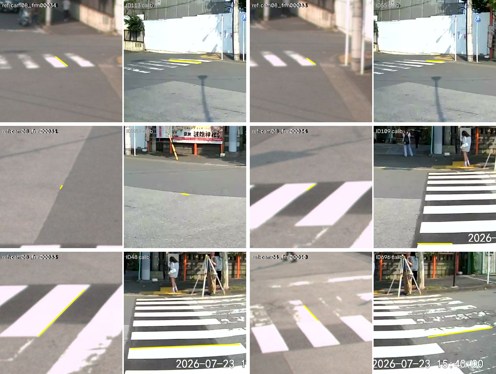
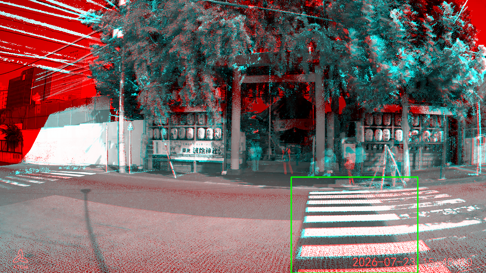
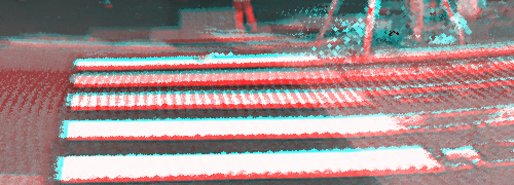
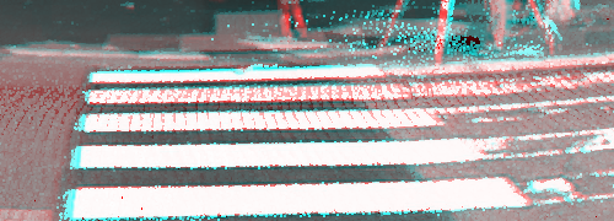

*Lens Calibration — Technical Brief (CCTV)*

# MMS点群による固定防犯カメラ(CCTV)のレンズキャリブレーション

*キャリブレーションボードを使用せずに、MMS(計測車両)由来のLiDAR点群と、位置のみ測量済みの固定防犯カメラの写真1枚から、レンズの歪み・焦点距離・取り付け向きを求める方法を整理した資料です。*


***図1** — 現時点の最良の結果(防犯カメラ`00001.jpg`、写真と**魚眼点群レンダリング**(推定したk1,k2による歪みを適用、実際のレンズの見え方を再現したもの)の交互表示)。鳥居・提灯・横断歩道を含む画角全体がほぼ一致して見える*

この結果で求まったレンズモデルとパラメータは以下の通りです(Stage5終了時点、最終結果。詳細は本文)。

| 項目 | 値 | 説明 |
|---|---|---|
| レンズモデル | 等距離射影(equidistant)ベースの魚眼モデル | θ_d = θ(1 + k1θ² + k2θ⁴ + k3θ⁶ + k4θ⁸)(θ: 入射角、θ_d: 歪みを含めた投影角。k1,k2はStage4までで、k3,k4はStage5の最終フィット(`--free_k34`、既定True)で追加で解く) |
| fx | 1100.22 | 焦点距離(x方向、px) |
| fy | 1092.80 | 焦点距離(y方向、px) |
| cx | 1016.70 | 主点(x座標、px) |
| cy | 544.41 | 主点(y座標、px) |
| k1 | -0.0205 | 歪み係数1 |
| k2 | 0.0722 | 歪み係数2 |
| k3 | -0.1592 | 歪み係数3 |
| k4 | 0.0705 | 歪み係数4 |

## 概要

**目的とダッシュカム版との違い**

目的は、[ダッシュカム版](https://github.com/iwanelab/LensCalibration/blob/main/README.md)(`main`ブランチ)と同じくMMS(Mobile Mapping System)のLiDAR点群を「正確な地図」として使い、カメラのレンズキャリブレーションを行うことです。ただし対象が**固定・非回転の防犯カメラ**であるため、問題の構造がダッシュカムとは大きく異なります。

| | ダッシュカム | 防犯カメラ(本資料) |
|---|---|---|
| カメラの動き | 走行中、フレームごとに位置・向きが変わる | 固定、動かない |
| 求める自由度 | フレームごとの位置・向き(N個)+ 共有のレンズパラメータ | **1組の**回転+レンズパラメータのみ(位置は測量済みで固定) |
| 対象フレーム数 | 較正対象フレーム(例: 10枚) | **1枚**(`00001.jpg`) |
| 対応点の性質 | フレームごとに別々の対応点セット | 全対応点が同一の(R, t)を共有するため、1つのプールにまとめて一括フィットできる |

カメラの位置(`camera_pos`)は現地測量により既知なので、求めるべき自由度は「回転R(3) + 内部パラメータfx,fy,cx,cy,k1,k2(6)」の**計9自由度**のみです(Stage5の最終フィットでは、既定で魚眼歪みの高次項k3,k4も追加で解くため計11自由度になります)。

この作業は、次の5つのStageからなるパイプライン(`run_pipeline.py`)として実装されています。

| Stage | 内容 | 出力先 |
|---|---|---|
| 1 | データセットのロード | `01_dataset/` |
| 2 | データセットと防犯カメラ間の特徴点マッチング | `02_matching/` |
| 3 | 防犯カメラの姿勢推定 | `03_pose/` |
| 4 | 点群レンダリングマッチングによる高精度化(ピンホール投影) | `04_render_refine/` |
| 5 | 線分マッチングによる高精度化 | `05_line_refine/`(最終結果) |

各ステージの出力は`--output_dir`配下の対応するフォルダに保存され、再実行時は既に完了しているステージを自動でスキップします。詳細は[パイプラインの使い方](#パイプラインの使い方)を参照してください。

**各ステージのカメラパラメータは最終結果にどれだけ近づいていたか**

fx,fy,cx,cy,k1,k2,k3,k4・回転をまとめて1つの数値で比較するため、Stage5(最終)の対応点2889点すべてを、各ステージの時点のカメラパラメータで再投影し、Stage5パラメータでの再投影位置との画素差を求めました。Stage3の時点の差を0%、Stage5(差0px、自分自身との比較)を100%として正規化しています。

| Stage | 最終結果との再投影誤差 | 最終結果への近さ |
|---|---|---|
| 3(直接マッチング) | 7.64px(中央値6.07px) | **0%**(基準点) |
| 4(ピンホールレンダリングマッチング) | 0.84px(中央値0.71px) | **約89%** |
| 5(線分マッチング、最終) | 0px | **100%** |

Stage3→4の1回のレンダリングマッチング精密化だけで、カメラパラメータは最終結果の**約9割**まで到達しており、Stage5(線分マッチング)は残り1割の微調整(特にk3,k4の導入)を担っていることが分かります。

---

## Stage 1 — データセットのロード

**参照点群・参照画像姿勢のパース**

MMSから得られたCOLMAP形式の参照データセット(`cameras.txt` / `images.txt` / `points3D.txt`)をパースし、以降のステージで使う numpy 形式(`cameras.npy` / `images.npy` / `points_xyz.npy` / `points_rgb.npy`)に変換します。ダッシュカム版と全く同じ参照データセット形式・同じパース処理(`calibration_lib.py`の`parse_dataset`)を再利用しています。

---

## Stage 2 — データセットと防犯カメラ間の特徴点マッチング

**参照画像703枚 × 防犯カメラ写真1枚の総当たりマッチング**

防犯カメラの写真(`00001.jpg`、1枚のみ)を、参照データセット内の全参照画像(703枚)それぞれとALIKED/LightGlueでマッチングします。防犯カメラは1枚しかないため、ダッシュカムのように「時系列で近い参照画像に絞る」といった絞り込みができず、703枚全件との総当たりになります。

**「geo-verified」とは**: ログや図中に頻出する「raw → conf-kept → geo-verified」は、1組の画像ペアに対する対応点の絞り込み段階を表します。

1. `raw` — ALIKED/LightGlueが検出した生の対応点
2. `conf-kept` — LightGlueのマッチング信頼度が閾値(`--conf`、既定0.5)以上のもの
3. `geo-verified` — さらに、2視点間のエピポーラ拘束(基礎行列)をRANSACでフィットし、その内点(inlier)と判定されたもの(`geometric_filter`、`cv2.findFundamentalMat`+`FM_RANSAC`、許容再投影誤差`--ransac_thresh`既定4.0px、点数が8点未満のペアはRANSACを行わず全件通過)

つまり「geo-verified」は、信頼度だけでなく**2画像間の幾何的な整合性(同じ3次元シーンを異なる視点から見た場合に成り立つべき関係)まで検証を通過した対応点**を指します。ただし[後述の通り](#誤マッチペアの発見と対策)、1ペアあたりのgeo-verified対応点数が少なすぎる場合は、RANSAC自体がたまたま整合する誤対応を通してしまい、この検証だけでは誤マッチを防ぎきれないことが分かっています。


***図8** — 703枚中もっともgeo-verified対応点数が多かったペア(`cam07_frm00026` vs `00001.jpg`、n=82、31件をmismatchとして棄却)。左=参照画像側、右=防犯カメラ側。鳥居・提灯・横断歩道を含む同じシーンが撮影されており、対応線は概ね妥当な位置を結んでいる*

---

## Stage 3 — 防犯カメラの姿勢推定

**全対応点を1つのプールにまとめて一括フィット**

Stage2で得られた対応点(参照画像側の2Dピクセル)に、Stage1の点群からz-bufferで3次元座標を割り当て(`lookup_correspondences`)、703枚ぶんの対応点を**フレーム分けせず1つのプールに合流**させて、1回のLM(Levenberg-Marquardt)フィットで回転+内部パラメータを解きます(`fit_static_camera_pose`)。カメラが動かないため、ダッシュカムのように「フレームごとに別のposeを求める」制約がなく、全対応点を対等に使えます。

### 誤マッチペアの発見と対策

この一括フィットを行ったところ、当初k2が-0.93という物理的にあり得ない値に発散し、レンダリング結果が下図のように「鏡面球」状に破綻しました。



***図2** — 誤マッチ対策前の**魚眼点群レンダリング**(k1=0.137, k2=-0.9255をそのまま適用)。周辺部の点群が球状に折り返って中央に写り込み、実写とは似ても似つかない結果になっている*

**原因の切り分け**: 当初は「周辺部(画像端)のデータが少ないせいでk1,k2という2パラメータ多項式が不安定になる」と推測し、`--max_fit_radius_px`(周辺除外)や`--k_bound`(k1,k2に上限を設ける)を試しましたが、いずれも改善しませんでした(除外はむしろk2をさらに悪化させ、boundsは境界値に張り付くだけでレンダリングの破綻自体は解消しなかった)。

`02_matching/vis/`の個別マッチング結果を目視確認したところ、**1ペアあたりのgeo-verified対応点数が20未満のペアは、幾何検証(RANSAC)を通過していてもほぼ全て誤マッチ**であることが判明しました。下図はその一例で、n=3の「合格」対応点がありますが、線で結ばれた2点は明らかに違う場所を指しています(点数が少ないRANSACは、たまたま整合する誤対応を通しやすい)。



***図3** — `02_matching/vis`の実例(`cam00_frm00000` vs `00001.jpg`)。「n=3 geo-verified matches」と表示されているが、緑・赤・青の対応線はいずれも明後日の方向を指しており、幾何検証を通過していても内容的には誤マッチであることが分かる*

実際に集計すると、全487ペア中395ペア(81%)が20件未満で、そこに含まれる点数は全体の約26%を占めていました。**誤対応がプールに混入すると、それを無理やり矛盾なく説明しようとしてk1,k2が暴走する**、というのが根本原因でした(モデルの不安定性ではなく、データそのものの質の問題)。

**対策**: `fit_static_camera_pose`に`min_pair_matches`引数を追加し、同一参照フレームからのgeo-verified対応点がこの件数未満のペアを、フィットから完全に除外するようにしました(既定20)。

| | 対策前(全点使用) | **対策後(`--min_pair_matches 20`)** |
|---|---|---|
| k1, k2 | 0.1295, **-0.9054** | 0.0832, **-0.1505**(物理的に妥当) |
| フィット集合のRMS | 552.4px | **132.2px** |
| 15px以内の割合 | 60.6% | **80.0%** |
| レンダリング | 破綻(図2) | 正常(図4) |



***図4** — 誤マッチ対策後(`--min_pair_matches 20`)の**魚眼点群レンダリング**(Stage3で推定したk1,k2による歪みをそのまま適用し、防犯カメラの実際のレンズが写す見え方を点群上で再現したもの)。鳥居・提灯・横断歩道・道路がすべて正しい位置に自然に投影されている。

---

## Stage 4 — 点群レンダリングマッチングによる高精度化(ピンホール投影)

**視差ゼロでのマッチングによる精密化**

Stage3の直接マッチング(参照画像とはまるで異なる視点からの防犯カメラ写真を直接マッチングする)は視差が大きく、対応点の精度に限界があります。そこで、Stage3で求めた姿勢・内部パラメータを使って点群を防犯カメラとほぼ同じ視点で**ピンホール点群レンダリング**(`pinhole=True`、レンズ歪みk1,k2を無視した歪みなし投影)し、そのレンダリング画像を実写とマッチングします。あえて歪みを無視するのは、Stage4開始時点ではまだ不正確かもしれないk1,k2の初期値に引きずられて画像端が折り返る、といった不具合を避けるためです(歪みなしにする分、焦点距離を`--pinhole_render_fx_scale`(既定0.7)で縮小して画角を合わせています)。視点がほぼ一致するため視差が小さく、マッチングがずっと安定します。レンダリングした各ピクセルは「どの点群点から来たか」を厳密に記録しているため、z-bufferの近傍探索より正確な3次元座標を対応点に割り当てられます。



***図9** — **ピンホール点群レンダリング**の結果(`04_render_refine/render_it2.png`、反復3回目時点)。鳥居・提灯・横断歩道が実写とほぼ同じ構図で再現されている。図4(魚眼点群レンダリング、歪みあり)とは投影方式が異なる点に注意*



***図10** — 上記レンダリング画像(左)と防犯カメラ写真(右)をALIKED/LightGlueでマッチングした結果(`04_render_refine/match_vis_it2.png`、n=220 geo-verified matches)。視差がほぼゼロなため、Stage2(図8、n=82)より大幅に多い対応点が安定して得られている*

この過程を反復し(既定5回)、毎回のレンダリング→マッチング→再フィットで姿勢・内部パラメータを更新します。実際の実行では以下のように収束しました。

| 指標 | Stage3(直接マッチング) | **Stage4(レンダリングマッチング後)** |
|---|---|---|
| k1, k2 | 0.0832, -0.1505 | **0.0145, -0.0476**(より典型的な魚眼レンズ値) |
| フィット集合のRMS | 132.2px | **7.1px** |
| 15px以内の割合 | 80.0% | **97.0%** |

各反復の対応点数が3件未満、またはその反復のk1,k2が物理的にあり得ない値(|k1|または|k2| > 0.5)になった場合は、その反復の結果を破棄して直前の姿勢・内部パラメータのまま停止する安全装置が入っています。

---

## Stage 5 — 線分マッチングによる高精度化

**アパーチャ問題への対策: 3D直線としてのマッチング**

横断歩道の縞のような互いに平行な線分は、ALIKED/LightGlueが苦手とする**アパーチャ問題**(線分に沿った方向の位置がどこでも同じように見えてしまう)の影響を受けやすく、Stage2・Stage4の記述子マッチングでは対応点がほとんど得られません。Stage5では画角全体(路面点群と重なる参照画像を分け隔てなく全件)を対象に、線分同士を直接3D直線としてマッチングします(`match_3d_lines_typed_region`)。**建物や樹木は対象にせず、路面(道路・横断歩道)に限定した処理**である点がStage2〜4までとの大きな違いです。



***図11** — 路面点群(黄色)と防犯カメラ写真のオーバーレイ。道路・横断歩道の範囲にのみ点群が存在しており、Stage5の線分マッチングが路面に特化した処理であることが分かる*

処理の流れは以下の通りです。

1. **検出・統合**: 参照画像・実写画像それぞれで古典的な線分検出(LSD)を行い、バラバラな短い線分を、3D化したときの距離(既定0.05m以内)で同一直線とみなせるものだけ1本に統合する。2D画素上の隙間ではなく3D距離で統合するのは、2Dでは近く見えても実際には無関係な線分(ひび割れ・汚れなど)を誤って繋いでしまうことがあったため。
2. **種別分類**: 統合した各直線を、線分近傍の実画素値(明るさ・コントラスト)から`paint`(白色塗装との境界)/`other`(舗装補修痕などアスファルト同士の境界)に分類する。傾き等のジオメトリではなく物性由来の分類なので、参照画像・実写側のどちらで見ても同じ実世界の線は同じ分類になる。
3. **マッチング**: 参照画像側の直線と実写側の直線を、(a)種別が一致、(b)方向ベクトルの角度差が既定15°以内、(c)3D長さの差が既定0.30m以内、(d)**重心間距離**(=一方をどれだけ平行移動すればもう一方とほぼ重なるか)が既定0.20m以内、の4条件をすべて満たすものだけを候補とし、`scipy.optimize.linear_sum_assignment`(ハンガリー法、参照画像1枚ごとに独立実行)で1対1割り当てを行う。最良候補が次点候補より十分に優れていない(僅差の)場合は、どちらが正しいか自信が持てないため採用しない(`ambiguity_ratio`、既定0.7)。

実際にどの線分同士がマッチしたかは、`05_line_refine/line_intersection_vis/`に、参照画像・実写画像を左右に並べた画像やCSV・レビュー用HTML(`<region>_matches.csv`、`<region>_review.html`)として出力されます。



***図14** — `a_review.html`のマッチング結果から、防犯カメラ画像上の位置が異なる6件を抜粋したコラージュ(各ペア左=参照画像側、右=防犯カメラ側、黄色線がマッチした線分)。参照画像は`cam04`・`cam08`など複数の異なるカメラ・フレームにまたがっており、横断歩道の様々な縞・様々な位置がそれぞれ独立に対応付けられていることが分かる*

**Stage5前後での横断歩道の見え方の変化**: 防犯カメラ写真(赤チャンネル)と点群レンダリング(シアンチャンネル)を重ね合わせ、ズレを色の縁取りとして可視化しました(重なっていれば白、ズレていれば赤/シアンの縁取りが出ます)。緑枠が下記の拡大範囲です。



***図12(全体像)** — Stage5適用前(Stage4まで)の全体像。緑枠が図12の拡大範囲。横断歩道以外(建物・樹木など、路面点群の対象外の部分)にも赤/シアンのズレが見えるが、これはStage5(路面専用の線分マッチング)では改善されない箇所*



***図12** — 図12(全体像)の緑枠部分を拡大。横断歩道の縞の輪郭に沿って、上側がシアン・下側が赤という一貫したズレが縞ごとに見える*


***図13(全体像)** — Stage5適用後(最終結果)の全体像。図12(全体像)と同じ緑枠。横断歩道内は改善しているが、建物・樹木側の赤/シアンのズレはStage5の対象外のためほぼ変化していない*



***図13** — 図13(全体像)の緑枠部分を拡大。同じ場所の縞の輪郭のズレがほぼ解消され、白く一致して見える範囲が大幅に広がっている*

### 重要な発見: 「線分同士の最短点間距離」では誤マッチを見抜けない

線分マッチングの精度検証を進める中で、上記(d)の距離判定に当初使っていた「線分同士の最短点間距離」(`_seg_seg_dist_3d`)には見落としがあることが分かりました。方向が揃っていて、片方が短い線分だと、その端点がもう片方の(無関係な)長い線分の端点にたまたま近いだけで「一致」と判定されてしまうケースがありました。

実例(`output_pipeline_best`の実データより、`cam09_frm00031`の参照線分): 参照線分(長さ0.94m)と実写側の線分(長さ0.86m、方向の角度差2.8°)は、最短点間距離ではわずか0.086mでしたが、**重心間距離では1.01m**も離れていました。方向がほぼ揃っているために最短点間距離だけでは「一致」に見えてしまいますが、線分の主要部分同士は1m以上離れた全く別の場所にありました。

**対策**: 判定基準を最短点間距離から、**重心間距離**(一方を平行移動してもう一方に重ねるのに必要な移動量)に変更しました。これにより、方向は合っているが実際には別々の場所にある線分同士を正しく区別できるようになりました。

同様に、線分の種別分類(`paint`/`other`)についても、明るさの閾値が緩すぎて、明るめの舗装補修痕(白塗装ほど明るくないが閾値は超える)が`paint`に誤分類されるケースが見つかり、実測分布(真の白塗装はbright中央値250・contrast中央値92、その他は95%点でもbright=242・contrast=74.4)に基づいて閾値を引き上げて修正しました。

---

## パイプラインの使い方

```powershell
python run_pipeline.py `
  --dataset_dir "<参照データセットのディレクトリ(COLMAP形式)>" `
  --calib_target_dir "<防犯カメラのjpgsフォルダ>" `
  --camera_pos <X> <Y> <Z> `
  --calib_target_frames "00001" `
  --output_dir "<出力ディレクトリ>"
```

`--init_forward`・`--seed_intrinsics`のような初期値の指定は不要です。Stage4はStage3が実際にフィットした回転・内部パラメータを、Stage5はStage4の結果をそのまま自動で引き継ぎます。

**中断・再開**: 各ステージの完了時に状態ファイル(`static_pose_fit_FINAL.npy`、`state_FINAL.json`など)が`--output_dir`配下に書き出されます。同じ`--output_dir`で再実行すると、既に完了しているステージは自動でスキップされ、続きから再開します。`--force_from_stage {1,2,3,4,5}`を指定すると、そのステージ番号以降を(既存の出力があっても)強制的にやり直せます(それより前のステージはキャッシュを再利用)。

### 主なコマンドライン引数

| 引数 | 既定値 | 説明 |
|---|---|---|
| `--dataset_dir` | 必須 | 参照データセット(COLMAP形式)のディレクトリ |
| `--calib_target_dir` | 必須 | 防犯カメラのjpgsフォルダ |
| `--camera_pos` | 必須 | 測量済みの防犯カメラ位置 X Y Z |
| `--calib_target_frames` | 必須 | Stage2/3で使うフレームID(カンマ区切り)。Stage4/5は先頭のフレームのみ使用(現状1フレームのみ対応) |
| `--output_dir` | 必須 | 出力ディレクトリ |
| `--force_from_stage` | 自動判定 | 指定したステージ番号以降を強制的にやり直す |
| `--min_pair_matches` | 20 | Stage3で、同一参照フレームからのgeo-verified対応点がこの数未満のペアを除外(実証済みの値、[該当節](#誤マッチペアの発見と対策)参照) |
| `--max_fit_radius_px` | なし | 非推奨(実測で逆効果と判明、詳細は同節) |
| `--k_bound` | なし | 非推奨(実測で効果不十分と判明、詳細は同節) |
| `--iterations` | 5 | Stage4のレンダリング反復回数 |
| `--use_line_endpoints` | OFF | Stage4に線分端点マッチングを追加する |
| `--line_intersection_min_new_points` | 3 | Stage5で、新規対応点がこの件数未満なら再フィットをスキップ |
| `--line_intersection_weight` | 4.0 | Stage5の線分マッチング対応点の重み(weight=1〜1000の実測スイープでweight=4〜8付近が最良と判明) |
| `--line3d_angle_tol_deg` | 15.0 | Stage5で3D直線同士を同一とみなす方向ベクトルの角度差の上限 |
| `--line3d_dist_tol_m` | 0.20 | Stage5で3D直線同士を同一とみなす重心間距離の上限(旧既定0.60mは横断歩道の白線間隔に対して緩すぎ、無関係な白線に誤って対応付けてしまうことが実測で判明したため引き下げ) |
| `--exclude_ref_camera_ids` | なし | Stage5の線分マッチング参照画像候補から除外したいCOLMAPカメラID(誤マッチングが多い等の理由で特定カメラを丸ごと除外したい場合) |
| `--free_k34` | True | Stage5の最終フィットで、魚眼歪みの高次項k3,k4もfx,fy,cx,cy,k1,k2と一緒に自由パラメータとして解く。Stage4までの反復ループはk3,k4を0固定のまま |

*Security camera (CCTV) lens calibration — from-scratch pipeline with automatic stage-to-stage seeding brief*
