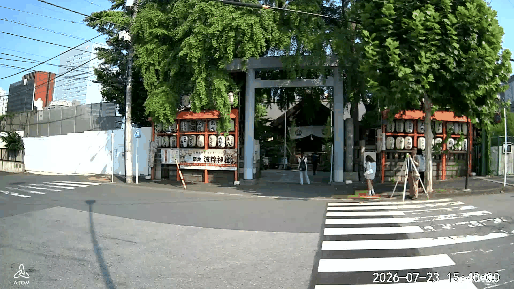
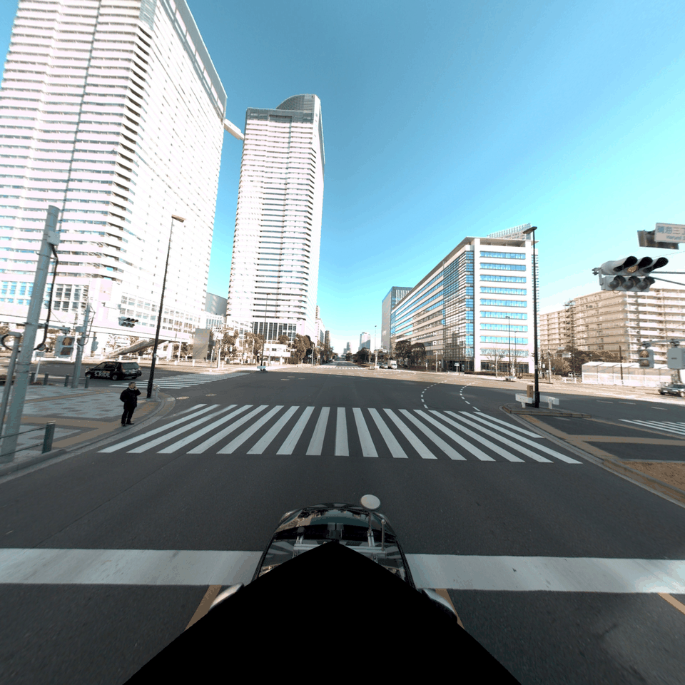
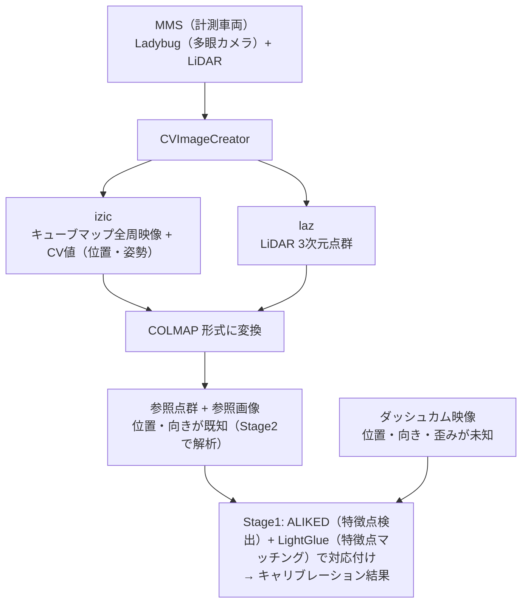
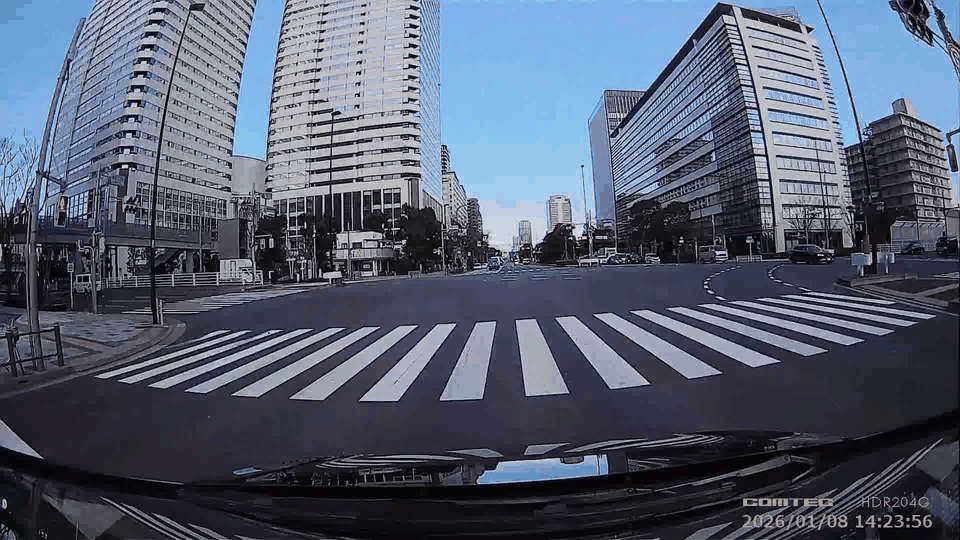
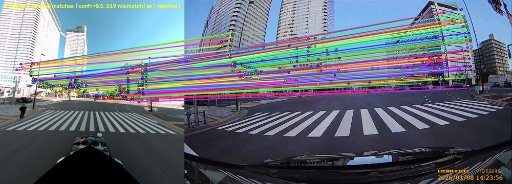
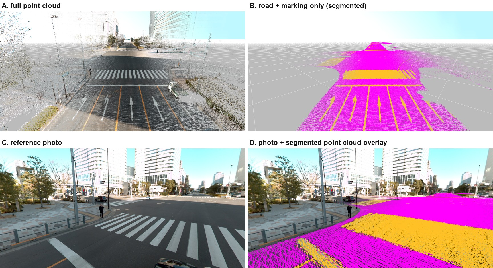
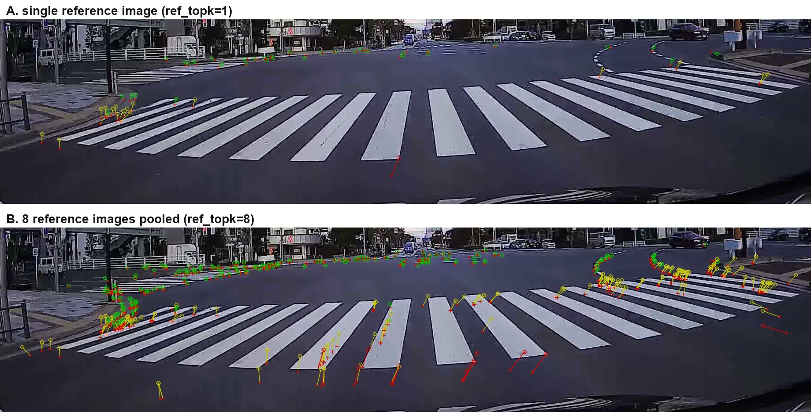
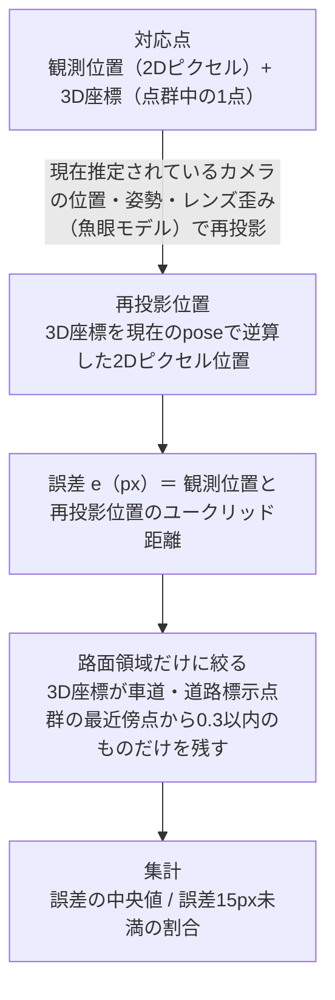
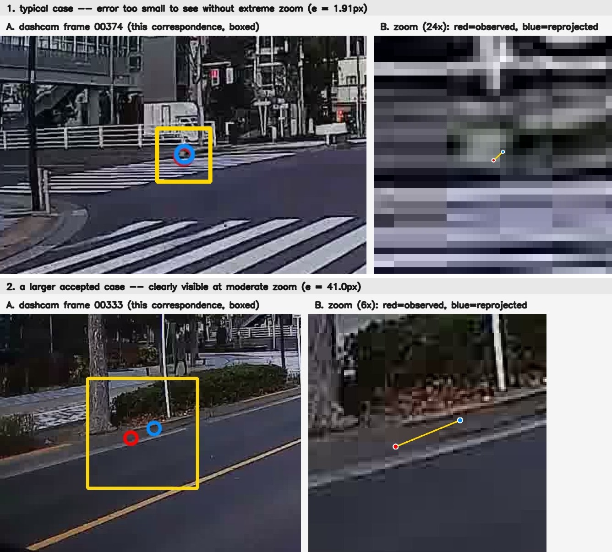

*Lens Calibration — Technical Brief*

# MMS全周映像・LiDAR点群による ダッシュカムのレンズキャリブレーション

*キャリブレーションボードを使用せずにMMS全周映像とLiDAR点群を使用してダッシュカム(コムテック ドライブレコーダー HDR204G)のレンズキャリブレーションを行う方法を整理した資料です。*



***図1** — 現時点の最良の結果（frame 00374、写真と点群レンダリングの交互表示）。横断歩道を含む路面全体がほぼ一致して見える*

この結果で求まったレンズモデルとパラメータは以下の通りです。

| 項目 | 値 | 説明 |
|---|---|---|
| レンズモデル | 等距離射影(equidistant)ベースの魚眼モデル | θ_d = θ(1 + k1θ² + k2θ⁴)（θ: 入射角、θ_d: 歪みを含めた投影角。動径方向2次の歪み係数k1・k2のみで、接線方向の歪みは扱わない） |
| fx | 909.46 | 焦点距離(x方向、px) |
| fy | 909.34 | 焦点距離(y方向、px) |
| cx | 976.38 | 主点(x座標、px) |
| cy | 522.55 | 主点(y座標、px) |
| k1 | -0.05998 | 歪み係数1 |
| k2 | -0.01921 | 歪み係数2 |

## 概要

**目的とパイプライン全体の構成**

目的は、**MMS**(Mobile Mapping System、計測車両)で取得した全周映像と**LiDAR**点群を使用して、ドライブレコーダー(ダッシュカム)のレンズキャリブレーション(レンズの歪み・焦点距離などの内部特性と、取り付け位置・向きを求めること)を行うことです。

この作業は、次の9つのStageからなる一連のパイプラインとして実装されています。以降の章では、このStage番号の順に内容を説明します。

| Stage | 内容 |
|---|---|
| 1 | マッチング (ALIKED / LightGlue) |
| 2 | 参照データセット解析 |
| 3 | 対応点ルックアップ (z-buffer) |
| 4 | 初期姿勢推定 (per-frame pose init) |
| 5 | 一括バンドル調整 (joint bundle adjustment) |
| 6 | 線分交点による補正 (LineMatch) |
| 7 | 誘導マッチングによる補正 |
| 8 | 路面点群クロス検証マッチング |
| 9 | レンダリング |

***図2** — パイプライン全体のStage構成*

補足: このStage番号は実装の整理に伴って今後も変わり得るため、コード側では番号ではなく`LineMatch`・`RoadCrossval`のような名前で各Stageを参照するようにしています。

---

## Stage 1 — マッチング (ALIKED / LightGlue)

**ALIKED と LightGlue による対応付け**

ダッシュカムの各フレームと参照画像それぞれから、**ALIKED**という手法で「特徴点」(角や模様の交点など、画像内で識別しやすい点)を検出します。次に**LightGlue**という手法で、2枚の画像間で同じ場所を写している特徴点同士を対応付けます。対象は参照画像**全件**(数百枚、参照データの詳細はStage2)で、多数の画像を効率よく処理するための標準的な設定(解像度・検出感度とも既定値)を使います。

対応付いた点は、参照点群側では3次元座標が分かっているため(Stage3で3次元座標を割り当てます)、「3次元座標 ↔ ダッシュカム画像上の2次元位置」の組が数千組集まります。この組を使って、Stage4・Stage5でダッシュカムの位置・向き・レンズの歪みを最適化計算によって求めます。

---

## Stage 2 — 参照データセット解析

**「正確な地図」としての参照データ**

MMSは**Ladybug**(全方位を一度に撮影する多眼カメラ)とLiDAR(レーザー光で周囲の形状を計測するセンサー)を搭載した計測車両で、これによって位置が既知の参照データを事前に取得しておきます。このデータを**CVImageCreator**に与え、キューブマップ化された全周映像と各フレームのカメラ位置・姿勢(CV値)を含む**izic**ファイル、およびLiDARによる3次元点群の**laz**ファイルが得られます。この izic と laz を**COLMAP**形式に変換したものが、Stage1で使われた参照データです。**COLMAP**は、複数の画像から3次元形状やカメラ位置を復元するStructure-from-Motion(SfM)ツールとして広く使われているオープンソースソフトウェアで、カメラパラメータ・各画像の位置姿勢・3次元点群をテキストファイル(cameras.txt / images.txt / points3D.txtなど)で表現する標準的なフォーマットとしても使われています。本パイプラインではこのCOLMAP形式を**データの受け渡し形式**として使っているだけで、COLMAP自体によるマッチング・SfM計算は行っていません(位置・姿勢・点群はすべてCVImageCreatorから得られた値です)。

つまり参照点群はLiDARによる直接計測から得られたものであり、参照画像の位置・姿勢も、画像同士のマッチングによる復元ではなく、計測時点で既に分かっている値(CV値)をそのまま使っています。この「正確な地図(参照点群+参照画像)」に対して、Stage1以降で「位置が分かっていないダッシュカムの映像」を重ね合わせ、位置・向き・レンズ特性を逆算していくことになります。

参照データ自身の精度を確認しておきます。下図は、参照画像(cam00_frm00233)に、同じ参照データの点群を、その画像自身の(MMSの直接計測による、推定を一切介さない)既知の位置・姿勢だけで再投影し、実際の写真と交互に表示して比較したものです。ダッシュカムの位置推定は一切関与していません。



***図3** — 参照画像(cam00_frm00233)に、参照データ自身の位置・姿勢(MMSの直接計測、推定なし)だけを使って点群を再投影し、写真と交互に表示して比較したもの。建物の輪郭・窓の格子・横断歩道の縞模様まで、目立ったズレなく重なっている*

点群・画像の位置姿勢がいずれも同一のMMS計測からそのまま得られた値であるため、この一致度は「推定の正しさ」ではなく「参照データそのものの内部整合性」を表しています。この精度が、Stage1以降でダッシュカムの位置・向き・レンズ特性を逆算する際の「正確な地図」としての土台になります。



***図4** — 参照データとダッシュカム映像を対応付ける全体の流れ*

---

## Stage 3 — 対応点ルックアップ (z-buffer)

**2次元の対応点に3次元座標を割り当てる**

Stage1で見つかった対応点(参照画像側の2Dピクセル)に、3次元座標を割り当てるステージです。参照画像を撮影したカメラの位置・姿勢(既知)を使って点群の全点をその参照画像に再投影し、同じピクセルに複数の点が重なる場合はカメラに最も近い(奥に隠れていない)点だけを残す**z-buffer**を構築します。対応点のピクセル位置の近傍でz-bufferが埋まっている最も近い点を探し、その1点をそのまま3次元座標として採用します。

補足: 割り当てられる3次元座標は、点群中に実在する1点そのものであり、複数点の平均や補間によって新しく作られた点ではありません。

---

## Stage 4 — 初期姿勢推定 (per-frame pose init)

**フレームごとのおおまかな位置・向きを求める**

Stage3で3次元座標が付いた対応点を使い、ダッシュカムの各フレームについて個別に、カメラの位置・向きのおおまかな初期値を求めます。これは次のStage5(全フレームをまとめて最適化する一括バンドル調整)の出発点として使われます。

---

## Stage 5 — 一括バンドル調整 (joint bundle adjustment)

**遠方の誤差は少ないが、路面付近の誤差が大きい**

Stage4の初期値を出発点に、全フレームの対応点をまとめて使い、ダッシュカムの位置・向き・レンズの歪みを一括で最適化します。しかし、建物など遠くの被写体は高精度に位置合わせできる一方、車両直近の路面や道路標示ではズレが大きく残りました。



***図5** — 実際の比較（写真と点群レンダリングを交互に表示、frame 00374）。奥の建物群はほぼ一致して見える一方、手前の横断歩道にはっきりとしたズレが見える*

根本の原因は、**特徴点マッチングが遠方の建物などにしかほとんど現れなかった**ことです。ALIKEDは検出感度や解像度の設定次第で路面にも特徴点を出せますが、Stage1の標準的な設定では、コントラストの強い建物の角などが優先的に検出され、テクスチャ（模様・凹凸）に乏しい路面の特徴点は結果的にほとんど埋もれてしまいます。加えて、破線や白線のような繰り返しパターンは線のどの位置を見ても同じように見えてしまう（**アパーチャ問題**）ため、たとえ特徴点が出ても本来対応するべき箇所ではなく隣の破線に誤ってマッチングしやすく、信頼できる対応点として使えません。



***図6** — 実際のStage1マッチング結果(標準設定のALIKED/LightGlue、frame 00374と最も近い参照画像)。緑・水色などの対応点はすべて奥の建物に集中しており、手前の横断歩道(両画像とも高コントラストで写っている)には1点も対応点が出ていない*

その結果、カメラの位置・向き・レンズの歪みを求める最適化は、事実上**遠方のデータだけ**に基づいて行われることになります。近傍（路面）の幾何を拘束するデータがほとんど無いまま、遠方に最適化されたカメラモデルがそのまま近傍にも適用される形になり、モデルにわずかな誤差が残っていても、それが近傍では画像上のズレとして大きく増幅されて現れます（同じ位置誤差でも、近い対象ほど画像上の見た目のズレが大きくなるため）。つまり近傍の精度を意図的に犠牲にしているわけではなく、**近傍を拘束する材料が最初から無かった**ために、遠方優先の最適化結果がそのまま近傍の誤差として表面化した、というのが実態です。

> **課題**
>
> 路面付近の精度向上が課題として残りました。この課題にStage6〜8で取り組みます。

---

## Stage 6 — 線分交点による補正 (LineMatch)

**線分の交点を使ったギャップ埋め**

Stage5までの結果でまだ対応点が無い領域を、古典的な線分検出(LSD)を使って補うステージです。線分同士の交点は、線分そのもの(アパーチャ問題の影響を受けやすい)と違って位置が一意に定まるため、参照画像側の交点をStage5までの姿勢で再投影し、ダッシュカム画像側で実際に検出された交点がその近くにあれば対応点として採用します。参照画像・ダッシュカム画像の両方に対してLSDを新たに実行するという意味で、Stage1(ALIKED/LightGlue)とは完全に独立した特徴抽出です(Stage1の結果は「まだ対応点が無い領域はどこか」を判定するためだけに使われます)。建物の角のような交点では高精度に機能しますが、横断歩道のような路面標示が作る交点は依然としてマッチングの手がかりとしては弱く、路面付近の精度改善という点ではStage8ほど信頼できません。

当初は、この交点情報が最適化計算で無視されるリスクを避けるため、LineMatchの対応点だけ通常より大きな重み(`--line_match_weight`)を与えて強制的に採用させていました。しかし実際に計測すると、LineMatch自身が見つけた対応点は、建物領域では1〜3px程度の誤差に収まる一方、路面領域では7〜15px程度の誤差を持つことが分かりました。強制的な重み付けは、この路面領域での低い精度をそのまま最適化計算に持ち込んでしまい、結果的に精度を悪化させていました。この計測結果を受けて、既定値は`--line_match_weight 1.0`(通常の対応点と同じ重みで公平に競わせる)に変更しています。

### LineMatchは路面に寄与しないのに、なぜ有用なのか

LineMatchが追加する対応点は建物の角などに集中しており、実際に調べると路面領域には1点も追加されません(路面点群から一定距離以内という採用条件に該当する新規点はゼロでした)。それでも、LineMatchを含めてカメラモデル全体(fx, fy, cx, cy, k1, k2 + 各フレームのpose)を再フィットすると、路面領域の精度が改善します。

| | 路面領域の対応点(n) | 誤差の中央値 |
|---|---|---|
| Stage5(LineMatch前) | 138 | 9.65px |
| Stage6(LineMatch後、同じ138点を再評価) | 138 | **6.22px** |

対応点の集合自体はStage5からStage6で変わっていません(同じ138点)。カメラモデルは画像全体で共有される1つのモデルなので、建物の角という路面とは無関係な領域の対応点で全体のフィットが改善されれば、その恩恵は(内容が変わっていない)路面領域の再投影精度にも及ぶ、ということです。

> **さらに確認: Stage8への波及効果**
>
> LineMatchを完全に無効化した場合(`--skip_line_match`)と既定設定を比較すると、最終的なStage8(路面点群クロス検証マッチング)の結果にも明確な差が出ます。
>
> | | LineMatchあり(既定) | LineMatchなし |
> |---|---|---|
> | 路面領域の対応点数 | 7,670 | 4,466 |
> | 誤差の中央値 | 2.64px | 3.12px |
>
> 興味深いのはこの差の原因です。Stage8は毎回ゼロから独立にマッチングをやり直すため、LineMatchの有無はStage8自身の候補生成に直接関係しません。実際、同じ参照画像を使ったペアでは、Step1(独立マッチング)・Step2(路面点群との重なり判定)の候補数は完全に一致します(例: frame 00001とcam00_frm00018のペアはどちらも1,210独立マッチ・126件が路面点群と重なる、で同一)。差が出るのはStep4(位置情報からの逆算との一致確認)の採用率だけで、LineMatchなしでは104件→81件のように2〜3割少なくなります。これは、LineMatchによって改善されたposeの精度が、Step3の予測位置の正確さを通じてStep4の合否判定に影響しているためです。

つまりLineMatchの価値は「路面に対応点を追加すること」ではなく、「画像全体のposeとレンズパラメータの精度を底上げし、それが最終的な路面領域の検証精度にも波及すること」にあります。

---

## Stage 7 — 誘導マッチングによる補正

**予測位置周辺の局所探索によるギャップ埋め**

Stage6と同様にギャップ埋めを行う補正ステージですが、線分交点ではなく、参照画像側の特徴点を現在の姿勢で予測位置に再投影し、その周辺の狭い範囲で正規化相互相関(NCC)により対応箇所を探します。ピークが一意に定まらない(周辺と区別できない)候補は棄却します。Stage6と同じ理由で、建物領域では有効ですが、路面領域では精度が十分でない場合があります。

Stage6と同様の理由で、当初は誘導マッチングの対応点も重み付けにより強制的に採用していましたが、実測したところ路面領域では22〜95px相当の誤差を持つ対応点が含まれていることが分かりました。局所的なNCC探索は建物のような明瞭なテクスチャでは機能しますが、路面のような繰り返しパターンでは十分な精度が得られないためです。このため、既定値では`--skip_guided_matching`により本ステージを実行しないようにしています(`--no-skip_guided_matching`で有効化可能)。

---

## Stage 8 — 路面点群クロス検証マッチング

**点群を分類し、車道・道路標示だけを抽出する**

参照データにはLiDARによる高密度な点群があり、しかもこの点群自体は道路上も含めシーン全体を密に覆っています。**つまり、点群の密度不足が原因ではありません。**Stage1・Stage6(LineMatch)・Stage7(誘導マッチングによる補正)も同じこの**フルの点群**を使って2次元の対応点に3次元座標を与えていますが、これらはいずれも「見た目に基づいて対応点を探す」という汎用的な手法である点で共通しています。Stage5で述べた通り、この種の手法はコントラストの高い建物などに対応点が偏りやすい構造的な性質を持つため、路面付近の精度を高めるには、汎用的な対応点探索そのものを改善するのではなく、**路面だけを狙って対応点を検証する専用の仕組み**が別途必要になります。

> **なぜフルの点群では実現できないのか**
>
> フルの点群は建物・車道・車・木など**あらゆるものを区別なく**含んでいます。ある対応点の参照画像側ピクセルの近くに「何らかの3次元点がある」ことを確認しても、それが車道の点なのか、たまたま近くに写り込んだ建物や車の点なのかは分かりません。実写真ではほぼどのピクセルの近くにも何かしらの3次元点があるため、この確認は事実上ほとんど絞り込みになっておらず、結果的にALIKEDが最も出やすい建物にマッチングが偏る、という元々の傾向をそのまま追認してしまいます。

下図は、特徴点マッチングの結果ではなく、**点群そのもの**を可視化したものです。上段は点群を3次元的に表示したもの、下段は参照画像を撮影したカメラの位置・向き(既知)を使って、点群を参照画像に重ねて描画したものです。



***図7** — 点群(LiDARの3次元点、実データ)。上段: 点群を3次元表示したもの(A: フルの点群、B: セマンティックセグメンテーションで車道[マゼンタ]・道路標示[オレンジ]だけを抽出した点群)。下段: 同じ抽出済み点群を実際の参照画像に重ねた例(C: 元の参照画像、D: 車道・道路標示点群をオーバーレイ)。横断歩道・車線の位置と点群がよく一致している*

そこで、点群の各点に対して**セマンティックセグメンテーション**（各点が「車道」「道路標示」「建物」などどのカテゴリに属するかをAIで分類する技術）を適用し、**車道と道路標示だけを抽出した、意味づけされた点群**を用意しました。

> **なぜセマンティックセグメンテーションした点群が有効なのか**
>
> この点群を使えば、「参照画像側のこのピクセルは、他の何かではなく**車道・道路標示そのものに対応している**」と、クラスまで含めて確認できます。これにより、Stage8のStep2は初めて意味のある絞り込みとして機能し、数百件の独立マッチングの中から**本当に路面領域の情報を持つもの**だけを的確に取り出せるようになります。フルの点群では区別できなかった「車道の点かどうか」を、セグメンテーションによるクラス情報が補っている、というのが実態です。

補足: 実装上、車道と道路標示は**区別せず1つの点群としてまとめて**使っています。アルゴリズムが必要としているのは「このピクセルが建物や車ではなく路面(車道・標示のどちらでもよい)に対応しているか」という判定だけで、車道と道路標示のどちらであるか、その境界がどこにあるかは使っていません。両者を分けて境界情報まで活用するアイデア(境界付近の点は特に高コントラストで信頼できるのでは、という仮説)も検討しましたが、実際に採用した検証方式(独立マッチングと再投影の一致確認)はこの境界情報が無くても機能するため、まとめて扱っても問題ありません。

> **残る限界: 走行車両・路上駐車の影響**
>
> セグメンテーションで担保されるのは「その3次元点が本当に車道・道路標示である」ことだけで、現在マッチングしている2次元ピクセルが実際に路面そのものを写しているかどうかまでは保証しません。走行中や路上駐車中の車両は、次の2通りで誤差の原因になり得ます。**(1)**MMS計測時に車両が路面上に存在すると、LiDARは車両の表面を計測してしまい、セグメンテーションモデルがその点を誤って「車道」クラスに分類した場合、本来の路面より高い位置の点が路面点群に混入します。**(2)** MMSとダッシュカムは別の走行時に撮影されているため、どちらか一方の画像にだけ車両が写り込んでいる状況が起こり得ます。現在の実装には車両やオクルージョンを検出・除外する仕組みがなく、Step1の独立マッチングが車両表面上でたまたま成立してしまった場合、その再投影位置が偶然Step4の許容範囲内に収まれば、誤って採用されてしまいます。

### 路面点群クロス検証マッチングとは？

「見た目だけで対応付けた点」と「現在分かっている位置情報から逆算した点」の**両方が一致する対応点だけ**を信頼する、という検証方法です。**路面付近の精度向上が課題**だった問題を、この**路面点群クロス検証マッチングで解決**しました。

ここでALIKED / LightGlueによるマッチングが**2回**登場することに気付いた方もいるかもしれません。1回目はStage1で説明した、参照画像全件に対する標準設定でのマッチングで、ここではおおまかなカメラの位置・向き・歪み(ラフなpose)を、実質的に遠方の建物の対応点だけを使って求めています。2回目がこのStage8のStep1で、**1回目で求めたラフなposeを使い**、近傍(路面)の精度を検証・向上させるために、あえて異なる設定・異なる対象で改めてマッチングを行っています。

|   | 1回目（Stage1、既存の手法） | 2回目（Stage8のStep1） |
|---|---|---|
| 目的 | おおまかなカメラの位置・向き・歪み(ラフなpose)を求める | ラフなposeを使い、路面付近の精度を検証・向上させる |
| 相手にする参照画像 | 参照画像**全件**（数百枚） | ラフなposeから選んだ**最も近い1枚**だけ |
| ALIKEDの設定 | 標準設定（多数の画像を効率よく処理） | 解像度・検出感度を上げ、検出数上限を外した専用設定 |
| 結果の使われ方 | そのままカメラの最適化計算に使う | 路面点群への重なり・再投影との一致を**検証してから**使う |

***図8** — ALIKED / LightGlueマッチングが2回登場する理由と、それぞれの違い*

1. **独立マッチング** — ダッシュカムの各フレームに近い撮影位置の参照画像を選び、ALIKED / LightGlueで見た目だけを頼りに対応点を探す。ここでは標準設定ではなく、**解像度を上げ、検出感度を上げ、検出数の上限も外したALIKED設定**を使い、路面の特徴点が建物に埋もれず拾えるようにしている。
2. **路面点群との照合** — 車道・道路標示だけの点群を参照画像に投影し、Step1の対応点のうちこの点群と重なるものだけを残す（3次元座標が付く）。
3. **再投影** — その3次元座標を、現在分かっているダッシュカムの位置・向きでダッシュカム画像に逆算して映してみる。
4. **一致確認** — 逆算した位置の近くに、Step1で見た目だけから見つけた対応点があれば、その対応点は信頼できると判断する。

> 2つの独立した手がかり（見た目 / 位置からの逆算）が一致 → 信頼できる対応点として採用

***図9** — 路面点群クロス検証マッチングの4ステップ*

ポイントは、外観だけに頼らず、位置情報からの逆算という**独立した根拠**も同時に要求することです。アパーチャ問題によって隣の破線に誤ってマッチングした場合、その誤った対応点は本来の3次元位置から逆算した位置とは大きくズレるため、Step4で自然に棄却されます。

### 実例: どれくらいの誤マッチングを排除しているか

frame 00374(参照画像8枚をプールした場合)を例に、実際の対応点数の推移を数値で確認します。


***図10** — frame 00374(参照画像8枚をプール)における実際の対応点数の推移(パイプラインのログ値)。路面点群による絞り込み(Step2)だけでなく、位置情報との一致確認(Step4)によっても、見た目だけでは検出できない誤マッチングの一部(1,099件中297件、27%)が除外されている*

Step1の独立マッチングでは7,015件の対応点候補が得られますが、これはStage1と同様に「見た目だけ」を頼りにマッチングした結果で、この時点では誤マッチングを検出する仕組みがありません。このうち路面点群と重なるもの(Step2)は1,099件で、残り5,916件は建物・車・歩道など路面以外を写しており、そもそも路面付近の精度検証には使えないものとして除外されます。

ここからが本題です。路面点群と重なった1,099件のうち、位置情報からの逆算(Step3)と実際に一致したもの(Step4)は802件でした。つまり、路面点群と重なってはいるものの、見た目だけのマッチングでは実は誤った箇所に対応付けていた候補が297件(1,099件中27%)含まれていたことになります。典型的には、アパーチャ問題によって横断歩道の縞模様の隣の縞に誤ってマッチングしてしまうようなケースです。**路面点群クロス検証マッチングの優位性は、単に「路面に関係する候補を選び出す」ことだけでなく、路面領域に限定した上でさらにこの27%のような誤マッチングを検出・除外できる**ことにあります。

### 改良: 参照画像を複数試す

Step1の独立マッチングは、ray-alignmentスコア上位**K枚**(既定値 `--road_match_ref_topk 8`)の参照画像それぞれに対して独立に行い、得られた候補をすべてプールしてからStep2〜4に進みます。横断歩道のような路面標示は、1枚の参照画像だけでは候補がほとんど得られない場合があるため、複数の参照画像を試すことで、そのうちのどれかが拾ってくれることを期待した設計です。



***図11** — frame 00374における路面点群クロス検証マッチングのStep1採用点(road_crossval_vis)。A: 参照画像1枚のみ(ref_topk=1) — 横断歩道の縞模様の上にはほとんど点が乗っていない。B: ray-alignment上位8枚をプール(ref_topk=8) — 縞模様のほぼ全体に点が広がっている*

補足: 図11のような`road_crossval_vis`画像は、Step4を通過した(採用された)対応点だけを次のように描画しています。

- **丸**: Step1の独立マッチングが実際に検出した、ダッシュカム画像上の観測位置
- **十字**(常に赤): 路面点群の3次元座標を、現在推定されているカメラの位置・姿勢で逆算(再投影)した予測位置
- **線**: 丸と十字を結び、両者のズレ(誤差 e)を表す
- **色**(丸・線): 緑=誤差 < 15px、黄=15px ≤ 誤差 < 40px、赤=誤差 ≥ 40px

黄・赤の点も棄却されているわけではなく、その点の奥行き(depth)に応じた許容範囲(`--road_match_metric_tol`による深度スケール、図9・図13参照)は満たしています。遠い点ほど同じ実距離の誤差でもピクセル上のズレが大きくなるため、遠方の点は多少黄・赤でも正常です。

この変更による路面領域の対応点数と精度の変化は次の通りです(全10フレーム集計)。

| 指標 | 参照画像1枚(ref_topk=1) | 上位8枚をプール(ref_topk=8) |
|---|---|---|
| 路面領域の対応点数 | 872 | 7,670 |
| 誤差の中央値 | 3.16px | 2.64px |
| 誤差15px未満の割合 | 92% | 96% |

***図12** — 参照画像を複数(ref_topk)使うことによる路面領域対応点の改善(全10フレーム集計)*

補足: 対応点数が872件から7,670件へと約9倍に増えているのは、これまで対応点がほとんど無かった横断歩道の縞模様のような箇所にも新たに候補が得られるようになったためです。厳しい(誤差の出やすい)箇所を新たに多数含めた上で中央値・割合とも改善しているため、単に易しい対応点を増やしただけではないことが確認できます。

> **結果**
>
> これが現時点で最良の結果であり、`--road_match_ref_topk 8`を含む本節の変更はすべて既定値になっています。冒頭の図1の比較画像は、この設定で得られた結果です。

### 路面付近の対応精度

路面点群クロス検証マッチングの導入と、その後の実装上の調整（マッチング候補の絞り込み方法や、対応点が実際の最適化計算に反映されるようにする重み付けの見直しなど）を経て、路面付近の対応点における位置ズレは次のように改善しました。まず、この「誤差」がどう計算されているかを示します。



***図13** — 誤差の求め方。実際の最適化計算(joint bundle adjustment)が使うデータ選択を再現した上で、路面領域だけに絞って集計している*

実際のデータで確認します。frame 00374の路面点群クロス検証マッチングによる対応点の1つを例にとります。



***図14** — 図13の手順を実際のフレームの対応点に適用した例(いずれも路面点群クロス検証マッチングで採用された点)。**1.** frame 00374、誤差 e = 1.91px — 大半の対応点はこの程度小さく、拡大しないと赤(観測位置)と青(再投影位置)の違いは見えない。**2.** frame 00333、誤差 e = 41.0px — 許容範囲内(このフレームの奥行きでの許容ピクセル数以内)ではあるが、ズレが目視でもはっきり分かる例*

| 指標 | 導入前 | 導入後 |
|---|---|---|
| 誤差の中央値 | 6.3px | 3.0px |
| 誤差15px未満の割合 | 74.6% | 97.9% |

***図15** — 路面付近の対応点における位置ズレ（導入前後比較）*

> **結果**
>
> これまで路面情報がほとんど得られていなかったフレームも含め、路面付近の精度が遠方と同程度の水準まで改善しました。

### 各ステージの寄与度

Stage5(最初の一括バンドル調整)からStage8(最終結果)までの間に、カメラのレンズパラメータ・各フレームのposeがどれだけ変化し、そのうちどの段階がどれだけ寄与しているかを確認します。Stage8の最終結果を「ゴール」とし、そこに至るまでの差をStage6がどれだけ縮めているかを見る、という比較です。

**レンズパラメータ(fx, fy, cx, cyの差の大きさ、ゴールとのユークリッド距離)**

| ステージ | ゴールとの差 | Stage5からの改善 |
|---|---|---|
| Stage5 | 26.85px | - |
| Stage6 | 13.22px | **51%短縮** |
| Stage8(ゴール) | 0px | 100% |

**各フレームのpose(全10フレーム平均、ゴールとの差)**

| ステージ | 回転差 | 並進差 | Stage5からの改善 |
|---|---|---|---|
| Stage5 | 1.56° | 2.46 | - |
| Stage6 | 0.50° | 0.70 | **回転68%・並進71%短縮** |
| Stage8(ゴール) | 0° | 0 | 100% |

**路面領域の誤差(感覚的な改善の目安)**

| ステージ | 路面領域の対応点数 | 誤差の中央値 |
|---|---|---|
| Stage5 | 138 | 9.65px |
| Stage6 | 138 | 6.22px |
| Stage8 | 7,670 | 2.64px |

Stage5からゴールまでのposeのズレのうち、半分から7割程度は**Stage6(LineMatch)だけで解消**されており、Stage8(路面点群クロス検証マッチング)が残りを仕上げる、という寄与度になります。

補足: これは「Stage8自身の結果をゴールとしたときの相対的な寄与度」であり、Stage8そのものの必要性(検証の仕組みがなければ信頼できる路面精度が得られないこと)とは別の観点です。路面領域の対応点数がStage8で138件から7,670件へと大きく増えているのも、Stage8になって初めて路面を狙って対応点を検証するようになるためで、pose収束への寄与度だけでは測れない役割(見た目と位置情報の両方が一致した、信頼できる対応点をそもそも大量に用意すること)をStage8は担っています。

---

## Stage 9 — レンダリング

**結果の可視化**

最終的に求まったカメラの位置・向き・レンズの歪みを使い、点群をダッシュカム視点に再投影して検証用の画像・GIFを生成するステージです。本資料で使っている実写真と点群レンダリングを交互に表示する比較(図1・図5など)も、このStage9の出力です。

---

## 付録

**主なコマンドライン引数**

本資料で触れた設定に対応する、実際のコマンドライン引数を以下にまとめます。実際の実行コマンドは次のような形になります(値は既定値、パスは一部省略)。

```
python run_calibration_pipeline_roadmatch.py \
  --dataset_dir O:\...\dataset \
  --calib_target_dir O:\...\dashcam_outside\jpgs \
  --road_points_txt O:\...\points3D(road).txt \
  --calib_target_frames 00001,00042,...,00374 \
  --render_frames 00374 \
  --mask_png O:\...\mask.png \
  --line_match_weight 1.0 \
  --skip_guided_matching \
  --road_match_max_kpts -1 \
  --road_match_aliked_threshold 0.01 \
  --road_match_metric_tol 0.3 \
  --road_match_ref_topk 8 \
  --road_weight 2.0 \
  --output_dir O:\...\output_roadmatch_reftopk8
```

### 基本引数

| 引数 | 既定値 | 説明 |
|---|---|---|
| `--dataset_dir` | 必須 | 参照データセット(COLMAP形式)のディレクトリ(Stage2) |
| `--calib_target_dir` | 必須 | ダッシュカム画像のディレクトリ |
| `--road_points_txt` | 必須 | 路面点群(points3D(road).txt、セマンティックセグメンテーション済み)のパス |
| `--render_frames` | 必須 | Stage9でレンダリングするフレーム |
| `--calib_target_frames` | 全件 | 処理対象のダッシュカムフレーム(カンマ区切り) |
| `--output_dir` | - | 出力ディレクトリ |

### Stage 1 — マッチング

| 引数 | 既定値 | 説明 |
|---|---|---|
| `--max_kpts` | 2048 | Stage1のALIKED最大検出点数 |
| `--extract_resize` | 1440 | Stage1の特徴抽出前リサイズ幅 |
| `--aliked_detection_threshold` | 0.05 | Stage1のALIKED検出感度(低いほど多く検出) |
| `--conf` | 0.5 | Stage1のLightGlueマッチング採用閾値 |
| `--mask_png` | harumi01用マスク | ダッシュカムのボンネット等を除外するマスク画像。`--mask_png ""`で無効化 |

### Stage 6 — 線分交点による補正 (LineMatch)

| 引数 | 既定値 | 説明 |
|---|---|---|
| `--skip_line_match` | オフ | LineMatchをスキップする |
| `--line_match_weight` | 1.0 | LineMatch対応点の重み。1.0で他の対応点と公平に競わせる |

### Stage 7 — 誘導マッチングによる補正

| 引数 | 既定値 | 説明 |
|---|---|---|
| `--skip_guided_matching` | オン(スキップ) | 誘導マッチングを実行しない。`--no-skip_guided_matching`で有効化 |
| `--guided_weight` | 2.0 | 誘導マッチング対応点の重み(有効化した場合) |

### Stage 8 — 路面点群クロス検証マッチング

| 引数 | 既定値 | 説明 |
|---|---|---|
| `--skip_road_match` | オフ | 路面点群クロス検証マッチングをスキップする |
| `--road_match_max_kpts` | -1(無制限) | Step1用ALIKEDの最大検出点数 |
| `--road_match_aliked_threshold` | 0.01 | Step1用ALIKED検出感度 |
| `--road_match_metric_tol` | 0.3 | Step4の許容誤差(実距離スケール、点の depth に応じてpxへ換算) |
| `--road_match_ref_topk` | 8 | Step1で独立に試す参照画像の枚数(ray-alignment上位K枚) |
| `--road_match_roi_frac` | 0.5 | 画像下部(路面)領域をエピポーラRANSACから除外する範囲 |
| `--road_weight` | 2.0 | Stage8対応点の重み。最適化計算での優先度と、候補選抜からの除外免除を兼ねる |

*Camera calibration project — road-surface cross-validation matching brief*