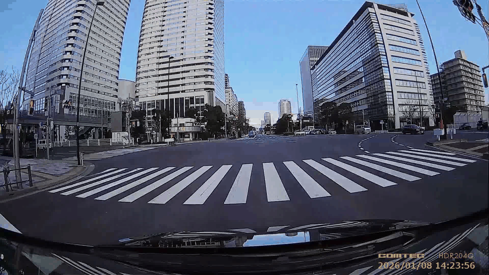
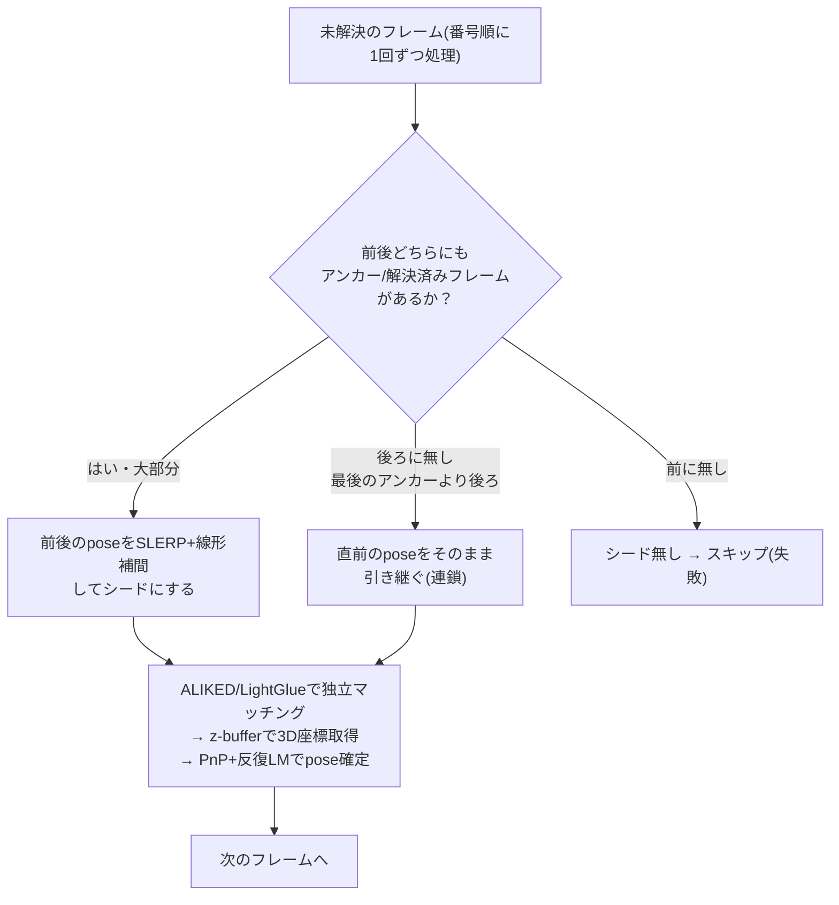

*Lens Calibration & Full-Trajectory Pose Estimation — Technical Brief*

# MMS全周映像・LiDAR点群を利用したダッシュカムのレンズキャリブレーションと全フレーム軌跡復元

*キャリブレーションボードを使用せずにMMS全周映像とLiDAR点群を使用してダッシュカム(コムテック ドライブレコーダー HDR204G)のレンズキャリブレーションを行い、さらにその結果を使って動画全フレームの位置・姿勢(軌跡)を復元する方法を整理した資料です。*

**全体の構成**

一連の処理は大きく2部に分かれます。

1. **[第1部: レンズキャリブレーション](#第1部-レンズキャリブレーション)** — ユーザーが目視で確認した参照画像を`anchor.json`に明示指定した少数の較正対象フレーム(アンカー)を使い、レンズの内部パラメータ(焦点距離・歪み係数)と、各アンカー自身の位置・姿勢を求める(`run_manual_calibration.py`)。
2. **[第2部: 全フレーム軌跡復元](#第2部-全フレーム軌跡復元)** — 第1部で求まった固定の内部パラメータを引き継ぎ、動画の残り全フレームの位置・姿勢を求める。

第2部は第1部の出力(内部パラメータ + 較正済みフレームのpose)がなければ実行できません。まず第1部から読み進めてください。

---

# 第1部: レンズキャリブレーション



***図1** — 現時点の最良の結果（frame 00374、写真と点群レンダリングの交互表示）。横断歩道を含む路面全体がほぼ一致して見える*

この結果で求まったレンズモデルとパラメータは以下の通りです。

| 項目 | 値 | 説明 |
|---|---|---|
| レンズモデル | 等距離射影(equidistant)ベースの魚眼モデル | θ_d = θ(1 + k1θ² + k2θ⁴)（θ: 入射角、θ_d: 歪みを含めた投影角。動径方向2次の歪み係数k1・k2のみで、接線方向の歪みは扱わない。k3・k4を加えた拡張モデルも検証したが不採用 — 理由は[後述](#k1k2のみを採用する理由レンズモデルの次数について)を参照） |
| fx | 907.74 | 焦点距離(x方向、px) |
| fy | 904.71 | 焦点距離(y方向、px) |
| cx | 984.93 | 主点(x座標、px) |
| cy | 529.08 | 主点(y座標、px) |
| k1 | -0.07093 | 歪み係数1 |
| k2 | -0.00242 | 歪み係数2 |

## 概要

目的は、**MMS**(Mobile Mapping System、計測車両)で取得した全周映像と**LiDAR**点群を使用して、ドライブレコーダー(ダッシュカム)のレンズキャリブレーション(レンズの歪み・焦点距離などの内部特性と、取り付け位置・向きを求めること)を行うことです。参照画像・参照点群はMMS(Ladybugによる多眼カメラ映像+LiDAR点群を、CVImageCreatorでCOLMAP形式に変換したもの)から得た、位置・向きが既知の「正確な地図」です。ここに、位置が未知のダッシュカム映像を重ね合わせ、位置・向き・レンズ特性を逆算します。

## 参照画像の選び方: 自動選択ではなく手動指定 (anchor.json)

較正対象フレームに対する参照画像を、視線方向(ray-alignment)などの指標から自動選択する方式を当初試みたが、視野が実際には重なっていないフレーム同士を誤って選んでしまい、マッチング自体は(見た目の上では)成立するものの、実際には無関係な画像同士を対応付けている「自己確認的な失敗」を起こすケースがあった(視野の重なりが薄いフレームほど対応点数が少なく、少ない対応点同士がたまたま整合してしまうと、誤りとして検出されにくい)。

この根本対策として、**参照画像をユーザーが目視で確認し、`anchor.json`に明示的に指定する**方式を採用した(`run_manual_calibration.py`)。

### anchor.json の形式

```json
{
  "<較正対象フレームのID>": {
    "ref_images": ["<参照画像名(拡張子無し)>", ...],
    "note": "<任意のメモ、ログの可読性のために表示される>"
  },
  ...
}
```

アンカーは3つ以上、各アンカーにつき参照画像は1枚以上指定する。参照画像は、そのアンカーフレームと実際に視野が重なっているものを選ぶ(重なりが薄いと点マッチング数が極端に少なくなり、そのアンカーの精度に悪影響する)。

## パイプライン(10ステップ)

| ステップ | 内容 |
|---|---|
| 1 | 点マッチング(ALIKED/LightGlue、各アンカー×各参照画像、路面ROIは除外) |
| 2 | 点対応から内部パラメータ・各アンカー姿勢を概算フィット |
| 3〜8 | 点群レンダリング→レンダー画像と実写のALIKED/LightGlueマッチング→フィット、を収束まで反復(非路面の点のみ)。破綻判定(後述)を含む |
| 9 | 路面線分マッチング(収束済み姿勢を前提に実行、詳細は次節) |
| 10 | 点対応+線分対応の両方を使った最終フィット、COLMAP形式で出力 |

非路面の点だけで先に高精度化してから、最後に路面線分マッチングで仕上げるという順序を採用している(路面線分マッチングは高精度なposeを前提にした検証的な性質が強く、粗いposeの段階でいきなり路面線分に頼ると、後段の判定基準(角度・距離の許容範囲)がposeの誤差と線分自体の対応誤差を区別できなくなるため)。

**破綻判定**: 各アンカーのフィット後カメラ位置が、そのアンカーに指定した参照画像(いずれか)の既知位置から`--broken_dist_threshold_m`(既定20m)以上離れたら「破綻」とみなし、反復を中断する。n_inliers・reprojection誤差といったデータ適合度だけの指標は、シーンの繰り返しパターンや退化した幾何構成によって「ゲームされ得る」(実際には誤ったフィットなのに指標上は良く見える)ことが分かっていたため、参照画像という独立な正解データとの比較を破綻判定に採用している。

## k1,k2のみを採用する理由(レンズモデルの次数について)

COLMAPのOPENCV_FISHEYEモデルはk1〜k4の4係数まで扱えるが、本パイプラインはk3,k4を常に0に固定し、k1,k2のみで魚眼レンズをフィットしている(`--free_k34`で明示的に解除しない限り)。理由は「精度が足りるから」ではなく、**k3,k4を自由にすると画像の四隅で歪みモデルが破綻する**ことが実験で確認されたため。

**症状**: θ_d(θ)(入射角θに対する歪み後の投影角)は本来θの増加に対して単調増加であるべきだが、k3,k4を自由にフィットすると、実対応点が届く範囲を超えたあたりでθ_dが減少に転じる(**折り返り**)。この「折り返り」より外側では点群がどこにも投影されず、画像四隅が完全に黒く抜ける。

**原因**: 実対応点は画像中心から一定半径までしか届かず、四隅との間に対応点が一切無い「無データ帯」が生じる。k1,k2の2係数だけならこの帯域でも滑らかに外挿されるが、k3,k4という自由度を追加すると、無データ帯の形状を拘束するものが何も無いまま歪みモデルが暴れられるようになる — 古典的な過学習(Runge現象)と同じ構図。

**検証した対策と結果**:

| 対策 | 結果 |
|---|---|
| k3,k4を自由なまま単調性への緩やかな罰則を追加 | 効果不十分、折り返り解消せず |
| k3,k4のみ固定(k1,k2は自由) | 四隅は解消するが、k1,k2だけでも同じ現象が起こり得ることが判明 |
| k1〜k4全て固定 | 四隅は解消するが、路面データがk1〜k4全体に関与できなくなる |
| 単調性への漸増罰則(k1〜k4自由) | 単調性は確保できるが、θ_dの到達範囲自体が不足(四隅に届かない) |
| **k3,k4への大きさベースのリッジ正則化**(k1〜k4自由) | 正則化を強めるほどk1,k2のみモデルの結果に漸近するだけで、途中の値で上回ることは一度もなかった |

最終的に、路面データを加えてもk1〜k4モデルの四隅性能はむしろ悪化することを実測で確認し、これは特定の設定ミスではなくk1〜k4モデル自体の構造的な不安定性であると結論づけた。k1,k2のみのモデルは反復を通じて安定した外挿挙動を維持しており、これを正式に採用している。

## 路面線分マッチングの設計

ステップ9の実装は、第2部(`refine_localization.py`)の`--line3d_match`(cctvブランチ由来)を土台にしているが、開発過程で複数の非自明な問題が見つかり、そのたびに設計を変更している。パラメータを安易に元へ戻すと過去に判明した問題が再発するため、経緯を含めて記録する。

### 検出: LSD + HoughLinesP のミックス方式

素のgray画像に対するCanny+LSDは、暗いアスファルトのテクスチャノイズを大量に拾ってしまう一方、note-tech.com/white_line_detect/を参考にした「明度フィルタ+Canny+HoughLinesP」はノイズには強いが、投票制のため横断歩道ストライプのような短い標示を検出できないという逆の弱点を持つ。そのため両方式で生線分を検出し、明度フィルタ後の入力から統合することで、ノイズを抑えつつ双方の苦手分野を補い合う設計にした(既定で有効)。

### 路面のクラック状ノイズ対策: 動的Canny閾値+両側明暗差フィルタ

濡れた路面の粒状テクスチャ(反射・アスファルト粒)は、上記のミックス方式でもCanny(15,45)固定閾値の下では大量の生セグメントとして誤検出される。当初は既存の「線に沿った明度の一貫性」フィルタ(along-line-std、中央値+k×MADで動的に外れ値判定)で除去を試みたが、実在マーキングを目視で囲んだ正解データ(groundtruth crop)と比較したところ、kをどれだけ厳しくしても実在/ノイズがほぼ分離できないことが判明した(実在side std中央値12.7 vs ノイズ10.4)。同じgroundtruthで局所密度・向きのばらつき(角度incoherence)・複数オフセットでの両側明暗一貫性・ストローク幅(平行パートナー線分)検出も試したが、いずれも精度0.3台にとどまるか、再現率が実用に耐えない水準まで落ちた。

有効だったのは検出段階での対策で、road_xyz投影範囲(路面点群が実際に再構成できている範囲、`_road_footprint_mask`)内の勾配強度(Sobel)分布のパーセンタイル(既定99.8%)からCanny閾値を画像ごとに動的に決定する方式(`_dynamic_canny_thresholds`)。濡れた路面の粒状ノイズの強さは画像・撮影環境ごとに大きく異なるため(実測: calib/fisheye側の閾値257〜463、ref/pinhole側98〜223、露出・カメラ種別が違えば必要な閾値も自然に変わる)、固定絶対値ではなく画像自身の分布に対する相対位置で決める設計にした(paint判定の自動閾値化と同じ思想)。これにより検出段階でノイズの大半を抑制しつつ実在検出を概ね維持できる(精度0.34→0.70〜0.87)。

さらに検出後、セグメント両側(進行方向に垂直なオフセット位置)の明暗差(`_side_contrast_score`)で残ったノイズを除去する(既定閾値30)。実在する白線・路面標示は片側(塗装)が明るく他方(アスファルト)が暗いという安定した非対称性を持つが、粒状ノイズにはこの非対称性が乏しい。動的Canny単独(精度0.70)にこのフィルタを組み合わせることで精度0.82まで改善し(実在検出の89%は維持)、この2段構えを採用した。

> **不採用にした案: 両側それぞれの明るさの一貫性も同時に要求する**
>
> 「塗装側・アスファルト側それぞれの明るさが長さ方向にほぼ一定であるはず」という着眼から、コントラストに加えて両側それぞれの分散の低さも要求する案を検証したが、実在の白線でも汚れ・摩耗・反射のムラで分散が下がらず(実在side std中央値18.4 vs ノイズ12.3で逆転)、再現率が0.03〜0.11まで落ちたため不採用とした。コントラスト(両側の明暗差の大きさ)だけを判定に使う。

### 種別分類(paint/other)の自動閾値化

第2部の`--line3d_calib_paint_bright_thresh`等は固定絶対値(calib 130/15、ref 190/40)だったが、ref画像はframeごとに露出が大きく異なることが判明した(実測: cover領域内の明度p88がcam00_frm00383で134、cam00_frm00350で96)。固定絶対値では、実在する白線でもframeによって安定して`paint`と判定できないケースがあったため、既定を「その都度の画像自身の検出結果分布に対するパーセンタイル」による自動決定に変更した(既定30%/40%、calib/refで独立に指定可能 — 撮影機材・解像度が異なる2つの画像ソースは分布の形自体が異なりうるため)。

判定の対象も、統合前の生セグメント単位(ノイズが大きく、同じ実在の線でも明度・コントラストが71〜166・1〜95とばらつくことが実測で判明)ではなく、統合後の最終グループの全サンプルをプールしてから一括で行うよう変更した。

### 断片統合と芋づる式誤統合の罠

1本の実在する白線が、生セグメントの検出・一次統合の粒度では複数の短い断片グループに分かれてしまうことがある。同じ向き・近接した3D区間を持つ断片同士をさらに統合する処理(`_consolidate_collinear_line_groups`)を追加したが、その実装には2段階の失敗があった。

> **失敗1: 無限直線への垂線距離で判定**
>
> 当初、統合条件を「無限直線への垂線距離」で判定していたところ、道路沿いに平行に伸びる別々の実在線同士まで、たまたま同じ向き・近い直線上に乗るという理由だけで芋づる式に大量誤統合し、1フレームの最終マッチ数が55件から6件に激減した。区間(有限の線分)同士の最短距離に判定基準を変更して解消した。

> **失敗2: 統合をまとめて検証し、まとめて棄却**
>
> 区間同士の距離に直しても、union-findで全ペアを先にまとめてから最後に1回だけ検証する方式では、A-B間・B-C間がそれぞれ許容内でもA-C間は無関係なほど離れているという連鎖的な誤統合が起こり得た(実測: 無関係な断片が連鎖し、3D長さ20〜37mという実在しない"線"が生成され、参照画像とのマッチングに誤って採用された)。さらに、検証で問題を検知した際に統合全体を棄却する方式だったため、本来正しく統合できるはずだった断片まで巻き添えでバラバラのまま残ってしまう副作用もあった。
>
> 最終的に、生セグメントの一次統合(第2部の`_incremental_merge_segments`)と同じ設計に改め、候補ペアをgapの小さい順に**1件ずつ**検証しながら統合するよう変更した(悪い統合1件だけをスキップし、他の良い統合は成立させる)。統合の妥当性検証は、外れ値除去後のinlier比率(既定60%以上)で行う — 垂線距離を外れ値除去**後**の点に対して測ると、除去後の点は定義上必ず閾値内に収まってしまい判定にならない点に注意。

### 3D長さの計算は外れ値除去後の点群を使う

外れ値除去(`_line_3d_fit`)はcentroid・directionを頑健化するが、"length"を外れ値除去**前**の点群から最大ペア距離で計算すると、road_xyzの最近傍探索がray-castで拾ってしまった無関係な1点のせいで、1本の生セグメントだけのグループでも3D長さが20m超という実在しない値になることが実測で見つかった。length・p_start・p_endは必ず外れ値除去後の点群から計算するよう修正した。

### ref/calib間の距離判定は区間同士の最短距離を使う

参照画像とダッシュカム画像の対応候補を絞り込むコスト行列は、当初centroid(線分の中心点)同士の距離で3D距離を判定していた。しかし、calib側とref側で検出・統合できた範囲(どこからどこまでを1本の線とみなせたか)が画像ごとに異なるため、centroid距離は「実際の位置ズレ」ではなく「検出範囲の違いによる見かけ上のズレ」を主に反映してしまう。実測では、本来正しい対応のcentroid距離が0.79〜0.90mと許容値0.20mを大幅に超えていたが、内訳を分解すると線の向きに沿った成分が0.71m、線に垂直な真のズレは0.35m程度だった。区間同士の最短距離(断片統合と同じ考え方)で計算し直すと0.176mとなり、許容値内に収まることを確認した。

### 長さの整合性は絶対値ではなく比率で判定する

第2部の`_LINE_LENGTH_DIFF_TOL_M`(絶対値0.30m)は、長い路面線分の正しい対応(11.37m vs 13.14m、差1.77m)まで弾いてしまうことが判明したため撤廃したが、長さの整合性チェックを完全に無くした結果、ref/calib間で3D長さが桁違い(実測: 22.6m vs 1.9m〔11.6倍〕、25.6m vs 0.41m〔61.7倍〕など)という明らかに無関係な対応まで採用されてしまう副作用が発生した。絶対値ではなく比率(長い方/短い方、既定1.5倍)で判定するよう変更し、正しい対応(比率1.16倍)は通しつつ、無関係な対応(実測で1.8倍〜61.7倍)は弾けるようにした。

### レビュー用HTML

`09_line_match/{アンカーID}_a_review.html`(cctvブランチの`_write_match_review_html`を移植)で、成立したマッチを1件ずつ参照画像・実写画像を並べて目視確認できる。線・端点マーカーの色はtype別(paint=赤、other=青、unknown=グレー)。

`09_line_match/raw_line/{元画像ファイル名}`には、3Dマッチング前の生の検出結果(calib側・ref側それぞれの全検出線分、凡例・マッチ点なし)を元画像と同じファイル名で保存する。マッチ結果を介さず、検出方式(動的Canny閾値・両側明暗差フィルタ等)自体の品質を単体で目視確認するための出力。線が1本も形成されなかった(マッチ0件の)画像でも生の検出結果自体は確認できるよう、空判定より前の段階でダンプする。

> **知見: マッチ数だけでは不十分**
>
> 上記の断片統合・長さ整合性の問題は、いずれも「マッチ数が増えた/減った」という集計値だけでは気づけず、このレビューHTMLで個々のマッチを目視確認して初めて発覚した。新しい閾値やフィルタを追加・変更した際は、必ず実際のマッチが正しいか(向き・3D長さ・両画像に実在する線状の物体があるか)を目視確認することが欠かせない。

### 線分対応の重み付け

`joint_fit`(第1部独自の連立最小二乗フィット)で、線分対応点の残差重みは`line_weight × その対応の3D長さ(m)`(1mの線がline_weight単体と同じ重みになるスケール)。長い線ほど多くの3D点でフィットしており測定誤差の影響を受けにくく信頼度が高い、という考えに基づく。

## 最終出力の目視確認

`10_final`には、最終的に求まったカメラの位置・向き・レンズの歪みを使い、点群をダッシュカム視点に再投影して検証用画像を生成する。

- `overlay_{f}.jpg`: R=実写(グレースケール)、G=B=レンダー(グレースケール)の合成画像。ズレがあれば色収差のように見え、アライメントが一致していればグレーに揃う(静止画1枚で分かる)。
- `flicker_{f}.gif`: 実写画像とレンダー画像を交互に切り替えるアニメーションGIF。静止画の色収差では気づきにくい微小なズレも、交互切替(flicker)では動きとして知覚しやすいため、補完的な確認手段として使う。図1の比較画像もこの出力。

---

# 第2部: 全フレーム軌跡復元

## 概要

第1部で求まるのは、内部パラメータ(fx, fy, cx, cy, k1, k2)と、較正対象に選んだ少数のフレーム(本データセットでは10枚)自身の位置・姿勢だけです。しかし実際に使いたいのは、ダッシュカム動画の**全フレーム**(本データセットでは840枚)の位置・姿勢です。第2部はこれを2段階で行います。

| 段階 | スクリプト | 内容 |
|---|---|---|
| 1 | `run_localization.py` | 第1部の10枚を起点に、残り約830枚それぞれのposeを、参照データセットとの独立マッチングで個別に解く |
| 2 | `refine_localization.py` | 段階1で解いた全フレームのposeを、隣接フレーム同士の対応点も使って1つの連立最適化問題として同時に磨き上げる |

内部パラメータ(レンズの歪み・焦点距離)は第1部で求めた値のまま、第2部を通じて一切変更しません。第2部が求めるのはあくまで各フレームの位置・姿勢(pose)です。

---

## 全フレームへの適用 (run_localization.py)

**較正対象フレームだけでなく、動画の全フレームの位置を求める**

第1部の較正パイプライン(`run_manual_calibration.py`)が最適化するのは、`anchor.json`で指定した少数のアンカーフレームだけです。しかし実際に使いたいのは、ダッシュカム動画の全フレームの位置・向きです。`run_localization.py`は、較正パイプラインが求めた固定の内部パラメータと、アンカーの確定済みposeを引き継ぎ、残りのフレームのposeを新たに求める後続のステップです。

**なぜ全参照画像との総当たりができないのか**

最も単純な方法は、残り830枚それぞれについて、Stage1と同じように参照画像**全件**(数百枚)とマッチングすることです。しかしこれは現実的ではありません。参照画像は解像度が大きく(3840×3840)、ALIKEDによる特徴抽出だけで1枚あたり数十秒かかります。830枚 × 参照画像数百枚という組み合わせを総当たりで処理すると、それだけで数十時間〜日単位の計算時間になってしまいます。

**解決策: 視線方向による参照画像の絞り込み + アンカー間補間シード**

そこで、各フレームについて参照画像**全件**ではなく、そのフレームの「おおよその位置・向き」に対して視線方向が近い上位`--ref_topk`枚(既定3枚)だけとマッチングします。ただし、この絞り込み自体に各フレームの「おおよそのpose」が必要になります。まだposeが分かっていない未知のフレームに対してこれを得るため、次の方式を使います。

1. フレームを番号順(=動画の時系列順)に1回だけ処理する。ダッシュカム動画は連続撮影のため、隣接フレームの位置は空間的にも近いという前提が成り立つ。
2. 較正済みの10枚は、そのままそのposeを採用する(joint bundle adjustment・LineMatch・路面点群クロス検証マッチングで磨き上げた、データセット中最も精度の高いposeのため、再マッチングは行わない)。
3. それ以外のフレームについて、参照画像を選ぶための**シード**(あくまで候補選びのためのおおよその位置)の決め方は3通りある。
   - **前後どちらにも**較正済み(または既に解けた)フレームがある場合: その2つのposeを**補間**したものをシードにする(回転はSLERP、並進はカメラ中心の線形補間)。大部分のフレームはこちらに該当する。
   - **前にしか**無い場合(=最後の較正済みアンカーより後ろのフレーム): 直前に成功したフレームのposeをそのまま**連鎖的に**引き継ぐ。
   - **前にも**無い場合(=先頭付近でまだ較正済みアンカーに到達していない): シードが得られないためそのフレームはスキップする(失敗としてカウントされるが、処理は次のフレームへ進む)。
4. 実際のposeは、このフレーム自身のマッチング結果から独立に**PnP**(Perspective-n-Point、複数の2D画素-3D点の対応から、その画素を観測したカメラのpose(位置・向き)を幾何学的に解く手法)+反復最小二乗法で解く。



***図16** — run_localization.pyのシード決定ロジック。全840フレームを番号順に1回ずつ処理する単純なfor文であり、「ループを抜ける条件」に相当するものは無い(最後のフレームまで処理したら終わる)。前後に較正済み/解決済みフレームが両方あるかどうかで、シードの決め方が3通りに分岐する*

**路面クロス検証の再利用**

一般点群だけから解いた初期poseは、Stage5で述べたのと同じ「遠方優先」の系統誤差を引き継ぎます。これを補正するため、`--road_points_txt`を指定すると、Stage7と同じ考え方の路面点群クロス検証パスを各フレームに追加できます。StepAの独立マッチングはすでに得ているため、追加のALIKED抽出コストなしに、路面領域の対応点だけを路面点群に照らして検証し、信頼できるものを一般点群対応点に加えてposeを解き直します。

> **課題: 参照データセットの空間的カバレッジ**
>
> 較正に使った参照データセット(300枚、走行区間のうちx:[0,152] y:[0,119]の範囲だけをカバー)では、この範囲を外れるフレーム(frame 500番台以降)で対応点数が~2000から~20-30まで崩壊し、姿勢が物理的にあり得ない値(奥行きが数十〜数百m飛ぶなど)になることが分かりました。地図としての参照データセットのカバー範囲が足りていないだけで、アルゴリズム自体の欠陥ではありません。走行区間全体をカバーする拡張データセット(573枚)を使うことで解消します。

**中断・再開**

830枚全部の処理には数時間かかることがあるため、各フレームのposeが確定次第`--output_dir/poses_partial.json`に逐次書き込みます。同じ`--output_dir`で再実行すると、既に解けたフレームをスキップして続きから再開します。

---

## 全フレームの同時再最適化 (refine_localization.py)

`run_localization.py`が解いた各フレームのposeは、そのフレーム自身の参照データセット対応点だけを使ったPnP+反復最小二乗法の結果であり、フレーム同士は連鎖的なシード(おおよその初期値)でしかつながっていません。`refine_localization.py`はこれをさらに一段階磨き上げる後処理で、**window内で隣接するダッシュカムフレーム同士を直接マッチングして三角測量した新規点**と、**参照データセット由来の固定点**の両方の再投影誤差を、全自由フレームのpose + 全新規点のxyzを1本のパラメータベクトルとして扱う**1回の連立最小二乗問題**にまとめて最適化します。

### 内部の3段階([1/3][2/3][3/3]) -- 第1部のステップ1〜10とは別の番号

`refine_localization.py`実行時のログに出る`=== [1/3] ... ===`〜`=== [3/3] ... ===`は、**第1部(レンズキャリブレーション、`run_manual_calibration.py`)のステップ1〜10とは全く別の、このスクリプト自身の3段階**を指す(たまたま両方に番号付きの段階が出るため紛らわしいが無関係)。

| | 内容 | 主な処理 |
|---|---|---|
| **[1/3]** | 内部パラメータ・初期pose読み込み | `run_localization.py`の出力(`--poses_colmap_dir`)から固定intrinsicsと全フレームの初期poseを読む。参照データセット対応点(`run_localization.py`が保存済み)もここで読み込む。 |
| **[2/3]** | ダッシュカム画像同士のマッチング + 三角測量 | window内で隣接するフレーム同士をALIKED/LightGlueでマッチングし、後述の3種類の対応点(自由な新規点/路面点群クロス検証点/フル点群クロス検証点、`--line3d_match`使用時は3D線分マッチング点も)を収集する。**GPU(ALIKED/LightGlue)を使う唯一の段階**で、フレーム数が多いと最も時間がかかる。 |
| **[3/3]** | 自由フレームpose + 新規3次元点の同時最適化 | [2/3]が集めた対応点を1本の連立最小二乗問題として解く(下記「3種類の残差」)。CPUのみ、[2/3]に比べ短時間。 |

**[2/3]の結果はキャッシュできる**: `--dump_stage2 <path>`を指定すると、[2/3]が集めた対応点データ一式(下記参照)をpickleに保存し、[3/3]を実行せずに終了する。`--load_stage2 <path>`で読み込むと[1/3][2/3]をスキップして[3/3]から実行できる。GPUが要る[2/3]は1回だけ実行し、その後`--line3d_weight`や`--interframe_weight`など[3/3]側の重みだけを変えたスイープをCPUだけで何度も高速に繰り返せる(`--line3d_weight`のスイープ実験で実際に使用、8〜9分かかる[2/3]を1回で済ませ、[3/3]だけを重み違いで数十秒〜数分ずつ再実行した)。保存される内容:

- 固定intrinsics・全フレームの初期pose・自由/アンカーフレームの判定
- 座標が既知の固定3次元点(`ref_obj`/`ref_img`) -- 参照データセット対応点/路面点群クロス検証点/フル点群クロス検証点をまとめて保持し、`ref_group`で種類を区別する(後述の`ref_weight`や精度集計はこの区別を使う)
- 3D線分マッチングの点対直線対応点(`--line3d_match`使用時、未使用なら空)
- 座標が未知の自由な新規点とその観測画素(2視点分)

### [2/3]の対応点収集: 3種類の候補と、その振り分け方

window内で隣接する2フレーム(frame_a, frame_b)をALIKED/LightGlueでマッチングした候補は、以下の順で振り分けられる:

1. **マスクによる除外**: `--mask_png`で車両自身(ダッシュボード・ワイパー)の映り込み領域を指定していれば、frame_a・frame_bどちらかの画素がその領域に入る候補は除外する。車両は全フレームで画面上の同じ位置に静止しているため、そのままではALIKED/LightGlueが高信頼度の「マッチ」を作ってしまうが、実シーンの視差を全く反映しない偽の対応点になる。
2. **路面ROI候補 → `--road_points_txt`でクロス検証**: 画像下部(road_roi_frac)に入る候補は、一方のフレームの現在poseで路面点群をz-buffer化して最近傍点を引き当て、もう一方のフレームへ再投影して許容誤差内かを検証する(路面標示はアパーチャ問題で通常のエピポーラRANSACに弾かれやすいため、代わりにこの検証を使う)。合格した点は`road_xyz`の座標をそのまま使う固定3次元点(`ref_group="road"`)として追加する。
3. **残り(路面ROI以外)の候補 → `--full_points_txt`でクロス検証(未指定ならスキップ)**: セマンティック分類前のフル点群(`points3D.txt`、道路・建物等すべて含む)を指定していれば、2と同じz-bufferクロス検証を建物・標識等にも適用する。合格した点は固定3次元点(`ref_group="full_pc"`)として追加する。LightGlueの信頼度スコアだけでなく、実際の3D点群との整合性で対応点の信頼性を判定できる。
4. **フル点群でも検証できなかった候補 → 三角測量**: 2視点三角測量(前述)で座標未知の自由な新規点として追加する。`--full_points_txt`を指定しない場合、路面ROI以外の候補は全てこの経路になる(従来の挙動)。

1ペアあたりの採用点数上限(`--max_points_per_pair`)は、LightGlueスコア上位N件ではなく**画像を10x10グリッドに分けて各セルから均等に抽出**する(スコア上位方式だと、道路標識のような一部の特に紛らわしくない領域に選抜が集中し、実際には密にマッチしている他の領域(建物ファサード等)にほぼ対応点が無くなることが、フレーム間トラッキングの可視化で確認された)。

### 3種類の残差: ra, rb, rr


***図19** — `ra`/`rb`/`rr`という3種類の残差の違い。紫の点Pは2つのフレーム(frame A・frame B)が共有する三角測量済みの新規点で、frame A側の再投影誤差が`ra`、frame B側が`rb`。同じ点Pの座標が両方の残差に登場するため、Pを介してframe Aとframe Bのposeが結びつく。緑の点Rは座標が既知で変化しない固定点(参照データセット対応点・路面点群クロス検証点・後述の3D線分マッチング点)で、対応する1フレームだけに`rr`という残差を持つ*

- **ra・rb**: window内で隣接する2フレーム(frame_a, frame_b)をALIKED/LightGlueでマッチングし、フィッシュアイモデルの逆変換で得た2本のカメラレイの交点として三角測量した新規点(座標は未知、最適化対象)への再投影誤差。**隣接フレーム同士を鎖状につなぐ**役割。
- **rr**: 座標が既知・固定の3D点への再投影誤差。中身は4種類あるが、残差としては区別されず同じ配列(`ref_frame_idx`/`ref_obj`/`ref_img`、種類は`ref_group`で記録)に連結される。
  1. `run_localization.py`が保存した参照データセットとの2D-3D対応点(`ref_group="orig"`)
  2. 路面点群クロス検証で採用された点(`--road_points_txt`、`ref_group="road"`)
  3. フル点群クロス検証で採用された点(`--full_points_txt`、路面ROI以外の候補が対象、`ref_group="full_pc"`)
  4. 後述の3D線分マッチングで得られた点(`--line3d_match`) -- これは点対点ではなく専用の点対直線残差を使うため、実際には`rr`とは別の残差配列(`line_*`)で扱われる

  1〜3は各フレームを**絶対位置・実スケールに係留する錨**の役割で、隣接フレームとは直接つながらない。

window内の全フレームが共有点(ra/rb)を介して鎖状に連結され、かつ各フレームが固定点(rr)で個別に係留されているため、最適化([3/3])が収束するまではどのフレームのposeも「確定」とは言えない(隣のフレームの未収束な誤差が共有点を介して逆流し得る)。このため`refine_localization.py`はフレームごとに逐次poseを書き出すのではなく、[3/3]の連立最適化が完了した時点で全フレームのposeを一括して書き出す設計になっている。

### 新規点(P)の三角測量


***図20** — 2視点三角測量の手順。frame A・frame Bそれぞれのカメラ中心から、マッチした画素へ向かうレイを求め、その2本のレイに最も近い点としてPの初期座標を求める*

1. **マッチング**: frame_a・frame_b(window内で隣接)をALIKED/LightGlueでマッチングし、画素ペア(ua,va)/(ub,vb)を得る。
2. **画素→レイ変換**: それぞれの画素を、そのフレームの現在のposeを使ってフィッシュアイモデルの逆変換でワールド座標系のレイ方向に変換する。
3. **三角測量**: 2本のレイは通常わずかにねじれの位置にあるため、両方のレイへの垂直距離の二乗和を最小化する点を最小二乗法で解き、Pの初期座標とする。

三角測量で得られるのはあくまで**初期値**で、両フレームの現在poseでの再投影誤差が閾値(既定30px)を超えていれば誤対応として棄却される。生き残った点は、Stage3の連立最適化でPの座標自体もframe_a・frame_bのposeと一緒にさらに調整される。

### 解析的ヤコビアンによる収束の改善

Stage3の連立最適化は当初、数値差分ヤコビアン(`jac_sparsity`によるスパース性のヒントのみを与え、実際の微分はscipyが有限差分で計算)を使っていた。しかしダッシュカム840フレーム規模(パラメータ数は自由フレーム数×6+新規点数×3で100万を超える)では、有限差分は1回のヤコビアン評価に多数の残差再計算を要するため、最適化ステップの予算(`max_nfev`)を使い切っても収束せず、`first-order optimality`が1e6台のまま(≒未収束)で打ち切られていた。

`calibration_lib.py`の`joint_bundle_adjust`(較正パイプライン本体のStage5)ですでに検証済みの解析的ヤコビアン(合成データでの数値差分との比較により、最大絶対誤差1.6e-8まで一致することを確認済み)と同じ導出を移植し、`jac=`に直接渡す + `x_scale='jac'`を指定する形に変更した。これにより1回のヤコビアン評価コストが残差評価そのものと同程度まで下がり、最終パスが`Both ftol and xtol termination conditions are satisfied`という形で実際に収束するようになった。

### 路面標示のアパーチャ問題と3D線分マッチング (--line3d_match)

window内の隣接フレーム同士のALIKED/LightGlueマッチング(ra/rbを生む三角測量)は、車線・横断歩道のような**等間隔の繰り返しパターン**に対してアパーチャ問題を起こしやすい(Stage1のマッチングで最初に直面したのと同じ問題)。実際に、ある区間(frame 00035〜00134)で路面標示の位置ズレが徐々に拡大する現象が確認された。

対策として、iwanelab/LensCalibrationのcctvブランチ(防犯カメラ向け静止カメラキャリブレーション)にある「Stage 5 — 線分マッチングによる高精度化」を、ダッシュカムの各自由フレーム1枚ずつ vs 参照データセット画像という構成に移植した。**ダッシュカムフレーム同士ではなく**、ダッシュカムフレーム(fisheye) ⇔ 参照データセット画像(pose・intrinsics既知、pinhole)の対応点であるため、得られる3D点は座標既知の固定点として`rr`側(緑の点R)に加わる。

**手法の要点**:
1. **検出+3D統合**: 古典的な線分検出(LSD)を両画像で行い、バラバラな短い線分を**3D距離**(2Dピクセル距離ではない)で1本の直線に統合する。2Dでは近く見えても3D的に無関係な線分(ひび割れ・汚れなど)を誤って繋がないための工夫。
2. **種別分類**: 統合した線分を、幾何(傾き等)ではなく**明るさ・コントラスト**で`paint`(白線境界)/`other`(舗装補修痕等)に分類する。同じ実世界の線は参照側・実写側のどちらで見ても同じ種別になる。
3. **マッチング**: 種別が一致し、3D化したときの方向ベクトルの角度差・3D長さの差・重心間距離がいずれも許容範囲内の組み合わせをHungarian法で1対1に割り当てる。次点候補との差が僅かな場合は採用しない(繰り返しパターンでの紛らわしい誤対応を防ぐ)。

> **知見: 撮影機材が違えば閾値も違う**
>
> paint/other分類の明るさ・コントラスト閾値は、防犯カメラ(securitycam)側の実測値(bright≥210, contrast≥55)をそのまま流用すると、このダッシュカムデータセットでは検出線分の明るさがp99でも198〜204にしか達せず、ほぼ全てが`other`に分類されてしまった。目視確認(線分を種別で色分けした画像を実際に見て判定)により、ダッシュカム(calib)側は`bright≥130, contrast≥15`、参照データセット(ref)側は`bright≥190, contrast≥40`という、**互いに異なる**閾値が実態に合うと判明した。露出・解像度(1920×1080 vs 3840×3840)・JPEG圧縮が異なる2つの画像ソースを同じ絶対閾値で扱う理由はない。

> **知見: ダッシュボードの映り込みを除外する**
> 車両自身が写り込む領域(ダッシュボード・ワイパー)の縁がLSDに強い直線として検出され、路面標示と誤ってマッチングされることが実測で判明した。較正パイプライン本体(`--mask_png`)と同じ可視領域マスクをダッシュカム側の検出対象領域から差し引くことで解消する。

> **知見: フィッシュアイの広い画角による性能劣化**
> 路面点群(この実験では652万点)を各画像へ再投影する処理自体は高速(1回0.9秒程度)だが、フィッシュアイの広い画角では「画角内」という条件だけで652万点中561万点が該当してしまう。この561万点全体に対して画像1枚ごとにcKDTreeを構築するコスト(1回3.6秒×1フレームあたりcalib+参照8枚=9回)が、実測した1フレームあたり総処理時間(約70秒)の大半を占めていた。路面標示のマッチングにカメラから数百m先の点は無関係なので、**距離40m以内**に絞ってからcKDTreeを構築するようにしたところ、対象点数が1/17程度(56万点)に減り、1フレームあたり約2.4倍(68.8秒→28.7秒)高速化した。

**実行方法**:

```
python refine_localization.py \
  --poses_colmap_dir O:\...\output_localize\colmap \
  --images_dir O:\...\dashcam_outside\jpgs \
  --road_points_txt O:\...\points3D(road).txt \
  --mask_png O:\...\mask.png \
  --line3d_match \
  --ref_dataset_npy_dir O:\...\02_dataset \
  --ref_images_dir O:\...\dataset_full\images \
  --output_dir O:\...\output_refine
```

---

# 付録

**主なコマンドライン引数**

本資料で触れた設定に対応する、実際のコマンドライン引数を以下にまとめます(第1部・第2部それぞれのスクリプトごとに整理)。

## run_localization.py — 全フレームへの適用

| 引数 | 既定値 | 説明 |
|---|---|---|
| `--calib_colmap_dir` | 必須 | 較正パイプラインのCOLMAP出力ディレクトリ(固定内部パラメータ+較正済みフレームのpose) |
| `--dataset_dir` | 必須 | 参照データセット(COLMAP形式)のディレクトリ |
| `--images_dir` | 必須 | poseを求める全画像のフォルダ |
| `--ref_topk` | 3 | フレームごとにマッチングする参照画像の枚数(ray-alignment上位k件) |
| `--road_points_txt` | なし | 路面点群クロス検証パスを有効にする場合のpoints3D(road).txtパス |
| `--limit` | 全件 | 処理するフレーム数を先頭から制限する(動作確認用) |

## refine_localization.py — 全フレームの同時再最適化

| 引数 | 既定値 | 説明 |
|---|---|---|
| `--poses_colmap_dir` | 必須 | `run_localization.py`のCOLMAP出力ディレクトリ(固定intrinsics+全フレームの初期pose) |
| `--images_dir` | 必須 | ダッシュカム画像のフォルダ |
| `--window` | 2 | 隣接フレームマッチングの前後窓幅 |
| `--road_points_txt` | なし | 路面点群クロス検証を有効にする場合のpoints3D(road).txtパス |
| `--full_points_txt` | なし | セマンティック分類前のフル点群(points3D.txt)のパス。指定すると路面ROI以外の候補にもz-bufferクロス検証を適用する |
| `--full_pc_max_depth` | 60.0 | フル点群のうちこの距離(m相当)より遠い点を除外(性能対策、路面より緩め) |
| `--full_pc_metric_tol` | 0.5 | フル点群クロス検証の許容誤差(実距離スケール、路面より緩め) |
| `--full_pc_lookup_radius` | 8 | フル点群z-bufferの最近傍探索半径(px) |
| `--interframe_weight` | 1.0 | ダッシュカム同士のフレーム間トラッキング(ra/rb)の重み。line3d/refに対して相対的に上げると、実測トラッキングの整合性を優先させられる |
| `--mask_png` | なし | ダッシュボード等を除外するマスク画像。`--line3d_match`使用時は指定を推奨。[2/3]の通常のフレーム間マッチングにも適用される |
| `--dump_stage2` | なし | [2/3]完了後の対応点データをpickle保存し、[3/3]を実行せず終了する(重みスイープ実験用) |
| `--load_stage2` | なし | `--dump_stage2`で保存したpickleを読み込み、[1/3][2/3]をスキップして[3/3]から実行する |
| `--line3d_match` | オフ | 3D線分マッチング(cctvブランチのStage5移植、点対直線残差)を有効にする |
| `--ref_dataset_npy_dir` | `--line3d_match`使用時必須 | 較正パイプラインの`02_dataset`(cameras.npy/images.npy)のパス |
| `--ref_images_dir` | `--line3d_match`使用時必須 | 参照データセットの画像フォルダ |
| `--line3d_ref_topk` | 8 | フレームごとに候補とする参照画像の枚数 |
| `--line3d_angle_tol_deg` | 15.0 | 3D直線同士を同一とみなす方向ベクトルの角度差の上限 |
| `--line3d_dist_tol_m` | 0.20 | 3D直線同士を同一とみなす重心間距離の上限 |
| `--line3d_ambiguity_ratio` | 0.7 | Hungarian割当の最良候補が次点候補よりこの倍率以上小さくない場合は不採用 |
| `--line3d_weight` | 4.0 | 3D線分マッチング対応点の重み |
| `--line3d_calib_paint_bright_thresh` / `--line3d_calib_paint_contrast_thresh` | 130 / 15 | paint判定閾値(ダッシュカム側)。目視確認で撮影機材ごとに調整が必要 |
| `--line3d_ref_paint_bright_thresh` / `--line3d_ref_paint_contrast_thresh` | 190 / 40 | paint判定閾値(参照データセット側) |
| `--line3d_max_road_depth` | 40.0 | 路面点群のうちこの距離(m相当)より遠い点を除外(性能対策) |
| `--limit` | 全件 | 処理するフレーム数を先頭から制限する(動作確認用) |

## run_manual_calibration.py — 手動アンカー指定によるレンズキャリブレーション

```
python run_manual_calibration.py \
  --dataset_dir O:\...\dataset_full \
  --images_dir O:\...\dashcam_outside\jpgs \
  --output_dir O:\...\output_manualcalib \
  --anchors_json O:\...\anchor.json \
  --road_points_txt O:\...\points3D(road).txt \
  --mask_png O:\...\mask.png
```

| 引数 | 既定値 | 説明 |
|---|---|---|
| `--dataset_dir` | 必須 | 参照データセット(COLMAP形式)のディレクトリ |
| `--images_dir` | 必須 | ダッシュカム画像のディレクトリ |
| `--output_dir` | 必須 | 出力ディレクトリ(新規であること、上書き不可) |
| `--anchors_json` | 必須 | アンカー(較正対象フレーム)と参照画像の対応を記述したJSON |
| `--road_points_txt` | 必須 | 路面点群(points3D(road).txt)のパス |
| `--mask_png` | なし | 車両自身(ダッシュボード・ワイパー等)を除外する可視領域マスク |
| `--free_k34` | オフ | k3,k4も自由変数にする(既定は0固定、理由は[こちら](#k1k2のみを採用する理由レンズモデルの次数について)を参照) |
| `--broken_dist_threshold_m` | 20.0 | 反復高精度化ループでの破綻判定の距離閾値(m) |
| `--max_iterations` | 5 | 反復高精度化ループの最大反復回数 |
| `--line3d_weight` | 4.0 | 線分対応点の残差に掛ける基準重み。実際に各対応点へ掛かる重みは`line3d_weight × その対応の3D長さ(m)` |
| `--line3d_angle_tol_deg` | 15.0 | 3D直線同士を同一とみなす方向ベクトルの角度差の上限 |
| `--line3d_dist_tol_m` | 0.20 | 3D直線同士を同一とみなす、区間同士の最短距離の上限 |
| `--line3d_length_ratio_tol` | 1.5 | ref側/calib側の3D長さの比率(長い方/短い方)の許容上限。桁違いの対応(実測で最大61.7倍)を弾く |
| `--line3d_ambiguity_ratio` | 0.7 | Hungarian割当の最良候補が次点候補よりこの倍率以上小さくない場合は不採用 |
| `--line3d_calib_paint_bright_thresh` / `--line3d_calib_paint_contrast_thresh` | None(自動) | paint判定の絶対閾値(ダッシュカム側)。既定は画像自身の分布からパーセンタイルで自動決定 |
| `--line3d_ref_paint_bright_thresh` / `--line3d_ref_paint_contrast_thresh` | None(自動) | paint判定の絶対閾値(参照データセット側) |
| `--line3d_calib_paint_bright_percentile` / `--line3d_calib_paint_contrast_percentile` | 30 / 40 | paint判定閾値を自動決定する際のパーセンタイル(ダッシュカム側) |
| `--line3d_ref_paint_bright_percentile` / `--line3d_ref_paint_contrast_percentile` | 30 / 40 | paint判定閾値を自動決定する際のパーセンタイル(参照データセット側)。calib/refで独立に指定できるのは、撮影機材・解像度が異なり分布の形自体が異なりうるため |
| `--line3d_max_road_depth` | 40.0 | 路面点群のうちこの距離(m相当)より遠い点を除外(性能対策) |
| `--line3d_no_hough` | オフ | LSD+HoughLinesPミックス方式を無効にし、従来のLSD単独検出に戻す |
| `--line3d_hough_white_percentile` | 88 | Hough側の明度フィルタ閾値を自動決定する際のパーセンタイル |
| `--line3d_hough_canny_low` / `--line3d_hough_canny_high` | 50 / 150 | Hough側のCanny閾値 |
| `--line3d_hough_blur_ksize` | 5 | Hough側のCanny前GaussianBlurカーネルサイズ |
| `--line3d_hough_threshold` / `--line3d_hough_min_line_length` / `--line3d_hough_max_line_gap` | 40 / 50 / 25 | HoughLinesPのパラメータ |
| `--line3d_dynamic_canny_percentile` | 99.8 | 路面クラック状ノイズ対策。road_xyz投影範囲内の勾配強度分布のこのパーセンタイルからCanny閾値(LSD側・Hough側とも)を画像ごとに動的決定する。Noneで無効化し、固定閾値(`--line3d_hough_canny_low`/`high`等)に戻せる |
| `--line3d_dynamic_canny_low_ratio` | 0.7 | 動的Canny閾値のうちcanny_low = canny_high × この比率 |
| `--line3d_contrast_filter_thresh` | 30.0 | 検出後、セグメント両側(進行方向に垂直なオフセット位置)の明暗差がこの値未満の生セグメントを除外する。Noneで無効化できる |
| `--line3d_contrast_filter_offset` | 5.0 | 両側明暗差フィルタのオフセット距離(px) |
| `--line3d_contrast_filter_n_samples` | 5 | 両側明暗差フィルタのセグメント沿いサンプル点数 |

*Camera calibration project — road-surface cross-validation matching brief*